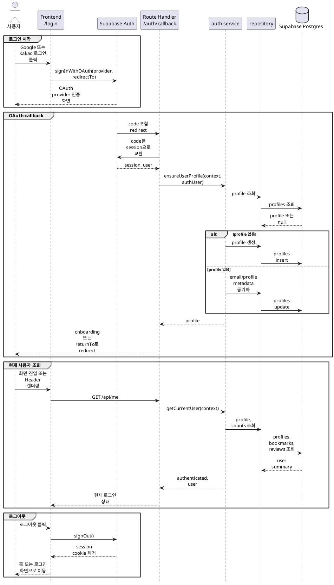

# 1. 인증 및 사용자 세션 구현 방안

인증 및 사용자 세션은 **Supabase Auth OAuth + Next.js App Router + 서버 공통 RequestContext + `profiles` 동기화**를 기준으로 구현한다.

## 목적

로그인/로그아웃과 현재 사용자 조회는 Cinemate의 개인화 기능 전체의 전제다. 비로그인 사용자는 영화 탐색과 상세 조회만 사용할 수 있고, 로그인 사용자는 온보딩, 찜, 리뷰, 맞춤 추천, AI 채팅, 캐릭터 채팅, 마이페이지를 사용할 수 있어야 한다.

구현 목표:

- Google, Kakao 소셜 로그인을 Supabase Auth로 처리한다.
- 로그인 성공 후 Supabase `auth.users`와 서비스 DB `profiles`를 1:1로 연결한다.
- 서버 Route Handler에서 일관된 방식으로 현재 사용자와 요청 컨텍스트를 얻는다.
- `GET /api/me`로 공통 Header와 보호 화면의 로그인 상태를 판정한다.
- 로그아웃은 별도 API 없이 Supabase `signOut`으로 처리한다.
- 온보딩 완료 여부에 따라 로그인 후 이동 대상을 결정한다.

## 기준 문서

| 문서 | 역할 |
|---|---|
| [../api-spec/auth-users.md](../api-spec/auth-users.md) | 현재 사용자, 온보딩 선호 영화 API 계약 |
| [../api-spec/common.md](../api-spec/common.md) | 인증 표기와 공통 에러 기준 |
| [../api-spec/screen-mapping.md](../api-spec/screen-mapping.md) | 로그인, 로그아웃, Header, 마이페이지 화면별 API 매핑 |
| [../db-schema/users.md](../db-schema/users.md) | `profiles`, `user_onboarding_movies` 스키마와 RLS 기준 |
| [../db-schema/rls-summary.md](../db-schema/rls-summary.md) | 사용자별 데이터 접근 정책 요약 |
| [../service-policy.md](../service-policy.md) | 비로그인/로그인 사용자 기능 제한 정책 |

## 사용 데이터

런타임에서 직접 사용하는 주요 데이터:

| 데이터 | 런타임 역할 |
|---|---|
| Supabase `auth.users` | 인증 사용자 원천, OAuth provider 식별자와 이메일 보관 |
| Supabase Auth session cookie | 브라우저와 서버 Route Handler의 로그인 상태 판정 |
| `profiles` | 서비스 표시 이름, 이메일, 프로필 이미지, 온보딩 완료 여부 |
| `user_onboarding_movies` | 온보딩 완료 후 개인화 추천 seed |
| `movie_bookmarks` | `/api/me`의 `bookmarkedMovieCount` 계산 |
| `reviews` | `/api/me`의 `reviewCount` 계산 |

`profiles.id`는 Supabase `auth.users.id`를 참조한다. 서비스의 사용자 ID는 모든 도메인에서 `profiles.id`를 기준으로 전달한다.

## 주요 흐름



## 구현 범위

### 로그인

- `/login` 화면의 Google, Kakao 버튼은 Supabase client의 `signInWithOAuth`를 호출한다.
- 로그인 시작은 별도 Route Handler를 만들지 않는다. 화면 매핑 문서 기준으로 로그인 API는 없다.
- `redirectTo`는 서버 callback route를 가리킨다.
- 사용자가 로그인 전에 보호 기능에서 이동한 경우 `returnTo` query를 유지해 로그인 성공 후 원래 목적지로 돌아갈 수 있게 한다.
- OAuth 실패, 취소, provider 설정 오류는 `/login`에서 사용자에게 오류 상태로 표시한다.

로그인 성공 후 이동 기준:

| 조건 | 이동 대상 |
|---|---|
| `returnTo`가 있고 안전한 내부 경로 | `returnTo` |
| 신규 또는 `onboardingCompleted=false` | `/onboarding` |
| 온보딩 완료 사용자 | `/` 또는 직전 목적지 |

`returnTo`는 open redirect를 막기 위해 같은 origin의 상대 경로만 허용한다.

### OAuth callback

Next.js App Router의 Route Handler로 callback을 둔다.

예상 경로:

| 파일 | 역할 |
|---|---|
| `app/auth/callback/route.ts` | OAuth `code` 교환, profile 보장, redirect 결정 |

callback route는 다음 책임만 가진다.

1. query의 `code`, `returnTo`, `error`를 파싱한다.
2. Supabase server client로 `code`를 session cookie로 교환한다.
3. 로그인 사용자 정보를 가져온다.
4. `authService.ensureProfile()`을 호출한다.
5. 온보딩 상태와 `returnTo`에 따라 redirect한다.

비즈니스 규칙은 `server/auth`와 `server/users` 하위로 분리한다.

### 로그아웃

- 공통 Header 또는 마이페이지의 로그아웃 버튼은 Supabase client의 `signOut()`을 호출한다.
- 로그아웃은 화면 매핑 문서 기준으로 별도 API가 없다.
- 로그아웃 성공 후 클라이언트 캐시의 현재 사용자 상태를 비우고 홈으로 이동한다.
- 로그아웃 실패 시 현재 화면에 오류 메시지를 표시하고, 서버 데이터는 변경하지 않는다.

### 현재 사용자 조회

`GET /api/me`는 로그인 여부와 사용자 기본 정보를 반환한다.

응답 기준:

| 상태 | 응답 |
|---|---|
| 비로그인 | `authenticated=false`, `user=null` |
| 로그인 + profile 있음 | `authenticated=true`, `user={...}` |
| 로그인 + profile 없음 | profile 생성 후 `authenticated=true`, `user={...}` |

`user` 필드는 API 스펙의 `id`, `name`, `email`, `profileImageUrl`, `onboardingCompleted`, `bookmarkedMovieCount`, `reviewCount`를 따른다.

`/mypage`처럼 인증이 필요한 화면은 `user=null`이면 `/login?returnTo=/mypage`로 이동한다. API 인증 표기가 `필요`인 Route Handler는 공통 인증 helper를 사용하고, 비로그인 요청에는 `401 Unauthorized`를 반환한다.

## 서버 모듈 구조

예상 파일:

| 파일 | 역할 |
|---|---|
| `server/auth/request-context.ts` | Route Handler에서 `RequestContext` 생성 |
| `server/auth/auth-service.ts` | 현재 사용자 조회, profile 보장, redirect 판단 |
| `server/auth/auth-types.ts` | `RequestContext`, `AuthenticatedContext`, auth user 타입 |
| `server/auth/auth-rules.ts` | `returnTo` 검증, 로그인 후 이동 경로 결정 |
| `server/auth/supabase-server.ts` | cookie 기반 Supabase server client 생성 |
| `server/users/user-service.ts` | profile 조회/생성/수정 유스케이스 |
| `server/users/user-repository.ts` | `profiles`, count 조회 DB 접근 |
| `server/users/user-schema.ts` | `/api/me` 응답, profile 수정 입력 검증 |
| `server/users/user-types.ts` | service/repository 전달 타입 |
| `app/api/me/route.ts` | `GET /api/me`, 추후 `PATCH /api/me` adapter |
| `app/api/me/preferences/movies/route.ts` | 온보딩 선호 영화 조회/저장 adapter |

`server/**` 파일은 서버 전용이므로 필요한 파일 상단에 `import 'server-only'`를 선언한다. Client Component는 `server/**`를 import하지 않는다.

## RequestContext

Route Handler, service, repository 사이에는 명시적인 context를 전달한다.

초기 타입:

```ts
export type RequestContext = {
  requestId: string;
  user: {
    id: string;
    email: string;
  } | null;
};

export type AuthenticatedRequestContext = RequestContext & {
  user: {
    id: string;
    email: string;
  };
};
```

공통 helper:

| 함수 | 역할 |
|---|---|
| `createRequestContext()` | session이 있으면 `user`를 채우고, 없으면 `user=null` 반환 |
| `requireAuthenticatedContext()` | 비로그인 요청이면 `401 Unauthorized` 응답에 사용할 에러 반환 |
| `getCurrentAuthUser()` | Supabase Auth user 조회 |

service는 `Request`, `Response`, cookie, header에 직접 의존하지 않는다.

## Profile 동기화

Supabase Auth 로그인 사용자는 서비스 기능을 쓰기 전에 반드시 `profiles` row가 있어야 한다.

생성 기준:

| `profiles` 컬럼 | 값 |
|---|---|
| `id` | Supabase Auth user id |
| `email` | Auth user email |
| `name` | provider metadata의 이름, 없으면 email local-part |
| `profile_image_url` | provider avatar URL, 없으면 null |
| `onboarding_completed` | 기본값 `false` |

동기화 기준:

- 기존 profile이 있으면 `id`는 변경하지 않는다.
- 이메일 변경이 감지되면 `profiles.email`을 최신 Auth email로 갱신한다.
- 사용자가 직접 수정한 표시 이름을 덮어쓰지 않도록, `name` 자동 갱신은 신규 생성 시에만 한다.
- provider avatar는 사용자가 별도 프로필 이미지를 수정하는 기능이 생기기 전까지 최신 값으로 동기화할 수 있다.

`PATCH /api/me`는 API README와 화면 매핑에 언급되어 있으나 [auth-users.md](../api-spec/auth-users.md)에는 상세 계약이 없다. 구현 전 요청 body, 수정 가능 필드, 이미지 업로드 정책을 API 스펙에 먼저 보완한다.

## 온보딩 세션 정책

- 온보딩은 로그인 사용자만 접근할 수 있다.
- `GET /api/me`의 `onboardingCompleted=false`인 사용자는 첫 로그인 후 `/onboarding`으로 유도한다.
- `PUT /api/me/preferences/movies`는 정확히 5개의 영화 ID를 검증한 뒤 `user_onboarding_movies`를 저장하고 `profiles.onboarding_completed=true`로 갱신한다.
- 온보딩 완료 사용자가 `/onboarding`에 직접 접근하면 `/recommend` 또는 홈으로 이동한다.
- `/recommend`는 로그인 및 온보딩 완료를 요구한다. 온보딩이 끝나지 않은 사용자는 `/onboarding`으로 이동한다.

## Frontend 상태 관리

공통 Header와 보호 화면은 `GET /api/me`를 로그인 상태의 서버 기준으로 사용한다.

구현 기준:

- 서버 렌더링 가능한 화면은 서버에서 `/api/me`에 해당하는 service를 직접 사용하거나, server component에서 Supabase server client로 현재 사용자를 확인한다.
- 상호작용이 필요한 로그인/로그아웃 버튼만 Client Component로 분리한다.
- 로그아웃 성공 후 Header의 사용자 상태를 즉시 갱신한다.
- 비로그인 사용자가 찜, 리뷰, 채팅, 추천 등 보호 기능을 클릭하면 API 호출 전에 `/login?returnTo=...`로 보낸다.

## 보안 및 권한

| 항목 | 기준 |
|---|---|
| 인증 원천 | Supabase Auth session |
| 사용자 ID | `auth.users.id`와 동일한 `profiles.id` |
| 보호 API | 공통 `requireAuthenticatedContext()` 사용 |
| 본인 데이터 접근 | repository query에서 `context.user.id`를 조건으로 사용 |
| RLS | `profiles`, `user_onboarding_movies`는 본인 row만 조회/수정 가능 |
| open redirect | `returnTo`는 내부 상대 경로만 허용 |
| 클라이언트 신뢰 | 클라이언트에서 전달한 `userId`는 사용하지 않음 |

서비스 레벨의 권한 검사는 RLS에만 의존하지 않는다. Route Handler와 service에서 현재 사용자 ID를 명시적으로 전달해 본인 데이터만 조회/수정한다.

## 실패 처리

| 상황 | 처리 |
|---|---|
| OAuth 실패 또는 취소 | `/login?error=oauth_failed`로 이동 |
| callback에 `code` 없음 | `/login?error=invalid_callback`으로 이동 |
| session 교환 실패 | `/login?error=session_exchange_failed`로 이동 |
| profile 생성 실패 | 로그인 세션은 유지하되 `/login?error=profile_sync_failed` 또는 오류 화면으로 이동 |
| 비로그인 보호 API 호출 | `401 Unauthorized` |
| 다른 사용자 데이터 접근 | `403 Forbidden` 또는 `404 Not Found` |
| `/api/me`에서 비로그인 | 정상 응답, `authenticated=false` |

## 테스트 계획

우선순위는 DB 없이 검증 가능한 `rules`와 `service` 테스트에 둔다.

| 대상 | 검증 |
|---|---|
| `auth-rules.test.ts` | 안전한 `returnTo`만 허용, 로그인 후 이동 경로 결정 |
| `auth-service.test.ts` | profile 없음 생성, profile 있음 동기화, 비로그인 처리 |
| `user-service.test.ts` | `/api/me` 응답 조립, count 계산 결과 매핑 |
| `preferences service test` | 정확히 5개 선택 검증, 온보딩 완료 갱신 |
| Route Handler test | 비로그인 `GET /api/me` 정상 응답, 보호 API `401` |

repository는 Drizzle query shape와 실제 DB 제약 검증이 필요한 경우 통합 테스트로 분리한다.

## 구현 순서

1. Supabase browser/server client와 session cookie 연동을 정리한다.
2. `server/auth`의 `RequestContext`, 인증 helper, redirect rule을 만든다.
3. `server/users`의 profile 조회/생성/동기화 service와 repository를 만든다.
4. `/auth/callback` route에서 OAuth code 교환과 profile 보장을 연결한다.
5. `/api/me` route를 구현해 Header와 보호 화면의 기준 API로 사용한다.
6. `/login` 화면의 Google/Kakao 로그인 버튼과 오류 상태를 구현한다.
7. Header 또는 마이페이지의 로그아웃 버튼을 Supabase `signOut()`으로 연결한다.
8. `/onboarding`, `/recommend`, `/mypage`의 로그인/온보딩 guard를 적용한다.
9. service/rules 테스트와 가능한 경우 `pnpm lint`를 실행한다.

## 검증 기준

| 항목 | 기준 |
|---|---|
| 로그인 시작 | Google, Kakao 버튼이 Supabase OAuth 흐름을 시작한다. |
| callback | OAuth 성공 시 session cookie가 설정되고 `profiles` row가 보장된다. |
| 신규 사용자 | 로그인 후 `onboardingCompleted=false`로 `/onboarding`에 도달한다. |
| 기존 사용자 | 기존 profile을 유지하고 온보딩 상태에 맞게 이동한다. |
| 로그아웃 | `signOut()` 후 `GET /api/me`가 `authenticated=false`를 반환한다. |
| 현재 사용자 | 로그인 사용자의 profile, 찜 수, 리뷰 수가 API 스펙 필드로 반환된다. |
| 보호 API | 비로그인 요청은 `401 Unauthorized`를 반환한다. |
| 보호 화면 | 비로그인 접근 시 `/login?returnTo=...`로 이동한다. |
| 온보딩 | 선호 영화 5개 저장 후 `profiles.onboarding_completed=true`가 된다. |
| 권한 | 다른 사용자의 profile, 온보딩 선호 영화에 접근할 수 없다. |
