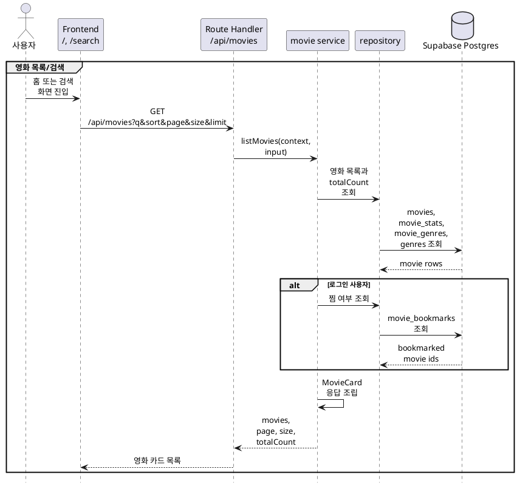
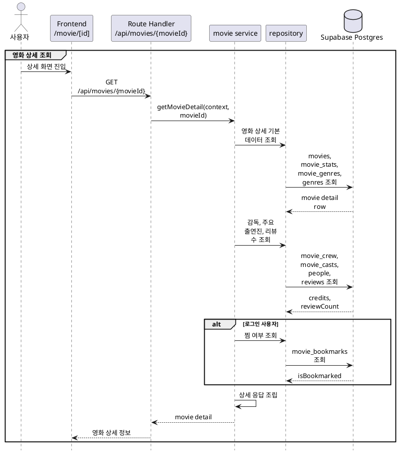

# 2. 영화 기본 데이터/탐색 구현 방안

영화 기본 데이터와 탐색은 **TMDB 기반 영화 카탈로그 + MovieLens/Cinemate 집계 평점 + 선택 인증 기반 찜 상태**를 기준으로 구현한다.

## 목적

비로그인 사용자도 홈, 검색, 영화 상세 화면에서 영화 정보를 탐색할 수 있어야 한다. 로그인 사용자는 동일한 응답에서 본인의 찜 여부를 함께 받아 탐색 중 바로 개인화 액션으로 이어질 수 있어야 한다.

구현 목표:

- 홈의 인기 영화, 최고 평점 영화 섹션을 DB 기반 목록 API로 전환한다.
- `/search`에서 영화 제목 검색과 페이지네이션을 제공한다.
- 온보딩 후보 조회는 MovieLens 매핑이 있는 인기 영화로 제한한다.
- `/movie/[id]`에서 영화 상세, 장르, 감독, 주요 출연진, 제작 국가, 예고편, 찜 여부, 리뷰 수를 조회한다.
- 영화 카드와 상세 화면에서 사용하는 이미지 URL은 TMDB path를 화면용 URL로 변환해 응답한다.
- 영화 도메인 서버 코드는 Route Handler와 분리해 테스트 가능한 service/rules/repository 구조로 둔다.

## 기준 문서

| 문서 | 역할 |
|---|---|
| [../api-spec/movies.md](../api-spec/movies.md) | 영화 목록, 상세, 유사 영화, 장르 API 계약 |
| [../api-spec/common.md](../api-spec/common.md) | `MovieCard`, `Genre`, 공통 인증/에러 기준 |
| [../api-spec/screen-mapping.md](../api-spec/screen-mapping.md) | 홈, 검색, 상세, 온보딩 화면별 API 사용처 |
| [../db-schema/movies.md](../db-schema/movies.md) | `movies`, `genres`, `movie_genres` 스키마 |
| [../db-schema/people.md](../db-schema/people.md) | `people`, `movie_casts`, `movie_crew` 스키마 |
| [../db-schema/item-cf-recommendations.md](../db-schema/item-cf-recommendations.md) | `movie_stats`와 표시 평점 계산 기준 |
| [../db-schema/reviews-likes.md](../db-schema/reviews-likes.md) | `movie_bookmarks`, `reviews` 기반 사용자별 상태와 리뷰 수 |
| [../service-policy.md](../service-policy.md) | 비로그인/로그인 사용자 기능 제한 정책 |

## 사용 데이터

런타임에서 직접 사용하는 주요 테이블:

| 테이블 | 런타임 역할 |
|---|---|
| `movies` | 영화 기본 표시 정보, TMDB movie id, 개봉 연도, 이미지 path, 줄거리, 러닝타임 |
| `movie_stats` | 표시 평점 계산, 인기/평점 정렬 기준 |
| `genres` | TMDB 장르 표시명 |
| `movie_genres` | 영화별 장르 연결 |
| `people` | 감독과 출연진 표시 이름, 프로필 이미지 path |
| `movie_casts` | 상세 화면 주요 출연진 |
| `movie_crew` | 상세 화면 감독 조회 |
| `movie_bookmarks` | 로그인 사용자의 `isBookmarked` 계산 |
| `reviews` | 상세 화면 `reviewCount` 계산 |

`movies.id`는 TMDB movie id이며 API의 `movieId`도 같은 값을 사용한다. `movies.movielens_id`는 온보딩 후보와 추천 도메인의 MovieLens 연결 여부를 판단하는 데 사용한다.

## 주요 흐름





## 구현 범위

### 영화 목록과 검색

`GET /api/movies`는 홈, 검색, 온보딩 후보 조회에서 공통으로 사용한다.

지원 query:

| Query | 역할 | 기본값 |
|---|---|---|
| `q` | 영화 제목 검색어 | 없음 |
| `sort` | `popular`, `rating` 정렬 | `popular` |
| `page` | 페이지 번호 | `1` |
| `size` | 페이지 크기 | `20` |
| `limit` | 홈/온보딩 섹션용 단순 제한 | 없음 |

처리 기준:

- `q`가 있으면 `movies.title`과 `movies.original_title`을 대상으로 검색한다.
- 검색어는 앞뒤 공백을 제거하고 빈 문자열이면 검색 조건을 적용하지 않는다.
- 첫 구현은 DB 호환성이 단순한 `ilike` 기반 검색으로 시작한다.
- 검색 품질 개선이 필요해지면 Postgres full-text search 또는 trigram index를 별도 변경으로 도입한다.
- `limit`이 있으면 섹션 조회로 보고 `page`, `size`보다 우선한다.
- `limit`이 없으면 `page`, `size`, `totalCount`를 반환한다.
- 온보딩 후보는 화면 요구에 따라 `sort=popular&limit=...`로 조회하되, `movies.movielens_id is not null` 조건을 적용할 수 있는 service 옵션을 둔다.

정렬 기준:

| `sort` | 정렬 |
|---|---|
| `popular` | `movie_stats.movielens_rating_count DESC`, `movie_stats.movielens_avg_rating DESC`, `movies.id ASC` |
| `rating` | 계산 평점 DESC, `movie_stats.movielens_rating_count DESC`, `movies.id ASC` |

표시 평점은 `movie_stats` 기준으로 응답 조립 시 계산한다.

```text
rating =
  (movielens_avg_rating * movielens_rating_count + cinemate_rating_sum)
  / (movielens_rating_count + cinemate_review_count)
```

분모가 0이면 `rating`은 0으로 응답한다.

### 영화 카드 응답

목록 API의 각 항목은 `MovieCard`를 따른다.

| 필드 | 조립 기준 |
|---|---|
| `id` | `movies.id` |
| `title` | `movies.title` |
| `year` | `movies.release_year` |
| `rating` | `movie_stats` 기반 계산 평점 |
| `genres` | `movie_genres`와 `genres` 조인 결과 |
| `posterUrl` | `movies.poster_path`를 TMDB 이미지 URL로 변환 |
| `isBookmarked` | 비로그인 `false`, 로그인 사용자는 `movie_bookmarks` 조회 |

`poster_path`가 없으면 `posterUrl`은 빈 문자열이 아니라 `null` 허용 여부를 API 스펙과 맞춰야 한다. 현재 공통 타입은 `string`이므로 초기 구현은 프론트에서 사용할 기본 poster placeholder URL을 서버 응답에서 제공하거나, API 스펙을 `string | null`로 조정하는 변경을 별도 논의한다.

### 영화 상세 조회

`GET /api/movies/{movieId}`는 `/movie/[id]`의 상단 정보와 상세 메타데이터를 반환한다.

조회 기준:

- `movieId`는 숫자 문자열만 허용한다.
- 대상 영화가 없으면 `404 Not Found`를 반환한다.
- 로그인 여부는 선택이며, 비로그인 요청의 `isBookmarked`는 항상 `false`다.

상세 응답 조립:

| 필드 | 조립 기준 |
|---|---|
| `id` | `movies.id` |
| `title` | `movies.title` |
| `originalTitle` | `movies.original_title` |
| `year` | `movies.release_year` |
| `rating` | `movie_stats` 기반 계산 평점 |
| `genres` | `movie_genres`, `genres` |
| `runtime` | `movies.runtime` |
| `originalLanguage` | `movies.original_language` |
| `countries` | `movies.production_countries` |
| `director` | `movie_crew.job = 'Director'`인 첫 인물 이름 |
| `cast` | `movie_casts.cast_order ASC` 기준 주요 출연진 |
| `synopsis` | `movies.overview` |
| `posterUrl` | TMDB poster URL |
| `backdropUrl` | TMDB backdrop URL 또는 `null` |
| `trailerUrl` | `movies.trailer_url` |
| `isBookmarked` | 현재 로그인 사용자의 찜 여부 |
| `reviewCount` | `reviews` count |

출연진은 초기 구현에서 상위 8명으로 제한한다. 상세 화면에서 전체 출연진 보기가 필요해지면 별도 credits API로 분리한다.

### 장르 목록

`GET /api/genres`는 검색 필터 UI 확장에 대비해 구현한다.

처리 기준:

- 인증은 불필요하다.
- `genres.name_ko`가 있으면 우선 사용하고, 없으면 `genres.name`을 응답의 `name`으로 사용한다.
- 정렬은 한국어 표시명 기준 오름차순으로 한다.

### 유사 영화

`GET /api/movies/{movieId}/similar`는 상세 화면의 비슷한 영화 영역에서 사용한다.

초기 구현 기준:

- 이미 seed된 Item CF 데이터가 있으면 `movie_similarities.source_tmdb_id = movieId`를 우선 사용한다.
- Item CF 후보가 부족하면 같은 장르의 인기 영화로 보충한다.
- 현재 영화 자신은 제외한다.
- 응답 필드는 API 스펙대로 `{ id, title, posterUrl }`만 반환한다.

이 API는 영화 기본 탐색 범위에 포함하되, 맞춤 추천 도메인의 개인화 로직과 섞지 않는다. 로그인 사용자 제외 규칙은 적용하지 않고, 상세 화면의 보조 탐색 목록으로 취급한다.

## 서버 모듈 구조

예상 파일:

| 파일 | 역할 |
|---|---|
| `server/movies/movie-service.ts` | 목록, 상세, 장르, 유사 영화 유스케이스 조립 |
| `server/movies/movie-repository.ts` | 영화, 장르, 출연진, 통계, 찜 상태 DB 조회 |
| `server/movies/movie-schema.ts` | query, path param, 응답 shape 검증 |
| `server/movies/movie-types.ts` | service/repository 전달 타입 |
| `server/movies/movie-rules.ts` | 평점 계산, 이미지 URL 조립, 정렬/페이지 입력 정규화 |
| `app/api/movies/route.ts` | `GET /api/movies` adapter |
| `app/api/movies/[movieId]/route.ts` | `GET /api/movies/{movieId}` adapter |
| `app/api/movies/[movieId]/similar/route.ts` | `GET /api/movies/{movieId}/similar` adapter |
| `app/api/genres/route.ts` | `GET /api/genres` adapter |

`server/**` 파일은 서버 전용이므로 필요한 파일 상단에 `import 'server-only'`를 선언한다. Client Component는 `server/**`를 import하지 않는다.

service는 factory와 기본 인스턴스를 함께 제공한다.

```ts
export function createMovieService(deps: MovieServiceDeps) {
  return {
    listMovies,
    getMovieDetail,
    listGenres,
    listSimilarMovies,
  };
}

export const movieService = createMovieService(defaultDeps);
```

테스트에서는 repository와 환경 설정을 fake로 주입해 DB 없이 규칙과 응답 조립을 검증한다.

## 입력 검증

Zod schema 기준:

| 대상 | 검증 |
|---|---|
| `movieId` | 양의 정수 문자열 |
| `q` | optional string, trim 후 최대 길이 제한 |
| `sort` | `popular`, `rating` enum |
| `page` | 양의 정수, 기본값 1 |
| `size` | 양의 정수, 최대 50 |
| `limit` | 양의 정수, 최대 50 |

검증 실패는 공통 기준에 따라 `400 Bad Request`를 반환한다.

Route Handler는 요청 파싱, 선택 인증 context 생성, schema 검증, service 호출, 응답 생성만 담당한다.

## 인증과 사용자별 필드

영화 탐색 API의 인증은 선택이다.

| 상태 | 처리 |
|---|---|
| 비로그인 | 영화 데이터는 정상 응답, `isBookmarked=false` |
| 로그인 | 응답 대상 영화 ID 목록으로 `movie_bookmarks`를 한 번에 조회 |
| 세션이 만료된 사용자 | 비로그인과 동일하게 처리하거나 공통 auth helper 정책에 따른다 |

목록 API에서는 N+1 조회를 피하기 위해 page 또는 limit 결과의 movie id 목록을 만든 뒤, 해당 목록에 대한 사용자의 찜 row를 한 번에 조회한다.

## DB 조회 설계

### 목록 조회

repository는 다음 데이터를 한 번의 유스케이스에서 반환한다.

| 데이터 | 조회 방식 |
|---|---|
| 영화 기본 row | `movies`와 `movie_stats` 조인 |
| 장르 | 목록 movie id 기준 `movie_genres`, `genres` 일괄 조회 |
| totalCount | `limit` 없는 페이지 조회에서만 count |
| 찜 상태 | 로그인 사용자일 때 결과 movie id 기준 일괄 조회 |

목록 조회는 `movies`와 `movie_stats`를 기준으로 먼저 정렬/제한을 확정한 뒤, 확정된 movie id에 대해 장르와 찜 상태를 붙인다. 장르 조인으로 pagination 결과가 중복되는 문제를 피하기 위해서다.

### 상세 조회

상세 repository는 다음 데이터를 조립한다.

| 데이터 | 조회 방식 |
|---|---|
| 영화 상세 row | `movies`, `movie_stats` 단건 조회 |
| 장르 | `movie_genres`, `genres` 조회 |
| 감독 | `movie_crew.job = 'Director'`와 `people` 조인 |
| 출연진 | `movie_casts.cast_order ASC`, `people` 조인 |
| 리뷰 수 | `reviews` count |
| 찜 상태 | 로그인 사용자일 때 `movie_bookmarks` 존재 여부 |

감독이 여러 명이면 `people.name`을 쉼표로 합친 문자열로 응답하거나 첫 번째 감독만 응답해야 한다. API 스펙의 `director`가 `string | null`이므로 초기 구현은 이름 오름차순 또는 DB 조회 순서의 첫 감독을 사용하고, 복수 감독 표시가 필요하면 스펙을 확장한다.

## 프론트엔드 전환 계획

초기 화면은 기존 UI 패턴을 유지하면서 데이터 공급원을 API로 교체한다.

| 화면 | 변경 |
|---|---|
| `/` | 하드코딩된 `popularMovies`, `topRatedMovies`를 서버 조회 결과로 교체 |
| `/search` | 클라이언트 필터링을 `GET /api/movies?q&page&size` 호출로 교체 |
| `/movie/[id]` | 하드코딩 상세 데이터를 `GET /api/movies/{movieId}` 결과로 교체 |
| `/onboarding` | 인기 영화 후보를 `GET /api/movies?sort=popular&limit=...` 결과로 교체 |

App Router 기준으로 페이지는 가능한 Server Component에서 초기 데이터를 조회한다. 검색 입력처럼 사용자 입력과 URL query 동기화가 필요한 부분만 Client Component로 분리한다.

## 테스트 계획

우선순위 테스트:

| 대상 | 검증 |
|---|---|
| `movie-rules.test.ts` | 평점 계산, 이미지 URL 조립, pagination 기본값, 검색어 trim |
| `movie-service.test.ts` | 비로그인 찜 false, 로그인 찜 병합, 목록 응답 조립, 상세 404 처리 |
| `movie-schema.test.ts` | query/path 검증 실패 케이스 |
| Route Handler 테스트 | 잘못된 query의 400, 없는 영화의 404, 정상 응답 shape |

DB가 필요한 repository 테스트는 초기 범위에서 생략하고, Drizzle query 구현 후 별도 integration 테스트로 보강한다.

## 품질 조정 지점

초기 구현 후 조정할 수 있는 값:

| 항목 | 초기값 |
|---|---|
| 목록 `size` 최대값 | 50 |
| 홈 섹션 `limit` | 6 |
| 검색 결과 기본 `size` | 20 |
| 상세 출연진 수 | 8 |
| 유사 영화 기본 `limit` | 10 |
| TMDB poster size | `w500` |
| TMDB backdrop size | `w780` |
| TMDB profile size | `w185` |

이 값들은 service 입력 기본값 또는 config성 상수로 분리해 테스트에서 고정할 수 있게 한다.

## 구현 순서

1. `server/movies`의 schema, types, rules를 작성한다.
2. Drizzle schema와 DB client가 준비된 상태를 확인한 뒤 movie repository를 작성한다.
3. `movieService` factory와 기본 인스턴스를 작성한다.
4. `GET /api/movies`, `GET /api/movies/{movieId}`, `GET /api/genres` Route Handler를 연결한다.
5. `GET /api/movies/{movieId}/similar`를 Item CF 우선, 장르 fallback 기준으로 추가한다.
6. 홈, 검색, 상세, 온보딩 화면의 하드코딩 데이터를 API 기반으로 교체한다.
7. rules/service/schema 테스트를 추가하고 `pnpm lint`를 실행한다.

## 제외 범위

다음 항목은 이 계획의 초기 구현 범위에서 제외한다.

- 영화 데이터 seed 또는 TMDB 동기화 배치 구현
- 영화 리뷰 작성/좋아요 API 구현
- 찜 추가/삭제 API 구현
- 고급 검색 필터 UI와 장르 필터
- full-text search, trigram 기반 검색 최적화
- 관리자용 영화 데이터 수정 기능
