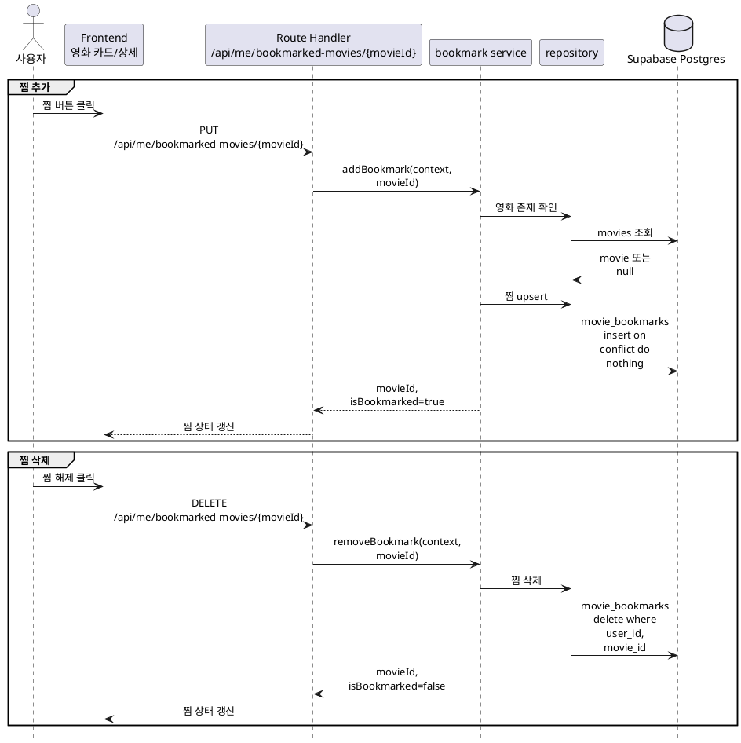
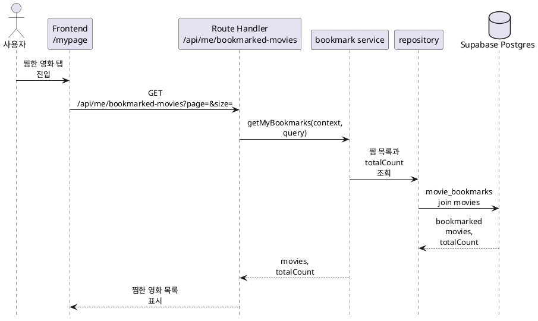

# 3. 찜 구현 방안

찜 기능은 **Supabase Auth 사용자 + `movie_bookmarks` 조인 테이블 + 영화 카드 공통 응답의 `isBookmarked` 필드**를 기준으로 구현한다.

## 목적

사용자는 영화 목록, 영화 상세, 추천 화면에서 관심 있는 영화를 찜하고, 마이페이지에서 찜한 영화 목록을 다시 확인할 수 있어야 한다.

구현 목표:

- 로그인 사용자가 영화를 찜 목록에 추가한다.
- 로그인 사용자가 이미 찜한 영화를 찜 목록에서 삭제한다.
- 마이페이지에서 로그인 사용자의 찜한 영화 목록을 페이지 단위로 조회한다.
- 영화 카드와 상세 응답에서 현재 사용자의 찜 여부를 일관되게 표시한다.
- 비로그인 사용자가 찜 버튼을 누르면 API 호출 대신 로그인 유도 UI로 연결한다.

## 기준 문서

| 문서 | 역할 |
|---|---|
| [../api-spec/reviews-bookmarks.md](../api-spec/reviews-bookmarks.md) | 찜 추가, 삭제, 목록 조회 API 계약 |
| [../api-spec/movies.md](../api-spec/movies.md) | 영화 목록/상세의 `isBookmarked` 응답 기준 |
| [../api-spec/common.md](../api-spec/common.md) | 인증 표기, 공통 에러, `MovieCard` 타입 |
| [../api-spec/screen-mapping.md](../api-spec/screen-mapping.md) | `/search`, `/movie/[id]`, `/recommend`, `/mypage` 화면별 API 연결 |
| [../db-schema/reviews-likes.md](../db-schema/reviews-likes.md) | `movie_bookmarks` 테이블과 서버 권한 검사 기준 |
| [../db-schema/movies.md](../db-schema/movies.md) | `movies` 테이블과 포스터 이미지 조합 기준 |
| [../db-schema/rls-summary.md](../db-schema/rls-summary.md) | 사용자별 데이터 접근 정책 요약 |

## 사용 데이터

런타임에서 직접 사용하는 주요 테이블:

| 테이블 | 런타임 역할 |
|---|---|
| `movie_bookmarks` | 사용자별 찜 영화 저장, 생성 시각 기준 목록 정렬 |
| `movies` | 찜 목록의 영화 제목, 개봉 연도, 포스터 표시 필드 |
| `movie_stats` | 공통 영화 카드 확장 시 평점 표시 기준 |
| `movie_genres`, `genres` | 공통 `MovieCard` 응답을 재사용할 경우 장르 표시 |
| `profiles` | `movie_bookmarks.user_id`의 사용자 FK 기준 |

`movie_bookmarks`의 기본 키는 `(user_id, movie_id)`다. 같은 사용자가 같은 영화를 여러 번 찜해도 row는 하나만 유지한다.

## 주요 흐름





## 구현 범위

### 찜 추가

`PUT /api/me/bookmarked-movies/{movieId}`는 로그인 사용자의 찜 목록에 영화를 추가한다.

처리 기준:

- `movieId`는 TMDB movie id이며 `movies.id`와 매칭한다.
- 인증되지 않은 요청은 `401 Unauthorized`를 반환한다.
- 존재하지 않는 영화는 `404 Not Found`를 반환한다.
- 이미 찜한 영화에 다시 요청해도 성공 응답을 반환한다.
- 응답은 API 스펙에 맞춰 `{ movieId, isBookmarked: true }`로 반환한다.

DB 쓰기는 `(user_id, movie_id)` unique 충돌에 안전해야 한다. Drizzle 구현에서는 insert 후 conflict 무시 또는 동등한 upsert 방식을 사용한다.

### 찜 삭제

`DELETE /api/me/bookmarked-movies/{movieId}`는 로그인 사용자의 찜 목록에서 영화를 삭제한다.

처리 기준:

- 인증되지 않은 요청은 `401 Unauthorized`를 반환한다.
- 영화 자체가 존재하지 않는 `movieId`는 `404 Not Found`와 에러 코드를 반환한다.
- 찜 row가 이미 없어도 삭제 결과는 `{ movieId, isBookmarked: false }`로 반환한다.
- 다른 사용자의 찜 row는 삭제할 수 없다.

삭제 조건은 반드시 `user_id = context.user.id`와 `movie_id = movieId`를 함께 사용한다.

### 찜한 영화 목록 조회

`GET /api/me/bookmarked-movies`는 로그인 사용자의 찜한 영화 목록을 조회한다.

처리 기준:

- 인증되지 않은 요청은 `401 Unauthorized`를 반환한다.
- query는 `page`, `size`를 사용하고 공통 Pagination 기준을 따른다.
- 기본값은 `page=1`, `size=20`으로 둔다.
- `size`는 과도한 조회를 막기 위해 최대값을 둔다. 초기 최대값은 50으로 한다.
- 목록은 `movie_bookmarks.created_at DESC`, `movie_id ASC` 순서로 정렬한다.
- 응답은 API 스펙에 맞춰 `movies: MovieCard[]`, `totalCount`를 반환한다. 찜 목록 항목의 `isBookmarked`는 `true`다.

`posterUrl`은 `movies.poster_path`에 TMDB 이미지 base URL과 크기 값을 조합해 만든다. 포스터가 없는 경우 화면 정책에 맞춰 빈 문자열보다 `null` 또는 fallback 이미지를 쓰는 편이 안전하므로, API 스펙 보완 전까지는 기존 영화 카드 변환 유틸의 반환 방식을 따른다.

## 영화 응답의 찜 상태

찜 기능 구현 후 다음 API는 로그인 상태에 따라 `isBookmarked`를 계산해야 한다.

| API | 기준 |
|---|---|
| `GET /api/movies` | 로그인 사용자의 `movie_bookmarks`를 현재 페이지 영화 ID와 매칭 |
| `GET /api/movies/{movieId}` | 해당 영화에 대한 현재 사용자의 찜 row 존재 여부 |
| `GET /api/me/recommendations/item-cf` | 추천 결과 영화 ID와 현재 사용자의 찜 row 매칭 |

비로그인 사용자의 `isBookmarked`는 항상 `false`다. 클라이언트에서 임의로 로그인 사용자 ID를 전달하지 않고, 서버의 `RequestContext`만 기준으로 계산한다.

## 서버 모듈 구조

예상 파일:

| 파일 | 역할 |
|---|---|
| `server/bookmarks/bookmark-service.ts` | 찜 추가, 삭제, 목록 조회 유스케이스 |
| `server/bookmarks/bookmark-repository.ts` | `movie_bookmarks`, `movies` DB 접근 |
| `server/bookmarks/bookmark-schema.ts` | path/query와 응답 shape 검증 |
| `server/bookmarks/bookmark-types.ts` | service/repository 전달 타입 |
| `server/bookmarks/bookmark-rules.ts` | pagination 정규화, 정렬 기준 등 순수 규칙 |
| `app/api/me/bookmarked-movies/route.ts` | `GET /api/me/bookmarked-movies` adapter |
| `app/api/me/bookmarked-movies/[movieId]/route.ts` | `PUT`, `DELETE` adapter |

`server/**` 파일은 서버 전용이므로 필요한 파일 상단에 `import 'server-only'`를 선언한다. Route Handler는 요청 파싱, 인증 확인, Zod 검증, service 호출, 응답 생성만 담당한다.

service는 다음 factory 형태를 제공한다.

```ts
export function createBookmarkService(deps: BookmarkServiceDeps) {
  return {
    addBookmark,
    removeBookmark,
    getMyBookmarks,
  };
}

export const bookmarkService = createBookmarkService(defaultDeps);
```

테스트에서는 repository와 이미지 URL 변환 의존성을 fake로 주입해 DB 없이 service 동작을 검증한다.

## 타입 및 검증

Route Handler, service, repository 사이에 전달되는 객체는 명시적인 타입으로 정의한다.

초기 입력 타입:

```ts
export type BookmarkMovieInput = {
  movieId: number;
};

export type GetMyBookmarksInput = {
  page: number;
  size: number;
};
```

Zod 검증 기준:

| 입력 | 검증 |
|---|---|
| `movieId` path | 정수, 1 이상 |
| `page` query | 정수, 1 이상, 기본값 1 |
| `size` query | 정수, 1 이상 50 이하, 기본값 20 |

`request.json()`은 사용하지 않는다. 찜 API는 path와 query만 검증한다.

## Frontend 연동

찜 버튼은 상호작용이 필요하므로 가장 작은 Client Component 경계로 분리한다.

적용 화면:

| 화면 | 동작 |
|---|---|
| `/search` | 영화 카드의 하트 클릭 시 `PUT` 또는 `DELETE` 호출 |
| `/movie/[id]` | 상세의 찜 버튼 클릭 시 현재 영화의 찜 상태 갱신 |
| `/recommend` | 추천 영화 카드의 하트 클릭 시 추천 목록의 해당 카드 상태 갱신 |
| `/mypage` | 찜한 영화 탭 진입 시 목록 조회, 필요 시 페이지네이션 |

비로그인 처리:

- 화면이 현재 사용자 상태를 알고 있으면 API 호출 전에 `/login?returnTo=현재경로`로 이동한다.
- 로그인 상태를 모르는 경우 API의 `401 Unauthorized`를 받아 로그인 유도 UI를 표시한다.
- 낙관적 업데이트를 적용하더라도 실패 시 이전 상태로 되돌린다.

찜 버튼 UI는 접근성을 위해 `aria-pressed`와 상태별 label을 제공한다. 아이콘 버튼은 기존 UI 패턴이 있으면 우선 재사용한다.

## 실패 처리

| 상황 | 처리 |
|---|---|
| 비로그인 요청 | `401 Unauthorized` |
| `movieId` 형식 오류 | `400 Bad Request` |
| 대상 영화 없음 | `404 Not Found` |
| `page`, `size` 범위 오류 | `400 Bad Request` |
| 이미 찜한 영화 추가 | 성공, `isBookmarked=true` |
| 이미 삭제된 찜 삭제 | 성공, `isBookmarked=false` |
| DB 제약 실패 | 공통 서버 에러 응답, 로그에는 requestId 포함 |

서비스 레벨에서는 권한을 서버에서 처리하고 `context.user.id` 조건을 명시적으로 사용한다. 기능 migration에는 RLS, policy, anon/authenticated grant를 추가하지 않는다.

## 테스트 계획

우선순위는 DB 없이 검증 가능한 `rules`와 `service` 테스트에 둔다.

| 대상 | 검증 |
|---|---|
| `bookmark-rules.test.ts` | pagination 기본값, 최대 size 제한, 정렬 입력 고정 |
| `bookmark-service.test.ts` | 영화 없음 `404`, 중복 추가 성공, 없는 row 삭제 성공 |
| `bookmark-service.test.ts` | 목록 조회 결과가 API 응답 형태로 매핑되는지 검증 |
| Route Handler test | 비로그인 요청 `401`, path/query 검증 실패 `400` |
| Repository integration test | `(user_id, movie_id)` 중복 방지, 본인 데이터만 조회/삭제 |

영화 목록/상세 API의 `isBookmarked` 계산은 각 API를 구현하는 도메인 테스트에서 함께 검증한다.

## 구현 순서

1. `server/bookmarks`의 schema, types, rules를 정의한다.
2. `bookmark-repository`에서 영화 존재 확인, 찜 upsert, 찜 delete, 찜 목록 조회를 구현한다.
3. `bookmark-service` factory와 기본 인스턴스를 만든다.
4. `app/api/me/bookmarked-movies`와 `app/api/me/bookmarked-movies/[movieId]` Route Handler를 연결한다.
5. 영화 목록/상세/추천 응답에서 `isBookmarked` 계산을 공통 조회 방식으로 연결한다.
6. `/search`, `/movie/[id]`, `/recommend`의 찜 버튼을 API 기반으로 전환한다.
7. `/mypage`의 찜한 영화 탭을 `GET /api/me/bookmarked-movies`로 전환한다.
8. service/rules 테스트와 가능한 경우 `pnpm lint`를 실행한다.

## 검증 기준

| 항목 | 기준 |
|---|---|
| 인증 | 로그인 사용자만 찜 추가, 삭제, 목록 조회 API를 호출할 수 있다. |
| 찜 추가 | 유효한 영화에 `PUT` 요청 시 `movie_bookmarks` row가 생성되고 `isBookmarked=true`를 반환한다. |
| 중복 추가 | 같은 영화에 여러 번 `PUT`해도 중복 row가 생기지 않는다. |
| 찜 삭제 | `DELETE` 요청 시 현재 사용자의 row만 삭제되고 `isBookmarked=false`를 반환한다. |
| 목록 조회 | `GET /api/me/bookmarked-movies`가 현재 사용자의 찜 영화만 반환한다. |
| 정렬 | 찜 목록은 최근 찜한 순서로 정렬된다. |
| 페이지네이션 | `page`, `size`, `totalCount`가 공통 Pagination 기준과 맞는다. |
| 영화 표시 | 목록 응답의 `id`, `title`, `year`, `posterUrl`이 DB 스키마 기준으로 매핑된다. |
| 비로그인 표시 | 비로그인 사용자의 영화 응답 `isBookmarked`는 항상 `false`다. |
| 화면 연동 | `/search`, `/movie/[id]`, `/recommend`, `/mypage`가 API 상태를 기준으로 찜 UI를 표시한다. |
| 권한 | 다른 사용자의 찜 목록을 조회하거나 삭제할 수 없다. |
