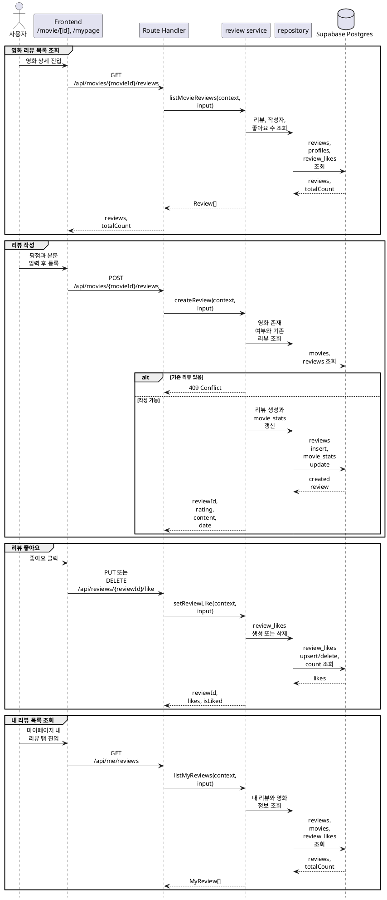

# 4. 리뷰 구현 방안

리뷰 기능은 **영화 상세 리뷰 목록 + 리뷰 작성 + 리뷰 좋아요 + 내 리뷰 목록**을 기준으로 구현한다.

## 목적

리뷰는 영화 상세 화면과 마이페이지를 연결하는 사용자 참여 기능이다. 비로그인 사용자는 영화별 리뷰를 읽을 수 있고, 로그인 사용자는 영화에 리뷰를 작성하고 다른 사용자의 리뷰에 좋아요를 남길 수 있어야 한다.

구현 목표:

- 영화 상세 화면에서 리뷰 목록을 페이지 단위로 조회한다.
- 로그인 사용자는 영화당 하나의 리뷰만 작성할 수 있다.
- 리뷰 작성 시 Cinemate 자체 평점 합계와 리뷰 수를 갱신한다.
- 로그인 사용자는 리뷰 좋아요를 추가하거나 취소할 수 있다.
- 마이페이지에서 내가 작성한 리뷰 목록을 영화 정보와 함께 조회한다.
- 리뷰 수정/삭제와 찜 기능은 이 문서의 범위에서 제외한다.

## 기준 문서

| 문서 | 역할 |
|---|---|
| [../api-spec/reviews-bookmarks.md](../api-spec/reviews-bookmarks.md) | 리뷰 목록, 리뷰 작성, 내 리뷰 목록, 리뷰 좋아요 API 계약 |
| [../api-spec/common.md](../api-spec/common.md) | `Review`, `UserSummary`, pagination, 공통 에러 기준 |
| [../api-spec/screen-mapping.md](../api-spec/screen-mapping.md) | `/movie/[id]`, `/mypage` 화면별 API 매핑 |
| [../db-schema/reviews-likes.md](../db-schema/reviews-likes.md) | `reviews`, `review_likes` 스키마와 RLS 기준 |
| [../db-schema/movies.md](../db-schema/movies.md) | 리뷰 목록과 내 리뷰 목록에 조인할 영화 표시 필드 |
| [../db-schema/users.md](../db-schema/users.md) | 리뷰 작성자 `profiles` 표시 필드 |

## 사용 데이터

런타임에서 직접 사용하는 주요 테이블:

| 테이블 | 런타임 역할 |
|---|---|
| `reviews` | 리뷰 본문, 평점, 작성자, 작성 영화, 작성 시각 저장 |
| `review_likes` | 사용자별 리뷰 좋아요 저장과 좋아요 수 집계 |
| `profiles` | 리뷰 작성자 이름과 프로필 이미지 표시 |
| `movies` | 내 리뷰 목록의 영화 제목, 개봉 연도, 포스터 표시 |
| `movie_stats` | 리뷰 작성 시 Cinemate 평점 합계와 리뷰 수 갱신 |

`reviews.movie_id`는 `movies.id`를 참조하며, 서비스의 영화 ID는 TMDB movie id를 기준으로 전달한다.

## 주요 흐름



## 구현 범위

### 리뷰 목록 조회

`GET /api/movies/{movieId}/reviews`는 영화 상세 화면의 리뷰 목록을 반환한다.

| 항목 | 기준 |
|---|---|
| 인증 | 선택 |
| Path | `movieId` |
| Query | `page`, `size`, `sort` |
| Response | `reviews: Review[]`, `totalCount` |

동작 기준:

- 비로그인 사용자도 목록을 조회할 수 있다.
- 로그인 사용자인 경우 각 리뷰의 `isLiked`를 현재 사용자 기준으로 계산한다.
- 비로그인 사용자인 경우 `isLiked=false`를 반환한다.
- 작성자 정보는 `profiles`의 `id`, `name`, `profile_image_url`을 사용한다.
- 좋아요 수는 `review_likes`를 `review_id` 기준으로 집계한다.
- 기본 정렬은 최신순으로 둔다.
- `sort`는 초기 구현에서 `latest`, `likes`를 지원한다.

정렬 기준:

| sort | 정렬 |
|---|---|
| `latest` | `reviews.created_at DESC`, `reviews.id ASC` |
| `likes` | `likes DESC`, `reviews.created_at DESC`, `reviews.id ASC` |

### 리뷰 작성

`POST /api/movies/{movieId}/reviews`는 로그인 사용자의 영화 리뷰를 생성한다.

| 항목 | 기준 |
|---|---|
| 인증 | 필요 |
| Path | `movieId` |
| Request body | `rating`, `content` |
| Response | `reviewId`, `rating`, `content`, `date` |

검증 기준:

- `rating`은 0.5 이상 5.0 이하이며 0.5 단위만 허용한다.
- `content`는 공백 제거 후 비어 있으면 `400 Bad Request`를 반환한다.
- `movieId`에 해당하는 영화가 없으면 `404 Not Found`를 반환한다.
- 같은 사용자가 같은 영화에 이미 리뷰를 작성했다면 `409 Conflict`를 반환한다.

저장 기준:

- `reviews`에 `user_id`, `movie_id`, `rating`, `content`를 저장한다.
- `unique (user_id, movie_id)` 제약을 DB에도 둔다.
- 동시 요청으로 중복 insert가 발생하면 unique violation을 `409 Conflict`로 변환한다.
- 리뷰 생성과 `movie_stats` 갱신은 하나의 트랜잭션으로 처리한다.
- `movie_stats.cinemate_rating_sum`에 작성 평점을 더한다.
- `movie_stats.cinemate_review_count`를 1 증가시킨다.

응답 후 화면 동작:

- 영화 상세 화면은 리뷰 목록을 갱신한다.
- 영화 상세 화면의 Cinemate 평균 평점도 갱신 대상이다.
- 사용자가 이미 리뷰를 작성한 영화에서는 작성 폼 대신 기존 작성 안내를 표시한다.

### 리뷰 좋아요

`PUT /api/reviews/{reviewId}/like`는 좋아요를 추가하고, `DELETE /api/reviews/{reviewId}/like`는 좋아요를 취소한다.

| 항목 | 기준 |
|---|---|
| 인증 | 필요 |
| Path | `reviewId` |
| Response | `reviewId`, `likes`, `isLiked` |

동작 기준:

- 리뷰가 존재하지 않으면 `404 Not Found`를 반환한다.
- `PUT`은 이미 좋아요한 상태에서도 성공 응답을 반환하는 idempotent 동작으로 둔다.
- `DELETE`는 이미 좋아요하지 않은 상태에서도 성공 응답을 반환하는 idempotent 동작으로 둔다.
- 응답의 `likes`는 처리 후 `review_likes`의 현재 집계 수다.
- 응답의 `isLiked`는 처리 후 현재 사용자의 좋아요 여부다.

저장 기준:

- `review_likes`는 `(review_id, user_id)` 복합 PK를 사용한다.
- `PUT`은 insert 또는 on conflict do nothing으로 처리한다.
- `DELETE`는 현재 사용자 row만 삭제한다.
- 사용자는 RLS와 service 검증 모두에서 본인 좋아요만 생성/삭제할 수 있다.

### 내가 작성한 리뷰 목록 조회

`GET /api/me/reviews`는 마이페이지 내 리뷰 탭에서 사용할 목록을 반환한다.

| 항목 | 기준 |
|---|---|
| 인증 | 필요 |
| Query | `page`, `size` |
| Response | `reviews: MyReview[]`, `totalCount` |

`MyReview` 조립 기준:

| 필드 | 데이터 원천 |
|---|---|
| `id` | `reviews.id` |
| `movieId` | `reviews.movie_id` |
| `movieTitle` | `movies.title` |
| `posterUrl` | `movies.poster_path`를 TMDB 이미지 URL로 변환 |
| `rating` | `reviews.rating` |
| `content` | `reviews.content` |
| `date` | `reviews.created_at` |
| `likes` | `review_likes` 집계 |

동작 기준:

- 현재 로그인 사용자 `context.user.id`의 리뷰만 조회한다.
- 최신 작성순으로 정렬한다.
- 삭제된 영화는 현재 스키마 범위에 없으므로 inner join으로 조회한다.
- 마이페이지 카드에서는 영화 상세로 이동할 수 있도록 `movieId`를 포함한다.

## 서버 모듈 구조

예상 파일:

| 파일 | 역할 |
|---|---|
| `server/reviews/review-service.ts` | 리뷰 목록, 작성, 좋아요, 내 리뷰 목록 유스케이스 조립 |
| `server/reviews/review-repository.ts` | `reviews`, `review_likes`, `movies`, `profiles`, `movie_stats` DB 접근 |
| `server/reviews/review-schema.ts` | query, path, body, response shape Zod 검증 |
| `server/reviews/review-types.ts` | service/repository 전달 타입 |
| `server/reviews/review-rules.ts` | 평점 단위, 본문 길이, 정렬 옵션 등 순수 규칙 |
| `app/api/movies/[movieId]/reviews/route.ts` | `GET`, `POST` Route Handler |
| `app/api/reviews/[reviewId]/like/route.ts` | `PUT`, `DELETE` Route Handler |
| `app/api/me/reviews/route.ts` | `GET /api/me/reviews` Route Handler |

`server/**` 파일은 서버 전용이므로 필요한 파일 상단에 `import 'server-only'`를 선언한다. Client Component는 `server/**`를 import하지 않는다.

## Service 설계

`reviewService`는 factory 기반으로 구성한다.

```ts
export function createReviewService(deps: ReviewServiceDeps) {
  return {
    listMovieReviews,
    createReview,
    setReviewLike,
    listMyReviews,
  };
}

export const reviewService = createReviewService(defaultDeps);
```

의존성:

| 의존성 | 역할 |
|---|---|
| `reviewRepository` | 리뷰와 좋아요 DB 접근 |
| `movieRepository` 또는 repository 내부 영화 조회 | 영화 존재 여부 확인 |
| `clock` | 테스트 가능한 작성 시각 기준이 필요한 경우 주입 |

service 규칙:

- `Request`, `Response`, cookie, header에 직접 의존하지 않는다.
- 인증이 필요한 기능은 `AuthenticatedRequestContext`를 인자로 받는다.
- DB 에러는 service 또는 route adapter에서 공통 API 에러로 변환한다.
- 리뷰 작성 통계 갱신처럼 원자성이 필요한 작업은 repository 트랜잭션 메서드로 캡슐화한다.

## Zod 스키마

예상 스키마:

| 스키마 | 검증 대상 |
|---|---|
| `reviewListQuerySchema` | `page`, `size`, `sort` |
| `createReviewBodySchema` | `rating`, `content` |
| `myReviewListQuerySchema` | `page`, `size` |
| `movieIdPathSchema` | TMDB movie id |
| `reviewIdPathSchema` | UUID review id |

`createReviewBodySchema`는 `z.infer<typeof createReviewBodySchema>`로 service input 타입을 파생한다. `request.json()` 결과를 타입 단언으로 바로 사용하지 않는다.

## Repository 설계

주요 메서드:

| 메서드 | 역할 |
|---|---|
| `findMovieById(movieId)` | 리뷰 작성 전 영화 존재 여부 확인 |
| `findReviewById(reviewId)` | 좋아요 대상 리뷰 존재 여부 확인 |
| `findReviewByUserAndMovie(userId, movieId)` | 중복 작성 확인 |
| `listReviewsByMovie(input)` | 영화별 리뷰, 작성자, 좋아요 수, 현재 사용자 좋아요 여부 조회 |
| `createReviewWithStats(input)` | 리뷰 insert와 `movie_stats` 갱신을 트랜잭션으로 처리 |
| `likeReview(reviewId, userId)` | 좋아요 insert |
| `unlikeReview(reviewId, userId)` | 좋아요 delete |
| `countReviewLikes(reviewId)` | 처리 후 좋아요 수 조회 |
| `listReviewsByUser(input)` | 내 리뷰와 영화 정보, 좋아요 수 조회 |

집계 조회는 N+1 쿼리를 피한다. 리뷰 목록은 리뷰 페이지 대상 row를 먼저 정한 뒤 좋아요 수와 현재 사용자 좋아요 여부를 함께 조인하거나 서브쿼리로 가져온다.

## Route Handler 설계

Route Handler는 얇은 adapter로 유지한다.

공통 처리:

1. `createRequestContext()` 또는 `requireAuthenticatedContext()`를 호출한다.
2. path, query, body를 Zod schema로 검증한다.
3. service를 호출한다.
4. 성공 응답 또는 공통 에러 응답을 반환한다.

에러 매핑:

| 상황 | HTTP |
|---|---|
| path/query/body 검증 실패 | `400 Bad Request` |
| 인증 필요 API의 비로그인 요청 | `401 Unauthorized` |
| 영화 또는 리뷰 없음 | `404 Not Found` |
| 이미 작성한 리뷰 | `409 Conflict` |

## 프론트엔드 연동

### `/movie/[id]`

영화 상세 화면에 필요한 동작:

- 화면 진입 시 `GET /api/movies/{movieId}/reviews`를 호출한다.
- 정렬 변경과 페이지 이동 시 query를 바꿔 다시 조회한다.
- 비로그인 사용자가 리뷰 작성 또는 좋아요를 누르면 로그인 유도 UI를 표시한다.
- 리뷰 작성 성공 후 목록 첫 페이지와 영화 평점 표시를 갱신한다.
- 좋아요 성공 후 해당 리뷰 카드의 `likes`, `isLiked`만 낙관적으로 갱신할 수 있다.

### `/mypage`

마이페이지 내 리뷰 탭에 필요한 동작:

- 탭 진입 시 `GET /api/me/reviews`를 호출한다.
- 비로그인 상태면 `/login?returnTo=/mypage`로 이동한다.
- 각 리뷰 카드에 영화 포스터, 제목, 평점, 본문, 작성일, 좋아요 수를 표시한다.
- 영화 포스터나 제목 클릭 시 `/movie/{movieId}`로 이동한다.

## 테스트 계획

### Rules 테스트

대상 파일:

| 파일 | 검증 |
|---|---|
| `server/reviews/review-rules.test.ts` | 평점 범위와 0.5 단위 검증 |
| `server/reviews/review-rules.test.ts` | 빈 본문, 공백 본문 거부 |
| `server/reviews/review-rules.test.ts` | 지원하지 않는 정렬 옵션 거부 |

### Service 테스트

DB 없이 fake repository로 검증한다.

| 케이스 | 기대 결과 |
|---|---|
| 비로그인 리뷰 목록 조회 | `isLiked=false`로 목록 반환 |
| 로그인 리뷰 목록 조회 | 현재 사용자의 좋아요 여부 포함 |
| 이미 리뷰를 작성한 영화에 재작성 | `409 Conflict` 도메인 에러 |
| 없는 영화에 리뷰 작성 | `404 Not Found` 도메인 에러 |
| 정상 리뷰 작성 | 리뷰 생성과 통계 갱신 repository 호출 |
| 좋아요 추가 | `isLiked=true`, 갱신된 `likes` 반환 |
| 좋아요 취소 | `isLiked=false`, 갱신된 `likes` 반환 |
| 내 리뷰 목록 조회 | 현재 사용자 리뷰만 반환 |

### Route Handler 테스트

가능한 경우 Route Handler 단위에서 다음을 검증한다.

| 케이스 | 기대 결과 |
|---|---|
| 잘못된 `movieId` 또는 `reviewId` | `400 Bad Request` |
| 잘못된 `rating` | `400 Bad Request` |
| 인증 필요 API의 비로그인 요청 | `401 Unauthorized` |
| 중복 리뷰 작성 | `409 Conflict` |

## 구현 순서

1. `server/reviews` 도메인 타입, schema, rules를 작성한다.
2. Drizzle schema에 `reviews`, `review_likes`, 필요한 `movie_stats` 관계와 unique 제약을 반영한다.
3. `review-repository.ts`에 목록, 작성, 좋아요, 내 리뷰 조회 쿼리를 구현한다.
4. `review-service.ts`에 유스케이스와 도메인 에러 매핑을 구현한다.
5. `app/api/movies/[movieId]/reviews/route.ts`를 구현한다.
6. `app/api/reviews/[reviewId]/like/route.ts`를 구현한다.
7. `app/api/me/reviews/route.ts`를 구현한다.
8. `/movie/[id]` 리뷰 목록, 작성 폼, 좋아요 UI를 API 기반으로 연결한다.
9. `/mypage` 내 리뷰 탭을 API 기반으로 연결한다.
10. rules/service 중심 테스트를 추가하고 `pnpm lint`를 실행한다.

## 제외 범위

이번 리뷰 구현 범위에서 제외하는 기능:

- 리뷰 수정
- 리뷰 삭제
- 리뷰 신고
- 리뷰 댓글
- 스포일러 표시
- 리뷰 이미지 첨부
- 찜 API와 찜한 영화 목록 구현

리뷰 삭제를 추후 추가할 경우 `movie_stats.cinemate_rating_sum`과 `movie_stats.cinemate_review_count`를 되돌리는 트랜잭션 규칙을 함께 설계해야 한다.
