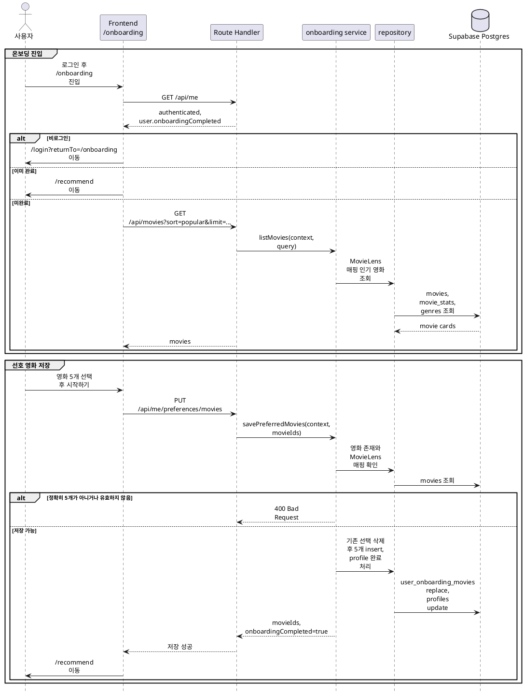

# 5. 온보딩 구현 방안

온보딩은 **로그인 사용자 + 인기 영화 후보 목록 + 선호 영화 5개 선택 저장**을 기준으로 구현한다.

## 목적

온보딩은 신규 로그인 사용자가 선호 영화 5개를 선택해 맞춤 추천의 초기 seed를 만드는 기능이다. 저장된 선호 영화는 `/recommend` 화면의 Item CF 추천 섹션에서 사용한다.

구현 목표:

- 로그인 사용자가 온보딩 화면에서 인기 영화 후보를 조회한다.
- 온보딩 후보는 MovieLens 매핑이 있는 영화로 한정한다.
- 사용자는 선호 영화 5개를 정확히 선택해야 완료할 수 있다.
- 선택 순서를 `position`으로 저장해 추천 seed 우선순위로 사용한다.
- 저장 성공 후 `profiles.onboarding_completed = true`로 갱신한다.
- 온보딩 완료 사용자는 온보딩 화면으로 다시 이동하지 않는다.

## 기준 문서

| 문서 | 역할 |
|---|---|
| [../api-spec/auth-users.md](../api-spec/auth-users.md) | `GET /api/me`, `GET/PUT /api/me/preferences/movies` API 계약 |
| [../api-spec/movies.md](../api-spec/movies.md) | `/onboarding` 후보 영화 목록 조회 기준 |
| [../api-spec/common.md](../api-spec/common.md) | 인증 표기, 공통 에러, `MovieCard` 타입 |
| [../api-spec/screen-mapping.md](../api-spec/screen-mapping.md) | `/onboarding`, `/recommend` 화면별 API 연결 |
| [../api-spec/item-cf-recommendations.md](../api-spec/item-cf-recommendations.md) | 온보딩 선택 영화가 추천 seed로 사용되는 방식 |
| [../db-schema/users.md](../db-schema/users.md) | `profiles`, `user_onboarding_movies` 스키마와 RLS 기준 |
| [../db-schema/movies.md](../db-schema/movies.md) | `movies`, `movie_genres`, `genres` 후보 영화 표시 필드 |

## 사용 데이터

런타임에서 직접 사용하는 주요 테이블:

| 테이블 | 런타임 역할 |
|---|---|
| `profiles` | 온보딩 완료 여부 저장 |
| `user_onboarding_movies` | 사용자별 선호 영화 5개와 선택 순서 저장 |
| `movies` | 온보딩 후보와 저장된 선호 영화의 기본 표시 정보 |
| `movie_stats` | 인기순 후보 정렬 기준 |
| `movie_genres`, `genres` | `MovieCard` 장르 표시 |
| `movie_bookmarks` | `MovieCard.isBookmarked` 계산이 필요한 경우 현재 사용자 찜 여부 표시 |

`user_onboarding_movies.movie_id`와 `movies.id`는 모두 TMDB movie id를 기준으로 연결한다. `movies.movielens_id`가 `not null`인 영화만 온보딩 후보로 사용한다.

## 주요 흐름



## 구현 범위

### 온보딩 후보 영화 조회

`GET /api/movies?sort=popular&limit=...`는 `/onboarding`에서 선택 가능한 영화 후보를 반환한다.

| 항목 | 기준 |
|---|---|
| 인증 | 필요 |
| Query | `sort=popular`, `limit` |
| Response | `movies: MovieCard[]`, `totalCount?` |

동작 기준:

- `/onboarding` 화면에서는 로그인 사용자인 경우에만 후보를 조회한다.
- 후보 영화는 `movies.movielens_id`가 있는 영화로 한정한다.
- 기본 정렬은 인기순으로 둔다.
- `limit`은 화면에서 충분한 선택지를 제공하되 과도한 조회를 막기 위해 최대값을 둔다. 초기 최대값은 60으로 한다.
- 영화 카드는 공통 `MovieCard` 타입을 사용한다.
- `posterUrl`은 `movies.poster_path`와 TMDB 이미지 base URL을 조합한다.
- 포스터가 없는 영화는 후보에서 제외하거나 기존 영화 카드 변환 유틸의 fallback 정책을 따른다.
- 로그인 사용자의 `isBookmarked`는 `movie_bookmarks` 기준으로 계산할 수 있다. 온보딩 선택 자체와 찜 상태는 별개다.

정렬 기준:

| sort | 정렬 |
|---|---|
| `popular` | `movie_stats.movielens_rating_count DESC`, `movie_stats.movielens_avg_rating DESC`, `movies.id ASC` |

### 내 온보딩 선호 영화 조회

`GET /api/me/preferences/movies`는 현재 사용자가 저장한 온보딩 선호 영화 목록을 반환한다.

| 항목 | 기준 |
|---|---|
| 인증 | 필요 |
| Request | 없음 |
| Response | `movies: MovieCard[]` |

동작 기준:

- 현재 로그인 사용자 `context.user.id`의 선호 영화만 조회한다.
- 목록은 `user_onboarding_movies.position ASC` 순으로 반환한다.
- 저장된 선호 영화가 없으면 빈 배열을 반환한다.
- `/onboarding` 재진입 방지 판단은 `GET /api/me`의 `onboardingCompleted`를 우선 사용한다.
- `/recommend`는 이 목록을 직접 보여줄 수 있고, 추천 API는 같은 저장 데이터를 seed로 사용한다.

### 온보딩 선호 영화 저장

`PUT /api/me/preferences/movies`는 로그인 사용자의 선호 영화 5개를 저장하고 온보딩을 완료 처리한다.

| 항목 | 기준 |
|---|---|
| 인증 | 필요 |
| Request body | `movieIds: number[]` |
| Response | `movieIds`, `onboardingCompleted` |

검증 기준:

- `movieIds`는 배열이어야 한다.
- 정확히 5개를 선택해야 한다.
- 모든 값은 1 이상의 정수 TMDB movie id여야 한다.
- 중복된 영화 ID가 있으면 `400 Bad Request`를 반환한다.
- 모든 영화는 `movies`에 존재해야 한다.
- 모든 영화는 `movielens_id`가 있어야 한다.

저장 기준:

- 저장 전 현재 사용자의 기존 `user_onboarding_movies` row를 삭제한다.
- 요청 배열 순서를 기준으로 `position` 1~5를 부여한다.
- 5개 row insert와 `profiles.onboarding_completed = true` 갱신은 하나의 트랜잭션으로 처리한다.
- `profiles.updated_at`도 함께 갱신한다.
- 저장 완료 후 응답은 요청 순서의 `movieIds`와 `onboardingCompleted: true`를 반환한다.

동시성 기준:

- 같은 사용자가 동시에 저장 요청을 보내도 최종 상태는 마지막 성공 요청의 5개 영화와 순서가 되도록 한다.
- DB의 `unique (user_id, movie_id)`, `unique (user_id, position)` 충돌은 트랜잭션 내부의 replace 방식으로 회피한다.
- FK 또는 unique violation은 API 에러로 변환한다.

## 완료 후 라우팅

온보딩 상태에 따른 화면 이동 기준:

| 상태 | 동작 |
|---|---|
| 비로그인 | `/login?returnTo=/onboarding`으로 이동 |
| 로그인, `onboardingCompleted=false` | `/onboarding` 표시 |
| 로그인, `onboardingCompleted=true` | `/recommend` 또는 이전 목적지로 이동 |
| 저장 성공 | `/recommend`로 이동 |

공통 Header나 로그인 callback 이후에도 `GET /api/me`의 `onboardingCompleted`를 확인해 미완료 사용자를 `/onboarding`으로 유도할 수 있다.

## 서버 모듈 구조

예상 파일:

| 파일 | 역할 |
|---|---|
| `server/onboarding/onboarding-service.ts` | 선호 영화 조회, 저장 유스케이스 조립 |
| `server/onboarding/onboarding-repository.ts` | `profiles`, `user_onboarding_movies`, `movies` DB 접근 |
| `server/onboarding/onboarding-schema.ts` | 요청 body와 응답 shape Zod 검증 |
| `server/onboarding/onboarding-types.ts` | service/repository 전달 타입 |
| `server/onboarding/onboarding-rules.ts` | 5개 선택, 중복 제거, position 부여 등 순수 규칙 |
| `app/api/me/preferences/movies/route.ts` | `GET`, `PUT` Route Handler |

영화 후보 목록 조회는 기존 영화 목록 도메인의 `GET /api/movies`를 확장해 처리한다. 온보딩 도메인은 저장된 사용자 선호 영화에만 책임을 둔다.

`server/**` 파일은 서버 전용이므로 필요한 파일 상단에 `import 'server-only'`를 선언한다. Client Component는 `server/**`를 import하지 않는다.

## Service 설계

`onboardingService`는 factory 기반으로 구성한다.

```ts
export function createOnboardingService(deps: OnboardingServiceDeps) {
  return {
    listPreferredMovies,
    savePreferredMovies,
  };
}

export const onboardingService = createOnboardingService(defaultDeps);
```

의존성:

| 의존성 | 역할 |
|---|---|
| `onboardingRepository` | 선호 영화와 프로필 완료 상태 DB 접근 |
| `movieCardMapper` | 저장된 영화 row를 `MovieCard` 응답으로 변환 |
| `clock` | `profiles.updated_at` 갱신 시각을 테스트 가능하게 주입 |

service 규칙:

- `Request`, `Response`, cookie, header에 직접 의존하지 않는다.
- 모든 메서드는 `AuthenticatedRequestContext`를 인자로 받는다.
- `movieIds` 검증은 Zod schema와 rules에서 나누어 처리한다.
- 영화 존재 여부와 MovieLens 매핑 여부는 repository 조회 결과를 기준으로 service에서 판정한다.
- 저장 작업의 원자성은 repository 트랜잭션 메서드로 캡슐화한다.

## Zod 스키마

예상 스키마:

| 스키마 | 검증 대상 |
|---|---|
| `savePreferredMoviesBodySchema` | `movieIds: number[]` |
| `preferredMoviesResponseSchema` | `movies: MovieCard[]` |
| `savePreferredMoviesResponseSchema` | `movieIds`, `onboardingCompleted` |

`savePreferredMoviesBodySchema`는 `z.infer<typeof savePreferredMoviesBodySchema>`로 service input 타입을 파생한다. `request.json()` 결과를 타입 단언으로 바로 사용하지 않는다.

검증 규칙:

| 입력 | 검증 |
|---|---|
| `movieIds` | 배열, 길이 5 |
| 각 `movieId` | 정수, 1 이상 |
| 중복 | 허용하지 않음 |

## Repository 설계

주요 메서드:

| 메서드 | 역할 |
|---|---|
| `listPreferredMovies(userId)` | 현재 사용자의 선호 영화와 표시 정보를 `position ASC`로 조회 |
| `findOnboardingCandidateMovies(movieIds)` | 저장 요청 영화들의 존재, MovieLens 매핑 여부 확인 |
| `replacePreferredMovies(input)` | 기존 선호 영화 삭제, 5개 insert, profile 완료 갱신을 트랜잭션으로 처리 |

`replacePreferredMovies` 입력 예시:

```ts
export type ReplacePreferredMoviesInput = {
  userId: string;
  movies: Array<{
    movieId: number;
    position: number;
  }>;
  updatedAt: Date;
};
```

조회 기준:

- 저장 검증용 영화 조회는 요청한 `movieIds` 전체를 한 번에 조회한다.
- 조회 결과 수가 요청 수보다 적으면 존재하지 않는 영화가 있는 것으로 처리한다.
- 응답 조립 시 요청 순서를 유지해야 하므로 service에서 부여한 `position`을 repository에 명시적으로 전달한다.

## Route Handler 설계

Route Handler는 얇은 adapter로 유지한다.

공통 처리:

1. `requireAuthenticatedContext()`를 호출한다.
2. `PUT`은 body를 Zod schema로 검증한다.
3. service를 호출한다.
4. 성공 응답 또는 공통 에러 응답을 반환한다.

에러 매핑:

| 상황 | HTTP |
|---|---|
| body 검증 실패 | `400 Bad Request` |
| 인증되지 않은 요청 | `401 Unauthorized` |
| 영화가 존재하지 않음 | `400 Bad Request` |
| MovieLens 매핑이 없는 영화 | `400 Bad Request` |

온보딩 저장은 사용자가 고른 후보가 유효하지 않은 입력이라는 의미가 강하므로, 없는 영화나 후보가 아닌 영화도 초기 구현에서는 `400 Bad Request`로 통일한다.

## 프론트엔드 연동

### `/onboarding`

화면 동작:

- Server Component에서 `GET /api/me` 또는 서버 세션 유틸로 인증 상태를 확인한다.
- 비로그인 사용자는 `/login?returnTo=/onboarding`으로 이동한다.
- 이미 `onboardingCompleted=true`인 사용자는 `/recommend`로 이동한다.
- 미완료 사용자는 `GET /api/movies?sort=popular&limit=...`로 후보 영화를 조회한다.
- 선택 상태와 저장 버튼은 작은 Client Component로 분리한다.
- 영화 카드는 기존 `MovieCard` UI 패턴을 우선 재사용한다.

선택 UI 기준:

- 선택한 영화는 명확한 체크 상태와 선택 순서를 표시한다.
- 선택 개수는 `0/5`부터 `5/5`까지 표시한다.
- 5개가 선택되기 전에는 시작하기 버튼을 비활성화한다.
- 5개 선택 상태에서 다른 영화를 선택하면 안내를 표시하거나 기존 선택 해제 후 선택하도록 한다. 초기 구현은 추가 선택을 막는다.
- 선택한 영화를 다시 클릭하면 선택 해제한다.
- 저장 중에는 버튼을 loading 상태로 두고 중복 제출을 막는다.
- 저장 실패 시 API 에러 메시지를 화면에 표시하고 선택 상태는 유지한다.

### `/recommend`

추천 화면 연동 기준:

- 화면 진입 시 `GET /api/me`로 온보딩 완료 여부를 확인한다.
- `onboardingCompleted=false`인 사용자는 `/onboarding`으로 이동한다.
- 완료 사용자는 `GET /api/me/recommendations/item-cf`를 호출한다.
- 추천 API는 `user_onboarding_movies.position ASC` 기준 상위 seed를 사용한다.

## 테스트 계획

### Rules 테스트

대상 파일:

| 파일 | 검증 |
|---|---|
| `server/onboarding/onboarding-rules.test.ts` | 정확히 5개 선택 검증 |
| `server/onboarding/onboarding-rules.test.ts` | 중복 영화 ID 거부 |
| `server/onboarding/onboarding-rules.test.ts` | 요청 순서 기준 position 1~5 부여 |

### Service 테스트

DB 없이 fake repository로 검증한다.

| 케이스 | 기대 결과 |
|---|---|
| 저장된 선호 영화 없음 | 빈 배열 반환 |
| 저장된 선호 영화 조회 | `position ASC` 순서의 `MovieCard[]` 반환 |
| 5개 미만 또는 초과 저장 요청 | `400 Bad Request` 도메인 에러 |
| 중복 영화 ID 저장 요청 | `400 Bad Request` 도메인 에러 |
| 존재하지 않는 영화 포함 | `400 Bad Request` 도메인 에러 |
| MovieLens 매핑 없는 영화 포함 | `400 Bad Request` 도메인 에러 |
| 정상 저장 | replace repository 호출과 `onboardingCompleted=true` 반환 |

### Route Handler 테스트

가능한 경우 Route Handler 단위에서 다음을 검증한다.

| 케이스 | 기대 결과 |
|---|---|
| 비로그인 `GET /api/me/preferences/movies` | `401 Unauthorized` |
| 비로그인 `PUT /api/me/preferences/movies` | `401 Unauthorized` |
| 잘못된 body | `400 Bad Request` |
| 정상 저장 | `200 OK`, `onboardingCompleted=true` |

### 프론트엔드 테스트

| 케이스 | 기대 결과 |
|---|---|
| 비로그인 온보딩 진입 | 로그인 화면으로 이동 |
| 완료 사용자 온보딩 진입 | 추천 화면으로 이동 |
| 5개 미선택 | 시작하기 버튼 비활성화 |
| 5개 선택 후 저장 성공 | 추천 화면으로 이동 |
| 저장 실패 | 에러 표시와 선택 상태 유지 |

## 구현 순서

1. `server/onboarding` 도메인 타입, schema, rules를 작성한다.
2. Drizzle schema에 `profiles.onboarding_completed`, `user_onboarding_movies` 관계와 unique 제약을 반영한다.
3. 영화 목록 repository에서 `/onboarding` 후보 조회를 위해 MovieLens 매핑 필터와 popular 정렬을 보장한다.
4. `onboarding-repository.ts`에 선호 영화 조회와 replace 트랜잭션을 구현한다.
5. `onboarding-service.ts`에 조회, 저장 유스케이스와 도메인 에러를 구현한다.
6. `app/api/me/preferences/movies/route.ts`에 `GET`, `PUT` Route Handler를 구현한다.
7. `/onboarding` 화면을 API 기반으로 연결하고 5개 선택 UI를 구현한다.
8. 로그인 callback 또는 보호 라우팅에서 온보딩 미완료 사용자를 `/onboarding`으로 유도한다.
9. `/recommend` 화면에서 온보딩 미완료 사용자를 `/onboarding`으로 이동시킨다.
10. rules/service 중심 테스트를 추가하고 `pnpm lint`를 실행한다.

## 제외 범위

이번 온보딩 구현 범위에서 제외하는 기능:

- 온보딩 후보 검색
- 장르별 후보 필터
- 온보딩 완료 후 선호 영화 수정 화면
- 5개 외 선택 개수 개인화
- 온보딩 질문 기반 취향 수집
- 추천 결과 피드백을 통한 seed 자동 갱신

선호 영화 수정 기능을 추후 추가할 경우 `/mypage` 또는 설정 화면에서 같은 `PUT /api/me/preferences/movies`를 재사용하되, 완료 사용자의 `/onboarding` 재진입 정책과 별도로 설계한다.
