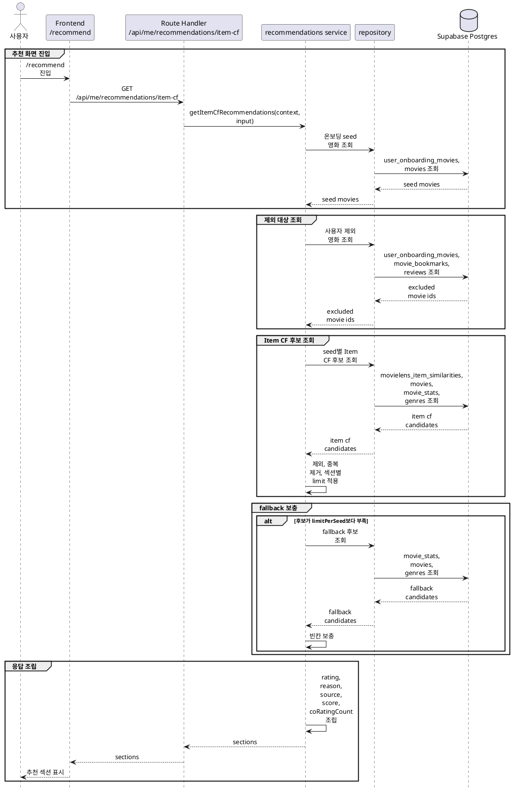

# Item CF 추천 구현 방안

Item CF 추천은 **온보딩 선호 영화 + seed된 MovieLens Item CF 유사도 + 영화 통계 + 사용자 제외 데이터**로 구현한다.

## 목적

`/recommend`는 사용자가 온보딩에서 선택한 선호 영화를 기준으로 개인화된 추천 섹션을 제공한다.

구현 목표:

- 온보딩에서 선택한 영화 순서를 기준으로 추천 섹션을 만든다.
- 미리 계산된 MovieLens Item CF 결과를 DB에서 조회한다.
- 사용자가 이미 선택, 찜, 리뷰한 영화는 추천 결과에서 제외한다.
- Item CF 후보가 부족하면 fallback 영화로 섹션의 빈칸을 채운다.
- 응답에 추천 출처와 Item CF 점검용 점수를 포함한다.
- 추천 계산 로직은 seed 단계에 두고, 런타임 API는 조회와 조립에 집중한다.

## 기준 문서

| 문서 | 역할 |
|---|---|
| [../api-spec/item-cf-recommendations.md](../api-spec/item-cf-recommendations.md) | Item CF 추천 API 계약 |
| [../db-schema/item-cf-recommendations.md](../db-schema/item-cf-recommendations.md) | 영화 통계와 Item CF 추천 DB 스키마 |
| [../db-schema/users.md](../db-schema/users.md) | 온보딩 선호 영화 DB 스키마 |
| [../db-schema/reviews-likes.md](../db-schema/reviews-likes.md) | 찜, 리뷰 제외 대상 DB 스키마 |
| [data-seed-plans/1.movielens-subset-seed-plan.md](data-seed-plans/1.movielens-subset-seed-plan.md) | MovieLens subset seed 상위 계획 |
| [data-seed-plans/1-3.movielens-recommendation-seed-plan.md](data-seed-plans/1-3.movielens-recommendation-seed-plan.md) | MovieLens 통계와 Item CF seed 생성 계획 |

## 사용 데이터

런타임에서 직접 사용하는 주요 테이블:

| 테이블 | 런타임 역할 |
|---|---|
| `user_onboarding_movies` | 사용자별 추천 seed 영화와 선택 순서 |
| `movielens_item_similarities` | 기준 영화별 Item CF 후보와 유사도 점수 |
| `movie_stats` | 표시 평점 계산, fallback 후보 정렬 |
| `movies` | 영화 제목, 개봉 연도, 포스터 등 화면 표시 필드 |
| `movie_genres`, `genres` | 추천 영화 장르 표시 |
| `movie_bookmarks` | 추천 제외 대상과 `isBookmarked` 계산 |
| `reviews` | 추천 제외 대상 |

`movielens_item_similarities`는 seed 단계에서 생성된 결과만 조회한다. 런타임에서 유사도를 새로 계산하지 않는다.

## 주요 흐름



### 추천 API

- `GET /api/me/recommendations/item-cf`는 로그인 사용자의 온보딩 선호 영화를 기준으로 추천 섹션을 반환한다.
- Route Handler는 인증 확인, query 검증, service 호출, 응답 생성만 담당한다.
- `seedLimit` 기본값은 3이며, 온보딩 선택 영화 5개 중 `position ASC` 기준으로 사용한다.
- `limitPerSeed` 기본값은 10이며, 각 seed 영화 섹션의 최종 영화 수를 의미한다.
- 온보딩 영화가 없으면 빈 `sections`를 반환한다.

### Service 구성

추천 도메인은 `server/recommendations/**` 하위에 둔다.

예상 파일:

| 파일 | 역할 |
|---|---|
| `item-cf-service.ts` | 추천 유스케이스 흐름 조립 |
| `item-cf-repository.ts` | 온보딩, 추천 후보, fallback 후보 DB 조회 |
| `item-cf-schema.ts` | query와 응답 shape 검증 |
| `item-cf-types.ts` | service, repository 간 전달 타입 |
| `item-cf-rules.ts` | 제외, 중복 제거, limit, fallback 병합 규칙 |

service는 `createItemCfRecommendationService(deps)` factory를 제공한다. 테스트에서는 repository를 fake로 주입해 DB 없이 추천 조립 규칙을 검증한다.

### Item CF 후보 조회

seed 영화별로 `movielens_item_similarities.source_tmdb_id`를 조회한다.

정렬 기준:

```text
score DESC,
co_rating_count DESC,
target_tmdb_id ASC
```

조회 시점에는 `limitPerSeed`보다 넉넉하게 가져온다. 제외 대상과 중복 제거를 거치면 후보 수가 줄어들 수 있기 때문이다.

Item CF 후보의 응답 필드:

| 필드 | 값 |
|---|---|
| `source` | `item_cf` |
| `score` | `movielens_item_similarities.score` |
| `coRatingCount` | `movielens_item_similarities.co_rating_count` |

### 제외와 중복 제거

추천 결과에서 제외할 영화:

| 대상 | 이유 |
|---|---|
| 온보딩 선택 영화 | 이미 사용자가 선호 영화로 고른 항목 |
| 찜한 영화 | 이미 사용자가 저장한 항목 |
| 리뷰한 영화 | 이미 사용자가 평가한 항목 |
| 같은 응답 내 노출 영화 | 여러 섹션에서 같은 영화가 반복되는 것을 방지 |

중복 제거는 응답 조립 단계에서 seed 순서대로 처리한다. 앞선 seed 섹션에 먼저 들어간 영화는 뒤 섹션에서 제외한다.

### fallback 처리

Item CF 후보가 `limitPerSeed`보다 부족하면 fallback 후보로 빈칸을 채운다.

fallback 후보는 `movie_stats`를 기준으로 조회한다.

정렬 기준:

```text
movielens_rating_count DESC,
movielens_avg_rating DESC,
tmdb_id ASC
```

fallback 후보에도 온보딩 선택 영화, 찜한 영화, 리뷰한 영화, 같은 응답 내 노출 영화 제외 규칙을 동일하게 적용한다.

fallback 후보의 응답 필드:

| 필드 | 값 |
|---|---|
| `source` | `fallback` |
| `score` | null |
| `coRatingCount` | null |

### 표시 평점 계산

`rating`은 `movie_stats`의 MovieLens 집계와 Cinemate 리뷰 집계를 합쳐 계산한다.

```text
rating =
  (movielens_avg_rating * movielens_rating_count + cinemate_rating_sum)
  / (movielens_rating_count + cinemate_review_count)
```

분모가 0이면 `rating`은 0 또는 null로 응답한다. API 구현 시 화면 처리 방식을 기준으로 하나로 고정한다.

### 추천 이유

초기 구현은 정적 템플릿으로 `reason`을 생성한다.

Item CF 추천:

```text
{seedMovie.title}을 좋아한 사용자들이 함께 높게 평가한 영화
```

fallback 추천:

```text
많은 사용자가 높게 평가한 영화
```

추천 이유는 DB에 저장하지 않고 API 응답 조립 시 생성한다.

## 품질 조정 지점

런타임 API가 직접 조정하는 값:

| 항목 | 영향 |
|---|---|
| `seedLimit` | 추천 섹션 수와 기준 영화 범위 |
| `limitPerSeed` | 섹션별 추천 개수 |
| Item CF 후보 fetch 배수 | 제외 후에도 충분한 후보를 확보할 가능성 |
| fallback 사용 여부 | 추천 섹션을 항상 채울지 여부 |
| 응답 내 중복 제거 범위 | 섹션 다양성 |

seed 단계에서 조정하는 값:

| 항목 | 영향 |
|---|---|
| `similarityMethod` | 영화 간 유사도 계산 방식 |
| `minCoRatingCount` | 함께 평가한 사용자 수 기준 |
| `minSimilarityScore` | 낮은 유사도 후보 제외 기준 |
| `maxSimilarMoviesPerSource` | 기준 영화별 저장 후보 수 |
| `storeBidirectionalCandidates` | 양방향 추천 후보 생성 여부 |

seed 생성 파라미터는 [data-seed-plans/1-3.movielens-recommendation-seed-plan.md](data-seed-plans/1-3.movielens-recommendation-seed-plan.md)에서 관리한다.

## 실패 처리

- 인증되지 않은 요청은 실패한다.
- query가 허용 범위를 벗어나면 validation error를 반환한다.
- 온보딩을 완료하지 않은 사용자는 빈 `sections`를 반환하거나 온보딩 필요 상태를 반환한다. 최종 정책은 API 구현 시 화면 라우팅 정책과 맞춘다.
- 특정 seed 영화에 Item CF 후보가 없으면 fallback으로 채운다.
- fallback까지 부족하면 가능한 개수만 반환한다.
- 영화 상세 필수 필드가 없는 후보는 응답에서 제외한다.

## 검증 기준

| 항목 | 기준 |
|---|---|
| 인증 | 로그인 사용자만 `GET /api/me/recommendations/item-cf`를 호출할 수 있다. |
| query 검증 | `seedLimit`, `limitPerSeed`가 허용 범위를 벗어나면 실패한다. |
| seed 선택 | `user_onboarding_movies.position ASC` 기준으로 seed 영화를 선택한다. |
| 섹션 수 | 최대 `seedLimit`개 섹션을 반환한다. |
| 섹션별 추천 수 | 각 섹션은 최대 `limitPerSeed`개 영화를 반환한다. |
| Item CF 정렬 | 후보는 `score DESC`, `co_rating_count DESC`, `target_tmdb_id ASC` 순서로 사용한다. |
| 제외 대상 | 온보딩 선택, 찜, 리뷰 영화는 추천 결과에 포함되지 않는다. |
| 중복 제거 | 같은 응답 안에서 동일 영화가 여러 섹션에 중복 노출되지 않는다. |
| fallback | Item CF 후보가 부족하면 fallback으로 빈칸을 채운다. |
| fallback 정렬 | fallback 후보는 `movielens_rating_count DESC`, `movielens_avg_rating DESC`, `tmdb_id ASC` 순서로 사용한다. |
| 추천 출처 | Item CF 추천은 `source = item_cf`, fallback 추천은 `source = fallback`으로 응답한다. |
| 점수 필드 | Item CF 추천은 `score`, `coRatingCount`를 포함하고 fallback 추천은 둘 다 null이다. |
| 찜 상태 | 현재 사용자가 찜한 영화의 `isBookmarked`를 정확히 계산한다. |
| 표시 평점 | `movie_stats` 기준 계산식으로 `rating`을 응답한다. |
| 테스트 | service와 rules는 DB 의존성을 fake로 주입해 테스트할 수 있다. |
