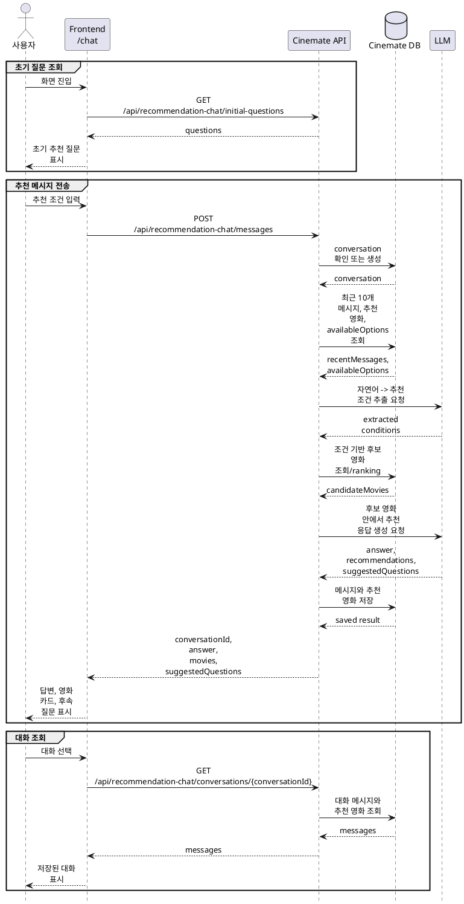

# AI 영화 추천 채팅 구현 방안

AI 영화 추천 채팅은 별도 모델 학습 없이 **LLM API + 영화 메타데이터 + MovieLens Tag Genome 기반 후보 + 최근 대화 기록**으로 구현한다.

## 목적

`/chat`은 사용자가 자연어로 상황, 분위기, 장르, 감정, 취향을 입력하면 조건에 맞는 영화를 추천하는 경험을 제공한다.

구현 목표:

- 사용자 메시지에서 추천 조건을 해석한다.
- 대화가 이어질수록 최근 맥락을 반영해 조건을 좁히거나 수정한다.
- DB에 있는 영화만 추천 결과로 반환한다.
- 추천 답변과 추천 영화 카드를 함께 제공한다.
- 추천 대화 기록을 저장해 사용자가 이전 대화를 다시 볼 수 있게 한다.

## 기준 문서

| 문서 | 역할 |
|---|---|
| [../api-spec/recommendation-chat.md](../api-spec/recommendation-chat.md) | AI 영화 추천 채팅 API 계약 |
| [../db-schema/recommendation-chat.md](../db-schema/recommendation-chat.md) | 추천 채팅 대화 저장 DB 스키마 |
| [../api-spec/item-cf-recommendations.md](../api-spec/item-cf-recommendations.md) | 맞춤 추천 API와 Item CF 추천 응답 기준 |
| [6.item-cf-implementation-plan.md](6.item-cf-implementation-plan.md) | Item CF 추천 구현 방향 |
| [data-seed-plans/1.movielens-subset-seed-plan.md](data-seed-plans/1.movielens-subset-seed-plan.md) | MovieLens subset seed 상위 계획 |
| [data-seed-plans/1-3.movielens-recommendation-seed-plan.md](data-seed-plans/1-3.movielens-recommendation-seed-plan.md) | 추천용 MovieLens 데이터 seed 계획 |

## 사용 데이터

런타임에서 직접 사용하는 주요 데이터:

| 데이터 | 런타임 역할 |
|---|---|
| `movies` | 추천 가능한 영화 기본 정보 |
| `genres` / 영화 장르 연결 | 장르 조건 해석과 카드 표시 |
| `movie_tags` | LLM이 선택할 수 있는 MovieLens Tag Genome tag 목록 |
| `movie_tag_relevances` | tag 조건과 맞는 후보 탐색과 ranking |
| `movie_stats` | 후보 영화의 평점 계산과 보충 정렬 |
| `bookmarks` | 사용자가 이미 찜한 영화 제외 또는 표시 |
| `reviews` | 사용자가 이미 평가한 영화 제외 또는 선호 힌트로 활용 |
| `recommendation_chat_conversations` | 사용자별 추천 대화 세션 |
| `recommendation_chat_conversation_messages` | 사용자 메시지와 AI 응답 기록 |
| `recommendation_chat_conversation_message_movies` | 응답 메시지에 연결된 추천 영화 목록 |

## 주요 흐름



### 추천 질문 조회

- `GET /api/recommendation-chat/initial-questions`는 `/chat` 화면 진입 시 초기 추천 질문을 반환한다.
- 초기 추천 질문은 사용자 메시지나 대화 맥락을 반영하지 않는다.
- 기본 질문은 DB 저장이 필요 없으면 서버 상수로 시작한다.
- 사용자 메시지 기반 후속 질문은 메시지 전송 응답의 `suggestedQuestions`로 반환한다.

### 메시지 전송

- `POST /api/recommendation-chat/messages`는 사용자 메시지를 처리하고 추천 답변을 생성한다.
- `conversationId`가 없으면 service에서 새 conversation을 생성한 뒤 메시지를 처리한다.
- `conversationId`가 있으면 현재 사용자의 conversation인지 먼저 확인한다.
- 최근 10개 메시지와 response 메시지에 연결된 추천 영화를 함께 조회한다.
- LLM은 현재 사용자 메시지와 최근 context를 바탕으로 추천 조건을 추출한다.
- 서버는 추출된 조건으로 DB에 존재하는 후보 영화를 조회하고 ranking한다.
- LLM은 최종 답변 문장, 추천 이유, 후속 추천 질문을 생성하되, 존재하지 않는 영화 ID를 새로 만들 수 없다.
- 응답의 `suggestedQuestions`는 현재 사용자 메시지와 최근 대화 맥락을 기반으로 한 후속 질문이다.
- LLM 호출이 실패하면 잘못된 추천 응답 메시지를 저장하지 않는다.

### 대화 조회

- `GET /api/recommendation-chat/conversations`는 사용자의 추천 대화 목록을 반환한다.
- `GET /api/recommendation-chat/conversations/{conversationId}`는 저장된 메시지와 메시지별 추천 영화, 후속 질문을 반환한다.
- 다른 사용자의 conversation은 조회할 수 없다.

## 자연어 -> 추천 조건 추출과 후보 영화 선별

자연어에서 추천 조건을 추출하는 단계는 LLM을 사용하고, 후보 영화 조회와 ranking은 서버가 수행한다. LLM에 전체 영화 목록을 넘기지 않고, 서버가 DB에 존재하는 후보만 좁혀 최종 응답 생성에 사용한다.

초기 구현:

1. conversation 권한을 확인한다.
2. 최근 10개 메시지와 response 메시지에 연결된 추천 영화 목록을 조회한다.
3. 현재 사용자 메시지, 최근 대화, 추천 영화, `availableOptions`를 LLM에 전달해 추천 조건을 추출한다.
4. 추출된 조건의 장르, tag, 연도 범위, 국가, 언어, 제외 조건을 서버가 DB query와 ranking에 사용한다.
5. 장르 조건이 있으면 영화 장르로 1차 필터링한다.
6. tag 조건은 `movie_tag_relevances`의 relevance를 사용해 후보를 ranking한다.
7. 사용자가 이미 찜하거나 리뷰한 영화는 기본적으로 제외한다.
8. 후보가 부족하면 제외 조건을 유지한 채 평점이 높은 영화로 보충한다.
9. 상위 후보만 LLM 입력에 포함해 최종 추천 목록, 추천 이유, 응답 문장, 후속 질문을 생성한다.

초기 버전은 LLM 기반 자연어 -> 추천 조건 추출과 Tag Genome relevance ranking으로 시작한다. 품질이 부족하면 같은 DB 데이터 안에서 조건 schema와 ranking 기준만 개선한다.

## LLM 인터페이스

LLM 호출은 자연어 -> 추천 조건 추출과 추천 응답 생성으로 나눈다. LLM 출력은 schema로 검증하고, schema 검증에 실패하면 재시도하거나 fallback 응답을 반환한다.

### 자연어 -> 추천 조건 추출

서버가 LLM에 전달하는 값:

```json
{
  "currentMessage": "string",
  "recentMessages": [
    {
      "role": "request",
      "content": "string"
    },
    {
      "role": "response",
      "content": "string",
      "recommendedMovies": [
        {
          "movieId": 0,
          "title": "string",
          "reason": "string"
        }
      ],
      "suggestedQuestions": ["string"]
    }
  ],
  "availableOptions": {
    "genres": ["string"],
    "tags": ["string"],
    "countries": ["string"],
    "languages": ["string"]
  }
}
```

`recentMessages`는 현재 conversation의 최근 10개 메시지만 포함한다. `response` 메시지에는 해당 응답에서 추천한 영화와 후속 질문을 함께 포함한다.

초기 구현에서는 서버가 DB에 존재하는 전체 옵션을 `availableOptions`로 전달한다.

- `genres`: 전체 `genres` 목록
- `tags`: 전체 `movie_tags` 목록
- `countries`: `movies.production_countries`의 전체 국가 코드
- `languages`: `movies.original_language`에서 추출한 전체 언어 코드

LLM이 반환해야 하는 값:

```json
{
  "intent": "new_recommendation | refine_previous | ask_clarifying_question",
  "genres": ["string"],
  "tags": ["string"],
  "yearRange": {
    "from": 1990,
    "to": 2020
  },
  "countries": ["string"],
  "languages": ["string"],
  "exclude": {
    "genres": ["string"],
    "tags": ["string"],
    "movieIds": [0],
    "keywords": ["string"]
  },
  "desiredCount": 5,
  "constraintsSummary": "string"
}
```

LLM은 `availableOptions`에 포함된 값만 `genres`, `tags`, `countries`, `languages`에 반환한다. 매핑되지 않는 사용자 표현은 `exclude.keywords` 또는 별도 검색 keyword로만 사용한다.

### 추천 응답 생성

서버가 LLM에 전달하는 값:

```json
{
  "currentMessage": "string",
  "recentMessages": [],
  "conditions": {
    "intent": "new_recommendation | refine_previous | ask_clarifying_question",
    "genres": ["string"],
    "tags": ["string"],
    "yearRange": {
      "from": 1990,
      "to": 2020
    },
    "countries": ["string"],
    "languages": ["string"],
    "exclude": {
      "genres": ["string"],
      "tags": ["string"],
      "movieIds": [0],
      "keywords": ["string"]
    },
    "desiredCount": 5,
    "constraintsSummary": "string"
  },
  "candidateMovies": [
    {
      "id": 0,
      "title": "string",
      "year": 2000,
      "genres": ["string"],
      "rating": 4.0,
      "overview": "string",
      "tagMatches": [
        {
          "tag": "string",
          "relevance": 0.0
        }
      ]
    }
  ]
}
```

`conditions`는 앞 단계인 자연어 -> 추천 조건 추출의 출력값이다. 추천 응답 생성 LLM은 이 조건을 기준으로 후보 영화 안에서 최종 추천 목록과 이유를 작성한다.

LLM이 반환해야 하는 값:

```json
{
  "answer": "string",
  "recommendations": [
    {
      "movieId": 0,
      "reason": "string"
    }
  ],
  "suggestedQuestions": ["string"]
}
```

최종 추천 응답의 `movieId`는 `candidateMovies.id` 안에서만 선택한다. 영화 카드에 필요한 제목, 포스터, 평점, 장르 필드는 LLM 응답을 신뢰하지 않고 DB 조회 결과로 조립한다.

## 추천 결과 저장

- 사용자 입력은 `role = 'request'` 메시지로 저장한다.
- AI 답변은 `role = 'response'` 메시지로 저장한다.
- LLM의 구조화 출력과 `suggestedQuestions`는 response 메시지의 `raw_response`에 저장한다.
- 추천 영화 목록은 response 메시지 기준으로 `recommendation_chat_conversation_message_movies`에 저장한다.
- 전체 prompt 전문은 저장하지 않는다.

## 검증 기준

| 항목 | 기준 |
|---|---|
| 초기 추천 질문 | `/chat` 진입 시 초기 추천 질문이 반환된다. |
| 권한 | 다른 사용자의 conversation에 메시지를 보내거나 조회할 수 없다. |
| 메시지 처리 | `conversationId`가 없어도 첫 메시지와 함께 새 대화 생성 후 추천을 처리한다. |
| 자연어 -> 추천 조건 추출 | 현재 메시지, 최근 10개 메시지, response별 추천 영화를 바탕으로 추천 조건을 추출한다. |
| 후보 선별 | 서버가 DB에 존재하는 영화만 추천 후보로 사용한다. |
| 장르 조건 | 사용자가 장르를 언급하면 후보 선별에 반영된다. |
| tag 조건 | `movie_tag_relevances.relevance`가 후보 ranking에 반영된다. |
| 추천 응답 | 응답에 자연어 답변, 추천 영화 카드 데이터, 후속 질문이 함께 포함된다. |
| 메시지 저장 | 사용자 메시지, AI 응답, 추천 영화 연결이 저장된다. |
| 후속 질문 저장 | 응답 생성 시점의 `suggestedQuestions`가 `raw_response`에 저장된다. |
| 대화 조회 | 저장된 대화 목록과 메시지를 다시 조회할 수 있다. |
| 실패 처리 | LLM 호출 실패 시 잘못된 AI 응답 row를 남기지 않는다. |
| 테스트 | service와 rules는 DB/LLM 의존성을 fake로 주입해 테스트할 수 있다. |

## 추후 성능 개선

- `availableOptions` 목록이 커져 LLM 비용, 지연 시간, 조건 선택 품질 문제가 생기면 현재 메시지와 최근 대화 기반 후보 옵션으로 축소한다.
