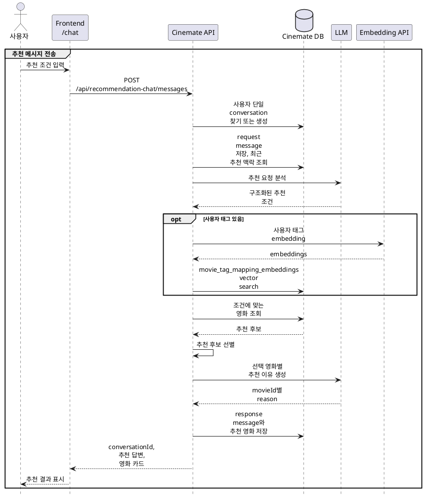

# AI 영화 추천 채팅 구현 방안

## 목적

`/chat`은 사용자가 자연어로 장르, 국가, 언어, 개봉 시기, 러닝타임, 분위기, 감정, 소재 같은 영화 콘텐츠 조건을 입력하면 조건에 맞는 영화를 추천하는 경험을 제공한다.

## 용어

| 용어 | 의미 |
|---|---|
| 추출 메타데이터 | 사용자 자연어에서 뽑은 영화 메타데이터 기반 조건. 장르, 국가, 언어, 연도, 러닝타임 등 |
| 사용자 태그 | 사용자 자연어에서 뽑은 영화 콘텐츠 속성 표현이며 아직 Cinemate 태그와 매핑되기 전의 값. 감성, 분위기, 소재, 장르적 결, 서사 상황을 포함한다. |
| Cinemate 태그 | Cinemate 추천에서 감성, 분위기, 소재 조건을 표현하는 서비스 내부 태그 |
| 추천 후보 | 추출 메타데이터와 Cinemate 태그 기반으로 조회한 추천 가능한 영화 목록 |
| 후보 선별 | 추천 후보를 점수화해 최종 추천 영화로 좁히는 과정 |

## 지원 범위

이번 개발의 지원 범위는 영화 추천 요청 이해, 조건 기반 추천, 일부 후속 요청 처리, 중복 추천 방지로 한정한다.

### 지원하는 요청

| 구분 | 지원 내용 | 예시 |
|---|---|---|
| 신규 추천 | 자연어에서 장르, 국가, 언어, 개봉 시기, 러닝타임, 분위기 조건을 추출해 추천한다. | 잔잔한 일본 로맨스 영화 추천해줘 |
| 조건 변경 | 이전 추천 조건 일부를 유지하고 사용자가 바꾼 조건만 반영한다. | 한국 영화로 |
| 조건 대체 | 이전 조건 중 사용자가 명시적으로 바꾼 조건을 새 조건으로 교체한다. | 로맨스 말고 코미디로 |
| 중복 제외 | 같은 대화에서 이미 추천한 영화는 다시 추천하지 않는다. | 아까 추천한 영화 말고, 다른 거 추천해줘 |

### 후속 요청 처리 기준

- “한국 영화로”처럼 일부 조건만 말한 경우, 이전 추천 조건 중 유지 가능한 조건을 함께 사용한다.
- “로맨스 말고 코미디로”처럼 제외 또는 대체 표현이 있으면 해당 조건을 새 조건으로 교체한다.
- “좀 더 밝은 걸로”처럼 비교 표현이 있으면 정량적 차이를 계산하지 않고 “밝은”, “가벼운”, “우울하지 않은” 조건으로 해석한다.

### 지원하지 않는 요청

| 입력 유형 | 처리 방식 | 예시 |
|---|---|---|
| 추천 조건이 아닌 대화 | 추천 후보 조회를 하지 않고 고정 안내 응답을 저장한다. | 고마워, 안녕 |
| 영화 정보 질의 | 추천 후보 조회를 하지 않고 고정 안내 응답을 저장한다. | 줄거리 알려줘 |
| 감독/배우/유사영화 기반 요청 | 추천 후보 조회를 하지 않고 고정 안내 응답을 저장한다. | 봉준호 감독 영화 추천해줘, 기생충 비슷한 영화 추천해줘 |
| 영화 콘텐츠 속성이 아닌 관람 상황/환경만 있는 요청 | 추천 후보 조회를 하지 않고 고정 안내 응답을 저장한다. | 친구랑 볼만한 거, 심심할 때 볼 거, 저녁에 볼 거, OTT에서 볼 거 |
| 조건이 너무 넓거나 모호한 요청 | 추천 후보 조회를 하지 않고 고정 안내 응답을 저장한다. | 아무거나, 볼만한 거, 내 스타일 |
| 평점/인기도만 있는 요청 | 추천 후보 조회를 하지 않고 고정 안내 응답을 저장한다. | 평점 높은 영화 추천해줘, 인기 많은 영화 추천해줘, 숨은 명작 추천해줘 |

미지원 입력도 conversation과 request message는 저장한다. response message에는 아래 고정 안내 문구를 저장하고, 추천 영화 목록은 비워 둔다.

```text
현재 추천 채팅은 배우, 감독, 특정 영화와 비슷한 작품, 줄거리/영화 정보, 관람 상황, OTT, 평점/인기도만으로는 추천할 수 없어요. 장르, 제작 국가, 언어, 개봉 시기, 러닝타임 같은 영화 메타데이터나 분위기, 감정, 소재 같은 영화 속성 정보를 포함해서 다시 물어봐 주세요.
```

## 주요 흐름



## 추천 요청 분석

### 초기 추천 질문

`GET /api/recommendation-chat/initial-questions`는 사용자 메시지나 대화 맥락을 반영하지 않는 서버 상수 질문 3개를 반환한다. 이 질문은 `/chat` 화면의 추천 질문 탭에서 사용자가 첫 추천 요청을 시작하기 위한 예시이며, 대화 진행 중 갱신하지 않는다.

초기 질문 예시:

```json
{
  "questions": [
    "주말에 보기 좋은 영화 추천해줘",
    "잔잔한 감성의 일본 영화 추천해줘",
    "러닝타임 2시간 이하 코미디 추천해줘"
  ]
}
```

이번 구현에서는 추천 응답마다 후속 질문을 생성하는 `suggestedQuestions`를 제공하지 않는다.

자연어 조건 해석은 LLM이 현재 사용자 메시지, 최근 추천 요청-응답 3쌍, DB에서 조회한 선택 가능 메타데이터 목록을 함께 참고해 추천 조건을 구조화한다. 후속 요청인 경우 이전 조건을 반영한 최종 추천 조건을 반환한다.

아래는 “잔잔한 일본 로맨스 영화 추천해줘” 이후 후속 요청으로 “한국 영화로”를 입력했을 때의 예시다.

LLM 분석 입력 예시:

```json
{
  "currentMessage": "한국 영화로",
  "availableOptions": {
    "genres": [
      {
        "id": 10749,
        "name": "Romance",
        "nameKo": "로맨스"
      },
      {
        "id": 35,
        "name": "Comedy",
        "nameKo": "코미디"
      }
    ],
    "countries": [
      {
        "code": "JP"
      },
      {
        "code": "KR"
      }
    ],
    "languages": [
      {
        "code": "ja"
      },
      {
        "code": "ko"
      }
    ]
  },
  "recentExchanges": [
    {
      "request": "잔잔한 일본 로맨스 영화 추천해줘",
      "response": "요청하신 조건에 맞는 영화를 골라봤어요.",
      "movies": [
        {
          "id": 101,
          "title": "샘플 영화 A"
        },
        {
          "id": 102,
          "title": "샘플 영화 B"
        }
      ]
    }
  ]
}
```

LLM 분석 결과 예시:

```json
{
  "intent": "refine_recommendation",
  "genreIds": [10749],
  "countryCodes": ["KR"],
  "languageCodes": ["ko"],
  "yearRange": null,
  "runtimeRange": null,
  "userTagQueries": [
    {
      "userTag": "잔잔한",
      "embeddingTerms": ["잔잔한", "차분한", "고요한", "느린 호흡", "감성적인", "일상 정서", "여운"]
    }
  ],
  "excludedTerms": ["영화", "추천해줘"],
  "confidence": 0.88
}
```

LLM은 `genreIds`, `countryCodes`, `languageCodes`를 `availableOptions`에 포함된 값 중에서만 선택해야 한다. 서버는 LLM 응답을 schema로 검증하고, 선택 가능 목록에 없는 값은 추천 조건으로 사용하지 않는다.

### 추출 메타데이터

추출 메타데이터는 `movie_tags`에서 찾지 않고, 각 조건의 authoritative source를 사용한다.

| 조건 | DB 기준 | 예시 |
|---|---|---|
| 장르 | `genres`, `movie_genres`의 `genreIds` | 코미디, 로맨스, 공포, 애니메이션, 가족 영화 |
| 국가 | `movies.production_countries`의 `countryCodes` | 일본 영화, 한국 영화, 프랑스 영화 |
| 언어 | `movies.original_language`의 `languageCodes` | 일본어 영화, 영어 영화, 한국어 영화 |
| 연도 | `movies.release_year` | 90년대, 2000년대, 최신 영화, 고전 영화 |
| 러닝타임 | `movies.runtime` | 2시간 이하, 90분 이하, 짧은 영화 |

평점, 인기도, 숨은 명작 여부는 MVP에서 사용자 입력 조건으로 추출하지 않는다. `movie_stats` 기반 표시 평점과 평가 수는 태그 조건이 없는 후보의 기본 정렬 보조 기준으로만 사용한다. `평점 높은`, `인기 많은`, `숨은 명작`처럼 평점/인기도 표현만 있는 요청은 지원하지 않는 요청으로 처리한다.

### 사용자 태그

`영화`, `추천해줘`, `볼 만한`, `찾아줘` 같은 요청 표현은 추천 조건에서 제외한다. 남은 표현 중 영화에 붙을 수 있는 감성, 분위기, 소재, 장르적 결, 서사 상황 같은 콘텐츠 속성 phrase만 사용자 태그로 사용한다.

관람 상황, 시간대, 플랫폼, 사용자 상태, 모호한 품질 요청은 사용자 태그로 사용하지 않는다. 예를 들어 `친구랑`, `심심할 때`, `저녁에`, `OTT에서`, `아무거나`, `볼만한`, `내 스타일`은 Cinemate 태그 vector search 대상이 아니다. 이런 표현만 있는 요청은 지원하지 않는 요청으로 처리하고, 다른 조건과 함께 들어온 경우에는 해당 표현을 `excludedTerms`에 넣고 추천 조건에서는 제외한다.

LLM 분석 결과에서는 사용자 태그를 `userTagQueries`로 반환한다. 각 항목의 `userTag`는 기존 사용자 태그 의미를 유지하고, `embeddingTerms`는 해당 사용자 태그를 Cinemate 태그 vector search에 넣기 위한 검색 표현 조각이다. 서버는 `embeddingTerms.join(" ")`를 embedding input으로 사용하고, 검색 결과는 같은 항목의 `userTag`에 대한 Cinemate 태그 매핑으로 저장한다.

사용자 태그 예시:

- 잔잔한 감성
- 감동적인
- 먹먹한
- 여운 남는
- 힐링되는
- 긴장감 있는
- 무서운
- 따뜻한
- 생각할 거리 있는

`embeddingTerms` 생성 규칙:

- 정확히 7개를 생성한다.
- 첫 번째 term은 반드시 `userTag` 원문과 동일하게 둔다.
- 나머지 6개는 한국어 중심의 짧은 표현으로 작성한다.
- 나머지 6개는 좁은 동의어 또는 직접 관련 표현 2개, 핵심 소재/장르/분위기 표현 2개, 대표 서사 상황 또는 맥락 표현 2개로 구성한다.
- 각 term은 1~3어절 이내로 작성한다.
- 공백으로 join했을 때 자연스럽게 embedding input이 되는 짧은 표현만 사용하고, 문장형 설명은 쓰지 않는다.
- 같은 의미의 단어를 반복하지 않고, `userTag` 의미를 넘어서는 넓은 확장을 하지 않는다.
- 해당 태그가 붙은 콘텐츠의 속성만 넣고, 사용자의 의도나 추천 동작을 설명하는 표현은 넣지 않는다.
- 관람 상황, 시간대, 플랫폼, 사용자 상태, 모호한 품질 요청을 표현하는 term은 넣지 않는다.
- `영화`, `작품`, `태그`, `추천`, `취향` 같은 일반어와 `보고 싶은`, `찾는`, `제외`, `싫은`, `피하고 싶은` 같은 요청/선호/제외 의도 표현은 넣지 않는다.
- 단독 분위기 userTag는 분위기/정서 중심으로 확장한다.
- 장르, 사건, 소재 표현은 사용자 문장에 해당 맥락이 있거나 그 userTag와 영화 맥락상 강하게 결합될 때만 포함한다.

## 조건에 맞는 영화 조회

### 조회 상수

MVP에서는 추천 품질과 구현 단순성을 위해 아래 값을 고정한다.

| 상수 | 값 | 의미 |
|---|---:|---|
| `MAX_USER_TAGS` | 3 | 자연어에서 추출할 사용자 태그 최대 개수 |
| `USER_TAG_MAPPING_LIMIT` | 3 | 사용자 태그 1개당 조회할 Cinemate 태그 매핑 결과 수 |
| `MIN_USER_TAG_MAPPING_SIMILARITY` | 0.45 | 사용자 태그 매핑을 유효하다고 볼 최소 top1 similarity |
| `FINAL_RECOMMENDATION_LIMIT` | 5 | 최종 추천 영화 최대 개수 |

`MAX_USER_TAGS`와 `USER_TAG_MAPPING_LIMIT`를 곱하면 한 요청에서 점수화에 쓰는 Cinemate 태그는 최대 9개다.

### Hard filter

아래 조건은 DB 조회의 hard filter로 적용한다. 서버는 후보 수를 채우기 위해 hard filter를 임의로 완화하지 않는다.

| 조건 | 적용 방식 |
|---|---|
| 장르 | 요청에 포함된 모든 장르를 만족해야 한다. MVP에서는 `AND`만 지원한다. |
| 국가 | `movies.production_countries`에 요청 국가 코드 중 하나 이상이 포함되어야 한다. |
| 언어 | `movies.original_language`가 요청 언어 중 하나와 일치해야 한다. |
| 연도 | `movies.release_year`가 `yearRange.from`, `yearRange.to` 범위 안에 있어야 한다. |
| 러닝타임 | `movies.runtime`이 `runtimeRange.from`, `runtimeRange.to` 범위 안에 있어야 한다. |
| 중복 추천 제외 | 같은 conversation에서 이전 response에 추천된 `movie_id`는 제외한다. |

찜한 영화와 리뷰한 영화는 추천 채팅 후보에서 제외하지 않는다. 추천 채팅의 중복 방지는 같은 대화 안에서 이미 추천한 영화에만 적용한다.

### 사용자 태그와 Cinemate 태그 매핑

사용자 태그는 DB에 바로 적용하지 않는다. 먼저 `movie_tag_mapping_embeddings` vector search로 Cinemate 태그에 매핑한다.

예:

```text
userTagQueries = [
  {
    userTag: "잔잔한",
    embeddingTerms: ["잔잔한", "차분한", "고요한", "느린 호흡", "감성적인", "일상 정서", "여운"]
  },
  {
    userTag: "여운 남는",
    embeddingTerms: ["여운 남는", "먹먹한", "기억에 남는", "감정적 울림", "깊은 정서", "긴 여운", "생각할 거리"]
  }
]

"잔잔한" -> quiet, slow paced, melancholy
"여운 남는" -> thought-provoking, touching, emotional
```

매핑 절차:

1. LLM이 반환한 `userTagQueries`에서 최대 3개만 사용한다.
2. 각 항목의 `embeddingTerms.join(" ")`를 embedding한다.
3. `movie_tag_mapping_embeddings`에서 embedding similarity 기준 상위 3개 Cinemate 태그를 조회한다.
4. 각 항목의 top1 similarity가 0.45 이상이면 해당 `userTag`의 상위 3개 Cinemate 태그를 사용한다.
5. top1 similarity가 0.45 미만이면 해당 `userTag` 전체를 매핑 실패로 보고 무시한다.
6. `userTagQueries`가 있었지만 유효 매핑된 사용자 태그가 0개면 영화 조회를 진행하지 않고 고정 fallback 응답을 반환한다.

`userTagQueries`가 처음부터 비어 있으면 태그 점수 없이 hard filter와 평점/평가 수 정렬만으로 추천한다.

태그 매핑 실패 fallback 문구:

```text
조건에 맞는 영화를 찾지 못했어요. 조건을 조금 바꾸거나 더 넓게 표현해서 다시 요청해 주세요.
```

### 태그 embedding 데이터

`movie_tag_mapping_embeddings`는 사용자 태그를 Cinemate 태그로 매핑하기 위해, 기존 `movie_tags`의 각 태그에 대한 embedding을 저장한다. 이 seed embedding input은 런타임의 `userTagQueries.embeddingTerms`와 목적이 다르다. seed embedding input은 영어 tag 이름만 사용하지 않고 한국어 label과 한국어 중심의 짧은 표현을 함께 포함한다.

현재 seed script의 embedding input 형식:

```text
slow paced 느린 전개 차분한 호흡 잔잔함 느긋한 분위기 여백 인물 감정 점진적 변화 slow burn
```

현재 MVP script는 `movie_tags_seed.csv`의 tag 값을 원문 `tag`로 유지하고, `labelKo`와 `embeddingInput`을 LLM으로 생성해 JSONL을 만든다. `embeddingInput`은 설명문이 아니라 공백으로 구분된 키워드와 짧은 구문으로 구성하며, 원문 tag, 한국어 label, 사용자 태그로 나올 법한 한국어 중심 표현을 포함한다. 사용자의 의도나 추천 동작을 설명하는 표현, `영화`, `작품`, `태그`, `추천`, `취향` 같은 일반어는 포함하지 않는다. embedding input 원문은 DB 컬럼에 중복 저장하지 않고 프로젝트 폴더의 tag embedding file로 관리한다.

tag embedding file은 JSONL 형식으로 만든다. 태그별 재시도와 부분 업로드가 쉽도록 한 줄에 tag 하나를 저장한다.

```jsonl
{"tagId":1,"tag":"slow paced","labelKo":"느린 전개","embeddingInput":"slow paced 느린 전개 차분한 호흡 잔잔함 느긋한 분위기 여백 인물 감정 점진적 변화 slow burn"}
```

MVP에서 embedding 모델은 `text-embedding-3-small`로 고정한다. `text-embedding-3-small`의 기본 embedding 차원은 1536이므로 `embedding` 컬럼은 `vector(1536)`으로 만든다.

`movie_tag_mapping_embeddings`의 최소 컬럼:

| 컬럼 | 설명 |
|---|---|
| `tag_id` | `movie_tags.tag_id` FK |
| `embedding_model` | embedding 생성에 사용한 모델명 |
| `embedding` | pgvector embedding, `vector(1536)` |
| `created_at` | 생성 시각 |

`tag_id`, `embedding_model` 조합은 unique로 관리한다. vector search 성능을 위해 `embedding` 컬럼에는 vector index를 둔다.

### 태그 기반 후보 조회

태그 조건이 있는 요청은 hard filter를 통과하고, 매핑된 Cinemate 태그 중 하나 이상에 대해 `movie_tag_relevances` row가 있는 영화를 모두 후보로 가져온다. 후보 조회 limit은 두지 않는다. 현재 영화 데이터는 3,000개 규모이므로 MVP에서는 서버에서 전체 후보를 점수화한다.

단, 조회할 `movie_tag_relevances`는 전체 태그 row가 아니라 매핑된 `tag_id`에 해당하는 row만 가져온다.

```text
mappedTagIds = [quiet, slow paced, melancholy, thought-provoking, touching, emotional]

조회 대상:
- hard filter를 통과한 movies
- mappedTagIds 중 하나라도 movie_tag_relevances row가 있는 movies
- mappedTagIds에 해당하는 movie_tag_relevances row
```

태그 조건이 없는 요청은 태그 후보 조회를 하지 않고 hard filter 결과를 `rating DESC`, `ratingCount DESC` 기준으로 정렬해 최대 5개만 조회한다.

후보가 5개보다 적으면 적은 개수 그대로 반환한다. 후보가 0개면 service에서 고정 fallback 문구를 반환한다. 후보 수를 채우기 위한 태그 threshold 완화, 매핑 개수 증가, 메타데이터 조건 완화, 평점/인기도 fallback 보충은 MVP에서 하지 않는다.

후보 0개 fallback 문구:

```text
조건에 맞는 영화를 찾지 못했어요. 조건을 조금 바꾸거나 더 넓게 표현해서 다시 요청해 주세요.
```

## 추천 후보 선별

추천 후보 선별은 후보 영화별 태그 점수를 계산하고 최종 최대 5개를 선택하는 과정이다.

### 점수 용어

| 점수 | 의미 |
|---|---|
| `tagTagRelevance` | 사용자 태그와 Cinemate 태그 사이 embedding similarity |
| `movieTagRelevance` | `movie_tag_relevances.relevance`에 저장된 영화와 Cinemate 태그 사이 관련도 |
| `userTagScore` | 특정 사용자 태그 하나를 영화가 얼마나 만족하는지 나타내는 점수 |
| `finalTagScore` | 모든 사용자 태그를 종합한 영화의 태그 매칭 점수 |

`movie_tag_relevances`에 특정 영화와 매핑 태그의 row가 없으면 해당 `movieTagRelevance`는 0으로 계산한다. 현재 seed는 `relevance >= 0.5` row를 기본 저장하고 영화별 최소 20개 row를 보장하므로, 없는 row는 약한 관련도로 간주한다.

### 사용자 태그별 점수

사용자 태그 1개에 매핑된 Cinemate 태그들을 가중 평균해 `userTagScore`를 계산한다.

```text
userTagScore =
  SUM(tagTagRelevance * movieTagRelevanceOrZero)
  / SUM(tagTagRelevance)
```

예:

```text
"잔잔한" 매핑 결과:
- quiet: tagTagRelevance 0.88
- slow paced: tagTagRelevance 0.85
- calm: tagTagRelevance 0.80

movieA의 movieTagRelevance:
- quiet: 0.79
- slow paced: 0.82
- calm: row 없음 -> 0

잔잔함점수 =
  (0.88 * 0.79 + 0.85 * 0.82 + 0.80 * 0)
  / (0.88 + 0.85 + 0.80)
```

분모는 해당 사용자 태그에 매핑된 전체 `tagTagRelevance` 합으로 유지한다. row가 없는 태그를 분모에서 제외하지 않는다. 그래야 일부 태그 하나만 강한 영화가 사용자 태그 전체를 잘 만족하는 것처럼 과대평가되지 않는다.

### 최종 태그 점수

여러 사용자 태그가 있으면 각 사용자 태그별 점수를 구한 뒤 평균 점수와 최저 점수를 함께 사용한다.

```text
finalTagScore =
  0.7 * avg(userTagScores)
  + 0.3 * min(userTagScores)
```

이 공식은 하나의 조건만 강하게 만족하는 영화보다 여러 감성 조건을 고르게 만족하는 영화를 우선하기 위한 것이다.

### 최종 정렬과 선택

태그 점수가 있는 후보는 아래 기준으로 정렬한다.

```text
finalTagScore DESC,
movieId ASC
```

태그 점수가 있는 경우에는 조건 적합도인 `finalTagScore`만 1차 정렬 기준으로 사용한다. `movieId ASC`는 완전 동점일 때 결과 순서를 고정하기 위한 보조 기준이다.

태그 점수가 없는 요청은 아래 기준으로 정렬한다.

```text
rating DESC,
ratingCount DESC,
movieId ASC
```

`rating`은 `movie_stats`의 MovieLens 집계와 Cinemate 리뷰 집계를 합친 표시 평점을 사용한다.

```text
rating =
  (movielens_avg_rating * movielens_rating_count + cinemate_rating_sum)
  / (movielens_rating_count + cinemate_review_count)
```

분모가 0이면 `rating`은 0으로 계산한다. `ratingCount`는 정렬 보조값이며 MVP에서는 `movielens_rating_count + cinemate_review_count`를 사용한다.

최종 추천 영화는 정렬 결과에서 최대 5개를 선택한다. 후보가 5개 미만이면 있는 개수만 반환한다.

## 추천 응답 생성

MVP에서는 추천 답변 문장은 고정 템플릿으로 생성하고, 추천 영화별 `reason`은 LLM으로 동기 생성한다. 서버 fallback reason은 사용하지 않는다.

추천 성공 응답 문구:

```text
요청하신 조건에 맞는 영화를 골라봤어요.
```

서버가 LLM에 전달하는 값:

```json
{
  "currentMessage": "잔잔하고 여운 남는 일본 로맨스 영화 추천해줘",
  "conditions": {
    "intent": "new_recommendation",
    "genreIds": [10749],
    "countryCodes": ["JP"],
    "languageCodes": ["ja"],
    "yearRange": null,
    "runtimeRange": null,
    "userTagQueries": [
      {
        "userTag": "잔잔한",
        "embeddingTerms": ["잔잔한", "차분한", "고요한", "느린 호흡", "감성적인", "일상 정서", "여운"]
      },
      {
        "userTag": "여운 남는",
        "embeddingTerms": ["여운 남는", "먹먹한", "기억에 남는", "감정적 울림", "깊은 정서", "긴 여운", "생각할 거리"]
      }
    ]
  },
  "selectedMovies": [
    {
      "id": 2788,
      "title": "Love Letter",
      "year": 1995,
      "genres": ["drama", "romance"],
      "overview": "세상을 떠난 연인에게 보낸 편지가 뜻밖의 답장으로 돌아오며 과거의 기억과 감정을 따라가는 이야기.",
      "matchedUserTags": [
        "잔잔한",
        "여운 남는"
      ]
    }
  ]
}
```

`overview`는 `movies.overview` 값을 그대로 전달한다. 값이 없으면 `null`로 전달한다.

LLM이 반환해야 하는 값:

```json
{
  "reasons": [
    {
      "movieId": 2788,
      "reason": "차분한 호흡으로 과거의 감정을 따라가고, 편지로 이어지는 기억의 여운이 오래 남는 로맨스라 요청한 분위기와 잘 맞아요."
    }
  ]
}
```

LLM이 반환한 `movieId`는 서버가 선택한 `selectedMovies.id` 안에서만 병합한다. 선택된 영화 밖 `movieId`를 반환하거나, 일부 영화의 reason이 누락되거나, schema 검증에 실패하면 성공 응답으로 만들지 않고 500 API error response로 처리한다. 추천 답변 문장과 후속 질문은 이 LLM 호출에서 생성하지 않는다.

## 추천 결과 저장

- 사용자 입력은 `role = 'request'` 메시지로 저장한다.
- 추천 후보 선별과 LLM reason 생성 성공 후 기본 답변을 `role = 'response'` 메시지로 저장하고, 추천 영화 목록은 response 메시지 기준으로 `recommendation_chat_conversation_message_movies`에 저장한다.
- 추천 이유는 LLM이 생성한 reason을 사용한다.
- LLM 추천 조건 분석 결과 JSON은 response message의 `analysis_result`에 저장한다.
- 미지원 입력, 태그 매핑 실패, 후보 0개 fallback 응답도 request/response message로 저장한다.
- 태그 매핑 실패와 후보 0개 fallback 응답은 분석이 성공한 흐름이므로 `analysis_result`를 저장한다.
- 미지원 입력도 LLM이 검증 가능한 분석 JSON을 반환한 경우 `analysis_result`를 저장한다.
- 전체 prompt 전문은 저장하지 않는다.

## 실패 처리

외부 API 호출 실패와 vector search 실패는 fallback 응답으로 바꾸지 않고 500 API error response로 반환한다. 추천 불가 fallback은 LLM 분석은 성공했지만 태그 매핑 결과가 0개이거나 후보 영화가 0개인 경우에만 사용한다.

| 실패 지점 | API error code |
|---|---|
| LLM 추천 요청 분석 API 실패 | `recommendationChatLlmApiFailed` |
| LLM 영화별 추천 이유 생성 API 실패 또는 reason 검증 실패 | `recommendationChatLlmApiFailed` |
| 사용자 태그 embedding API 실패 | `recommendationChatEmbeddingApiFailed` |
| `movie_tag_mapping_embeddings` vector search 실패 | `recommendationChatVectorSearchFailed` |

## 검증 기준

| 항목 | 기준 |
|---|---|
| 권한 | 비로그인 사용자는 `/chat`에서 로그인 화면으로 이동하고, API는 401을 반환한다. |
| 단일 대화 | 사용자당 conversation은 최대 1개이며, service가 현재 사용자의 conversation을 찾거나 생성한다. |
| 메시지 처리 | 요청 body의 `message`만으로 새 메시지를 저장하고 추천을 처리한다. |
| 대화 컨텍스트 준비 | 최근 추천 요청-응답 쌍과 response별 추천 영화를 후속 요청 맥락으로 조회한다. |
| 추천 요청 분석 | 사용자 자연어에서 추출 메타데이터와 `userTagQueries`를 만든다. |
| 요청 표현 제거 | `영화`, `추천해줘`, `볼 만한` 같은 표현은 사용자 태그에서 제외한다. |
| 태그 의미 매핑 | `embeddingTerms.join(" ")`를 embedding해 `movie_tag_mapping_embeddings` vector search로 Cinemate 태그에 매핑한다. |
| 태그 매핑 제한 | 사용자 태그는 최대 3개, 사용자 태그별 Cinemate 태그는 최대 3개만 사용한다. |
| 태그 매핑 실패 | 사용자 태그가 있었지만 top1 similarity 0.45 이상인 매핑이 하나도 없으면 영화 조회 없이 고정 fallback 응답을 반환한다. |
| 중복 추천 제외 | 같은 conversation에서 이미 추천된 영화는 후보에서 제외한다. 찜한 영화와 리뷰한 영화는 제외하지 않는다. |
| 후보 선별 | 서버가 hard filter, tag relevance, 평점 기반으로 DB에 존재하는 영화만 최종 최대 5개 선택한다. |
| 후보 부족 | 후보가 5개보다 적으면 적은 개수 그대로 반환하고, 0개면 고정 fallback 응답을 반환한다. |
| 미지원 입력 | 추천 후보 조회 없이 고정 안내 응답을 저장하고 반환한다. |
| 추천 응답 | 추천 영화 카드 데이터와 LLM이 생성한 reason을 반환한다. |
| 메시지 저장 | 사용자 메시지, 기본 AI 응답, 추천 영화 연결이 저장된다. |
| 테스트 | service와 rules는 DB/LLM 의존성을 fake로 주입해 테스트할 수 있다. |

## 추가 데이터와 추후 개선

- `movie_tag_mapping_embeddings` 테이블과 vector index를 추가해 Cinemate 태그 embedding을 저장한다.
- embedding 모델은 `text-embedding-3-small`, embedding 차원은 1536으로 고정하고, `embedding_model` 컬럼에 모델명을 저장한다.
- 사용자 태그는 그대로 embedding하지 않고, LLM이 생성한 `embeddingTerms`를 join해 embedding input으로 사용한다.
- Cinemate 태그 embedding input은 `tag + labelKo + 한국어 중심 키워드/짧은 구문`으로 만들고, input 원문은 프로젝트 폴더의 tag embedding file로 관리한다.
- 현재 seed script는 원문 tag를 기반으로 `labelKo`와 `embeddingInput`을 LLM으로 생성한다.
- tag embedding file은 JSONL 형식으로 `data/seeds/recommendation-chat/...` 하위에 둔다.

## Todo

- `POST /api/recommendation-chat/messages` 응답의 `suggestedQuestions`를 생성하고 저장한다.
- 대화 상세 조회에서 response message별 `suggestedQuestions`를 반환한다.
- 한국어 label과 embedding input을 LLM으로 보강해 tag embedding file 품질을 높인다.
- 비동기 reason 갱신이 필요하면 현재 동기 LLM reason 생성 흐름과 별도로 추가한다.
- 추천 처리 시간이 길어질 경우 SSE 기반 progress event로 현재 처리 단계를 노출한다.

## SSE progress event 개선

초기 구현은 일반 JSON API로 최종 결과만 반환한다. 이후 UX 개선이 필요하면 별도 stream endpoint를 추가해 추천 요청 분석, 사용자 태그 매핑, 영화 조회, 후보 선별, 추천 이유 생성 같은 서버 처리 단계를 SSE progress event로 전달한다.
