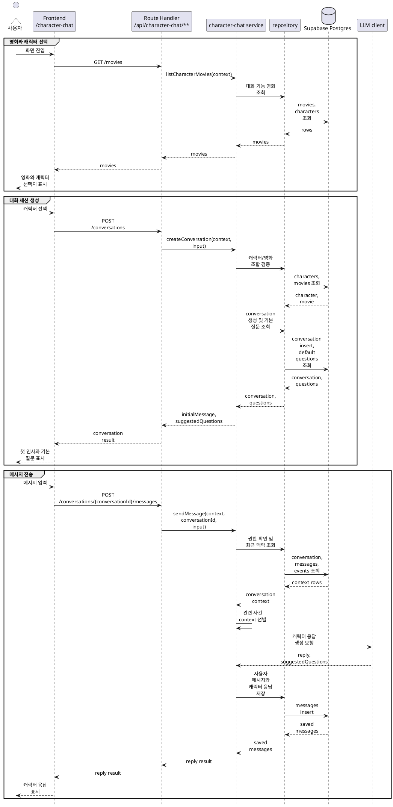

# 캐릭터 대화 구현 방안

캐릭터 대화는 별도 모델 학습 없이 **LLM API + seed된 캐릭터 persona + 사건/관점 데이터 + 최근 대화 기록**으로 구현한다. 

## 목적

`/character-chat`은 사용자가 영화를 본 뒤, 영화 속 대표 캐릭터와 대화하는 경험을 제공한다.

구현 목표:

- 캐릭터의 말투, 성격, 지식 한계를 유지한다.
- 영화 안의 주요 사건과 캐릭터별 관점을 응답 근거로 사용한다.
- 대화 시작 시 캐릭터별 기본 질문을 제공한다.
- 대화 중에는 현재 맥락에 맞는 후속 질문 후보를 동적으로 반환한다.
- 대화 기록을 저장해 이어지는 메시지에서 최근 맥락을 반영한다.

## 기준 문서

| 문서 | 역할 |
|---|---|
| [../api-spec/character-chat.md](../api-spec/character-chat.md) | 캐릭터 대화 API 계약 |
| [../db-schema/character-chat.md](../db-schema/character-chat.md) | 캐릭터 채팅 DB 스키마 |
| [data-seed-plans/2.character-chat-seed-plan.md](data-seed-plans/2.character-chat-seed-plan.md) | 캐릭터 채팅 seed 상위 계획 |
| [data-seed-plans/2-1.character-profile-seed-plan.md](data-seed-plans/2-1.character-profile-seed-plan.md) | 캐릭터 프로필, persona, 이미지 seed |
| [data-seed-plans/2-2.character-events-seed-plan.md](data-seed-plans/2-2.character-events-seed-plan.md) | 사건과 캐릭터별 관점 seed |
| [data-seed-plans/2-3.character-default-questions-seed-plan.md](data-seed-plans/2-3.character-default-questions-seed-plan.md) | 캐릭터별 기본 질문 seed |

## 사용 데이터

런타임에서 직접 사용하는 주요 테이블:

| 테이블 | 런타임 역할 |
|---|---|
| `characters` | 캐릭터 기본 정보, 인사말, persona prompt, 이미지 경로 |
| `character_chat_events` | 영화 안에서 일어난 주요 사건의 객관 요약 |
| `character_chat_event_participants` | 사건별 캐릭터의 역할, 관점, 감정, 지식 상태 |
| `character_chat_default_questions` | 대화 시작 전에 보여줄 캐릭터별 기본 질문 |
| `character_chat_conversations` | 사용자별 캐릭터 대화 세션 |
| `character_chat_conversation_messages` | 사용자 메시지와 캐릭터 응답 기록 |

`movies`는 영화 제목과 영화 존재 검증에 사용한다. `people`은 배우 연결 정보가 필요한 화면에서 선택적으로 사용한다.

## 주요 흐름

### 영화/캐릭터 조회

- `GET /api/character-chat/movies`는 `/character-chat` 화면 진입 시 대화 가능한 영화와 캐릭터 목록을 반환한다.
- 초기 seed에서 캐릭터 채팅 지원 영화는 2개로 고정하므로 pagination은 도입하지 않는다.
- 지원 영화 수가 늘어나 별도 탐색 UI가 필요해지는 시점에 pagination 또는 필터 조건을 추가한다.

### Conversation 생성

- `POST /api/character-chat/conversations`는 새 캐릭터 대화 세션을 만든다.
- Route Handler는 로그인 사용자 확인과 request body 검증만 수행한다.
- service는 `movieId`, `characterId` 조합이 유효한지 확인한 뒤 conversation을 생성한다.
- 응답의 `initialMessage`는 `characters.greeting`을 사용한다.
- 기본 질문은 `character_chat_default_questions.display_order` 오름차순으로 반환한다.

### 메시지 전송

- `POST /api/character-chat/conversations/{conversationId}/messages`는 사용자 메시지를 저장하고 캐릭터 응답을 생성한다.
- service는 conversation 접근 권한을 먼저 확인한다.
- 최근 대화, 캐릭터 정보, 영화 정보, 관련 사건/관점 데이터를 조회한다.
- 사용자 메시지와 최근 맥락을 기준으로 관련 사건 context를 선별한다.
- seed된 persona와 선별된 사건/관점 데이터를 조립해 LLM client가 캐릭터 응답과 후속 질문 후보를 생성한다.
- LLM 호출이 실패하면 잘못된 캐릭터 응답 메시지를 저장하지 않는다.
- 사용자 메시지를 먼저 저장할지, LLM 성공 후 함께 저장할지는 구현 시 트랜잭션 처리와 재시도 정책을 기준으로 결정한다.

## 관련 사건 Context 선별

관련 사건 context는 현재 캐릭터의 participant row를 기준으로 선별한다.

초기 구현:

1. 현재 `character_id`의 `character_chat_event_participants`를 조회한다.
2. 연결된 `character_chat_events`를 조회한다.
3. 사용자 메시지와 `event.title`, `event.summary`, `participant.perspective_summary`를 비교한다.
4. 관련도가 높은 사건 2~5개를 선택한다.
5. 선택된 사건과 캐릭터 관점 데이터를 LLM 입력에 포함한다.

초기 버전은 단순 키워드 매칭과 최근 대화 맥락 기반 휴리스틱으로 시작한다. 품질이 부족하면 DB에 저장된 동일 데이터 안에서 검색 기준과 ranking만 개선한다.

## 기본 질문 처리

- 캐릭터별 기본 질문은 seed 데이터로 관리한다.
- conversation 생성 응답에서 기본 질문을 반환한다.
- 기본 질문은 특정 사건과 DB에서 직접 연결하지 않는다.
- 사용자가 기본 질문을 클릭하면 일반 사용자 메시지와 동일하게 전송한다.
- 메시지 전송 응답의 `suggestedQuestions`는 현재 대화 맥락을 기준으로 동적으로 생성한다.
- 동적 `suggestedQuestions`는 DB에 저장하지 않는다.

## 검증 기준

| 항목                 | 기준                                                          |
| ------------------ | ----------------------------------------------------------- |
| 영화 목록              | `GET /api/character-chat/movies`가 대화 가능 영화와 화면 표시 필드를 반환한다. |
| conversation 생성    | 유효한 `movieId`, `characterId`로 conversation이 생성된다.           |
| 캐릭터 검증             | `characterId`가 요청한 `movieId`에 속하지 않으면 실패한다.                 |
| 기본 질문              | conversation 생성 응답에 캐릭터별 기본 질문이 순서대로 포함된다.                  |
| 권한                 | 다른 사용자의 conversation에 메시지를 보낼 수 없다.                         |
| 메시지 저장             | 사용자 메시지와 캐릭터 응답이 순서대로 저장된다.                                 |
| LLM 입력             | persona, 캐릭터 정보, 영화 정보, 관련 사건, 최근 대화가 포함된다.                 |
| 지식 상태              | `knowledge_state`에 반하는 단정적 응답을 줄이도록 LLM 입력에 반영된다.           |
| suggestedQuestions | 메시지 응답마다 후속 질문 후보가 동적으로 반환된다.                               |
| 실패 처리              | LLM 호출 실패 시 잘못된 캐릭터 응답 row를 남기지 않는다.                        |
| 테스트                | service와 rules는 DB/LLM 의존성을 fake로 주입해 테스트할 수 있다.            |
