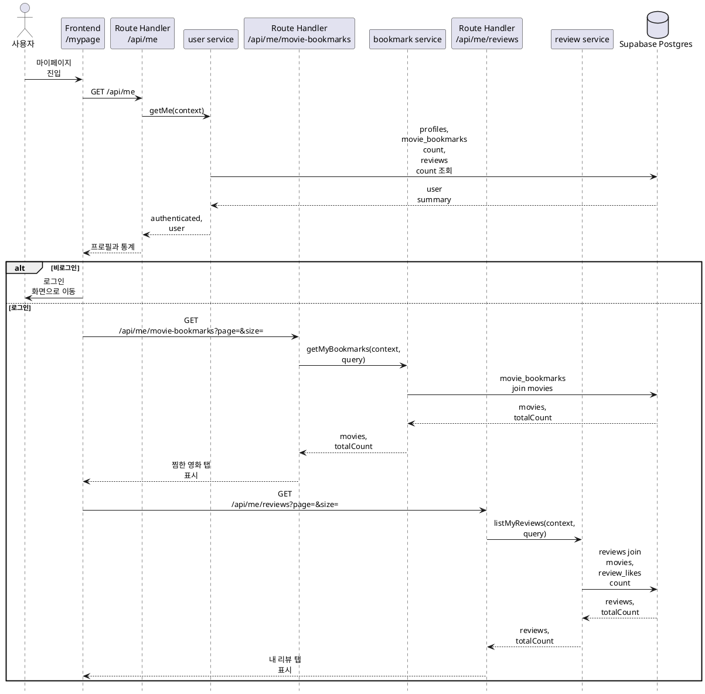

# 9. 마이페이지 구현 방안

마이페이지는 **로그인 사용자 프로필 + 찜한 영화 목록 + 내가 작성한 리뷰 목록**을 조회하는 화면으로 구현한다.

## 목적

마이페이지는 사용자가 Cinemate에서 남긴 활동을 한 곳에서 확인하는 개인화 화면이다. 로그인 사용자는 자신의 프로필 요약, 찜한 영화 수, 작성 리뷰 수, 찜한 영화 목록, 작성 리뷰 목록을 확인할 수 있어야 한다.

구현 목표:

- 로그인 사용자의 기본 프로필과 활동 통계를 조회한다.
- 비로그인 사용자가 `/mypage`에 접근하면 로그인 화면으로 유도한다.
- 사용자가 찜한 영화 목록을 페이지 단위로 조회한다.
- 사용자가 작성한 리뷰 목록을 영화 정보와 함께 페이지 단위로 조회한다.
- 각 목록 항목에서 영화 상세 화면으로 이동할 수 있게 `movieId`를 유지한다.
- 프로필 수정과 설정 기능은 이 문서의 범위에서 제외한다.

## 기준 문서

| 문서 | 역할 |
|---|---|
| [../api-spec/auth-users.md](../api-spec/auth-users.md) | `GET /api/me` 사용자 프로필과 마이페이지 통계 API 계약 |
| [../api-spec/reviews-bookmarks.md](../api-spec/reviews-bookmarks.md) | 찜한 영화 목록, 내 리뷰 목록 API 계약 |
| [../api-spec/common.md](../api-spec/common.md) | 인증 표기, pagination, 공통 에러 기준 |
| [../api-spec/screen-mapping.md](../api-spec/screen-mapping.md) | `/mypage` 화면별 API 매핑 |
| [../db-schema/users.md](../db-schema/users.md) | `profiles` 사용자 프로필 스키마와 RLS 기준 |
| [../db-schema/reviews-likes.md](../db-schema/reviews-likes.md) | `movie_bookmarks`, `reviews`, `review_likes` 스키마와 RLS 기준 |
| [../db-schema/movies.md](../db-schema/movies.md) | 찜/리뷰 목록에 표시할 영화 제목, 개봉 연도, 포스터 기준 |
| [../db-schema/rls-summary.md](../db-schema/rls-summary.md) | 사용자별 데이터 접근 정책 요약 |

## 사용 데이터

런타임에서 직접 사용하는 주요 테이블:

| 테이블 | 런타임 역할 |
|---|---|
| `profiles` | 사용자 이름, 이메일, 프로필 이미지, 온보딩 완료 여부 조회 |
| `movie_bookmarks` | 사용자별 찜 영화 수와 찜한 영화 목록 조회 |
| `reviews` | 사용자별 작성 리뷰 수와 내 리뷰 목록 조회 |
| `review_likes` | 내 리뷰 목록의 리뷰별 좋아요 수 집계 |
| `movies` | 찜/리뷰 목록의 영화 제목, 개봉 연도, 포스터 표시 |

사용자 식별은 클라이언트가 전달한 user id가 아니라 Supabase 세션에서 만든 `RequestContext.user.id`만 기준으로 한다.

## 주요 흐름



## 구현 범위

### 마이페이지 초기 조회

`/mypage` 화면은 진입 시 `GET /api/me`를 호출해 로그인 상태와 사용자 기본 정보를 확인한다.

| 항목 | 기준 |
|---|---|
| 인증 | 필요 화면. API 자체는 선택 인증 |
| API | `GET /api/me` |
| Response | `authenticated`, `user` |

동작 기준:

- `authenticated=false` 또는 `user=null`이면 마이페이지 내용을 렌더링하지 않고 로그인 화면으로 이동한다.
- 로그인 사용자는 프로필 헤더에 `name`, `email`, `profileImageUrl`을 표시한다.
- `bookmarkedMovieCount`와 `reviewCount`는 활동 통계 영역에 표시한다.
- `onboardingCompleted=false`인 사용자는 추천 기능 연결 시 온보딩 화면으로 이동할 수 있게 상태를 유지한다.

`user` 응답 조립 기준:

| 필드 | 데이터 원천 |
|---|---|
| `id` | `profiles.id` |
| `name` | `profiles.name` |
| `email` | `profiles.email` |
| `profileImageUrl` | `profiles.profile_image_url` |
| `onboardingCompleted` | `profiles.onboarding_completed` |
| `bookmarkedMovieCount` | `movie_bookmarks`에서 현재 사용자 row count |
| `reviewCount` | `reviews`에서 현재 사용자 row count |

### 찜한 영화 목록 조회

`GET /api/me/movie-bookmarks`는 마이페이지의 찜한 영화 탭에서 사용한다.

| 항목 | 기준 |
|---|---|
| 인증 | 필요 |
| Query | `page`, `size` |
| Response | `movies: { id, title, year, posterUrl }[]`, `totalCount` |

동작 기준:

- 현재 로그인 사용자 `context.user.id`의 찜 목록만 조회한다.
- 기본값은 `page=1`, `size=20`으로 둔다.
- `size` 최대값은 기존 찜 구현계획과 맞춰 50으로 둔다.
- 정렬은 `movie_bookmarks.created_at DESC`, `movie_id ASC` 기준으로 한다.
- 각 카드의 `id`는 TMDB movie id이며 클릭 시 `/movie/{id}`로 이동한다.
- 목록이 비어 있으면 빈 상태 UI를 표시하고 영화 탐색 화면으로 이동할 수 있는 액션을 제공한다.

응답 조립 기준:

| 필드 | 데이터 원천 |
|---|---|
| `id` | `movies.id` |
| `title` | `movies.title` |
| `year` | `movies.release_year` |
| `posterUrl` | `movies.poster_path`를 TMDB 이미지 URL로 변환 |

### 내가 작성한 리뷰 목록 조회

`GET /api/me/reviews`는 마이페이지의 내 리뷰 탭에서 사용한다.

| 항목 | 기준 |
|---|---|
| 인증 | 필요 |
| Query | `page`, `size` |
| Response | `reviews: MyReview[]`, `totalCount` |

동작 기준:

- 현재 로그인 사용자 `context.user.id`의 리뷰만 조회한다.
- 기본값은 `page=1`, `size=20`으로 둔다.
- `size` 최대값은 50으로 둔다.
- 정렬은 `reviews.created_at DESC`, `reviews.id ASC` 기준으로 한다.
- 각 리뷰 항목은 영화 제목 또는 포스터 클릭 시 `/movie/{movieId}`로 이동한다.
- 목록이 비어 있으면 빈 상태 UI를 표시하고 영화 탐색 화면으로 이동할 수 있는 액션을 제공한다.
- 리뷰 수정/삭제는 현재 범위에서 제외하고 조회 전용으로 표시한다.

`MyReview` 조립 기준:

| 필드 | 데이터 원천 |
|---|---|
| `id` | `reviews.id` |
| `movieId` | `reviews.movie_id` |
| `movieTitle` | `movies.title` |
| `posterUrl` | `movies.poster_path`를 TMDB 이미지 URL로 변환 |
| `rating` | `reviews.rating` |
| `content` | `reviews.content` |
| `date` | `reviews.created_at` |
| `likes` | `review_likes`를 `review_id` 기준으로 집계 |

## 화면 구성

### 서버/클라이언트 경계

`/mypage`는 App Router 기준으로 구현한다.

- 페이지 진입과 초기 인증 확인은 Server Component에서 처리한다.
- 탭 전환, 페이지네이션, 클라이언트 상태가 필요한 목록 영역만 Client Component로 분리한다.
- Client Component는 `server/**`를 직접 import하지 않고 API route 또는 server action 경계를 통해 데이터를 가져온다.
- 브라우저 API가 필요한 로직은 렌더링 중 직접 실행하지 않고 Client Component의 이벤트 또는 effect 안에서 처리한다.

### UI 영역

마이페이지는 다음 영역으로 나눈다.

| 영역 | 표시 데이터 | 비고 |
|---|---|---|
| 프로필 헤더 | 이름, 이메일, 프로필 이미지 | 프로필 이미지가 없으면 이름 기반 fallback 표시 |
| 활동 통계 | 찜한 영화 수, 작성 리뷰 수 | `GET /api/me` 응답 사용 |
| 탭 | 찜한 영화, 내 리뷰 | URL query 또는 내부 상태로 현재 탭 유지 |
| 찜한 영화 목록 | 영화 포스터, 제목, 개봉 연도 | `GET /api/me/movie-bookmarks` |
| 내 리뷰 목록 | 영화 정보, 평점, 본문, 작성일, 좋아요 수 | `GET /api/me/reviews` |

반응형 기준:

- 모바일에서는 프로필 헤더와 통계를 세로로 배치한다.
- 영화 카드 목록은 화면 너비에 맞춰 2열 이상으로 확장한다.
- 리뷰 목록은 본문 가독성을 우선해 세로 리스트로 표시한다.
- 긴 리뷰 본문은 카드 높이가 과도하게 커지지 않도록 적절한 줄 수로 말줄임 처리하고, 상세 확인은 영화 상세 화면에서 처리한다.

## 서버 모듈 구조

마이페이지 전용 통합 API는 초기 구현 범위에서 만들지 않는다. 기존 사용자, 찜, 리뷰 도메인 API를 화면에서 조합한다.

사용하거나 보완할 예상 파일:

| 파일 | 역할 |
|---|---|
| `app/mypage/page.tsx` | 마이페이지 진입, 인증 상태 확인, 초기 레이아웃 |
| `app/mypage/_components/mypage-tabs.tsx` | 탭 전환과 목록 조회 상태를 담당하는 Client Component |
| `app/mypage/_components/bookmarked-movie-list.tsx` | 찜한 영화 목록 UI |
| `app/mypage/_components/my-review-list.tsx` | 내 리뷰 목록 UI |
| `server/users/user-service.ts` | `GET /api/me` 사용자 정보와 활동 통계 조립 |
| `server/users/user-repository.ts` | `profiles`, 사용자별 count 조회 |
| `server/bookmarks/bookmark-service.ts` | 찜한 영화 목록 조회 |
| `server/reviews/review-service.ts` | 내 리뷰 목록 조회 |
| `app/api/me/route.ts` | `GET /api/me` adapter |
| `app/api/me/movie-bookmarks/route.ts` | `GET /api/me/movie-bookmarks` adapter |
| `app/api/me/reviews/route.ts` | `GET /api/me/reviews` adapter |

Route Handler는 요청 파싱, 인증/권한 확인, Zod 검증, service 호출, 응답 생성만 담당한다. 실제 조회 로직은 각 도메인의 `server/**` service와 repository에 둔다.

## 타입 및 검증

초기 입력 타입:

```ts
export type GetMyPageListInput = {
  page: number;
  size: number;
};
```

Zod 검증 기준:

| 입력 | 검증 |
|---|---|
| `page` query | 정수, 1 이상, 기본값 1 |
| `size` query | 정수, 1 이상 50 이하, 기본값 20 |

응답 타입은 API 스펙의 `user`, `movies`, `MyReview` 구조를 따른다. `request.json()`은 사용하지 않는다. 마이페이지 조회 API들은 path와 query만 검증한다.

## 에러 및 권한 처리

| 상황 | 처리 |
|---|---|
| `/mypage` 진입 시 비로그인 | 로그인 화면으로 이동 또는 로그인 유도 UI 표시 |
| 목록 API 비로그인 요청 | `401 Unauthorized` 반환 |
| 잘못된 pagination query | `400 Bad Request` 반환 |
| 사용자 프로필 row 없음 | `401 Unauthorized` 또는 프로필 생성 복구 플로우로 연결 |
| 찜/리뷰 목록 비어 있음 | 에러가 아니라 빈 목록과 `totalCount=0` 반환 |

RLS와 service 조건 모두에서 사용자별 데이터는 본인 row만 조회한다. 목록 조회 조건에는 반드시 `user_id = context.user.id`를 포함한다.

## 테스트 기준

우선 검증할 테스트:

| 대상 | 검증 |
|---|---|
| `user-service` | 로그인 사용자 기본 정보와 `bookmarkedMovieCount`, `reviewCount` 조립 |
| `bookmark-service` | 현재 사용자 찜 목록만 조회, pagination 기본값/최대값 적용 |
| `review-service` | 현재 사용자 리뷰만 조회, 영화 정보와 좋아요 수 조립 |
| `mypage` UI | 비로그인 상태 처리, 빈 목록 상태, 탭 전환, 페이지네이션 |

service 테스트는 repository를 fake로 주입해 DB 없이 실행 가능하게 작성한다. UI 테스트는 API 응답을 mock해 로그인/비로그인/빈 목록/다중 페이지 상태를 확인한다.

## 구현 순서

1. `GET /api/me`가 마이페이지 통계 필드를 반환하는지 확인하고 부족한 repository count 조회를 보완한다.
2. `GET /api/me/movie-bookmarks` 목록 조회와 pagination 검증을 구현 또는 확인한다.
3. `GET /api/me/reviews` 목록 조회와 `MyReview` 응답 조립을 구현 또는 확인한다.
4. `/mypage` Server Component에서 인증 상태를 확인하고 기본 레이아웃을 구성한다.
5. 탭과 목록 영역을 Client Component로 분리하고 각 API를 연결한다.
6. 빈 상태, 로딩 상태, 에러 상태, 페이지네이션 UI를 정리한다.
7. service/rules 테스트와 가능한 경우 `pnpm lint`를 실행한다.
