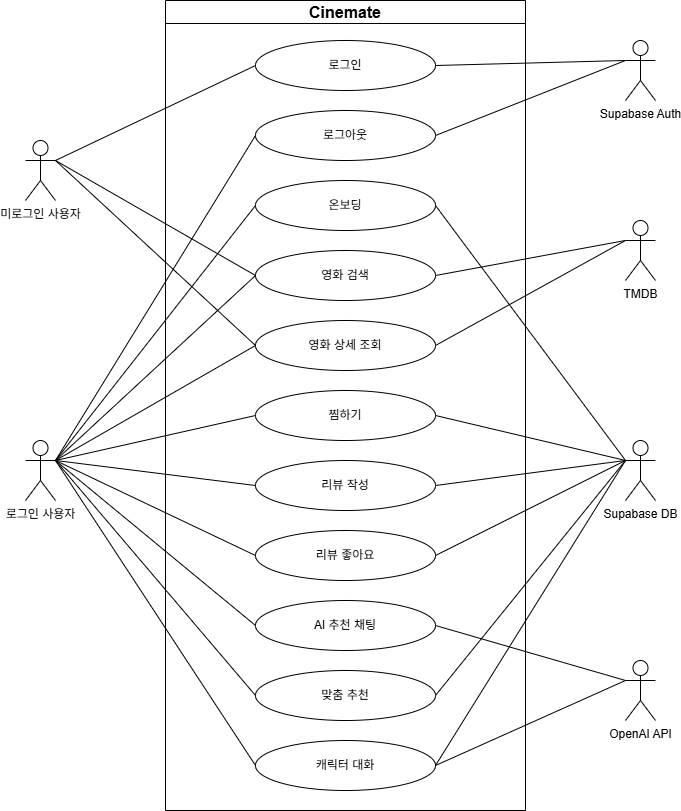
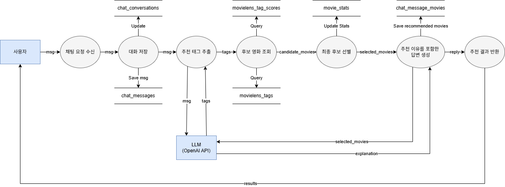
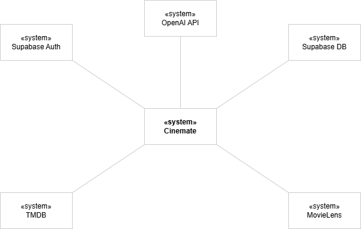
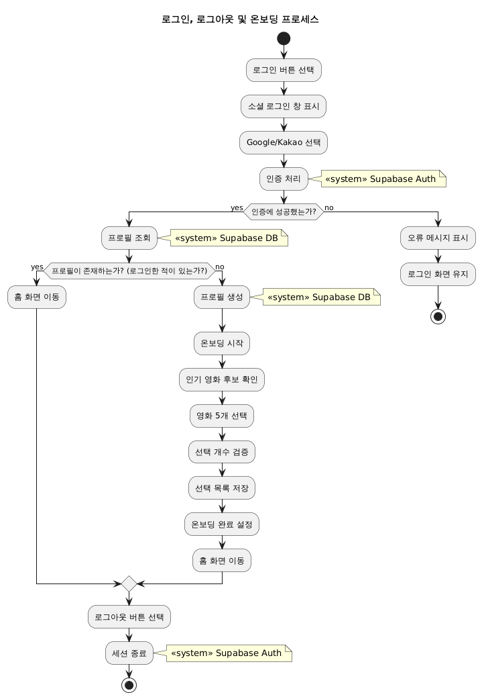
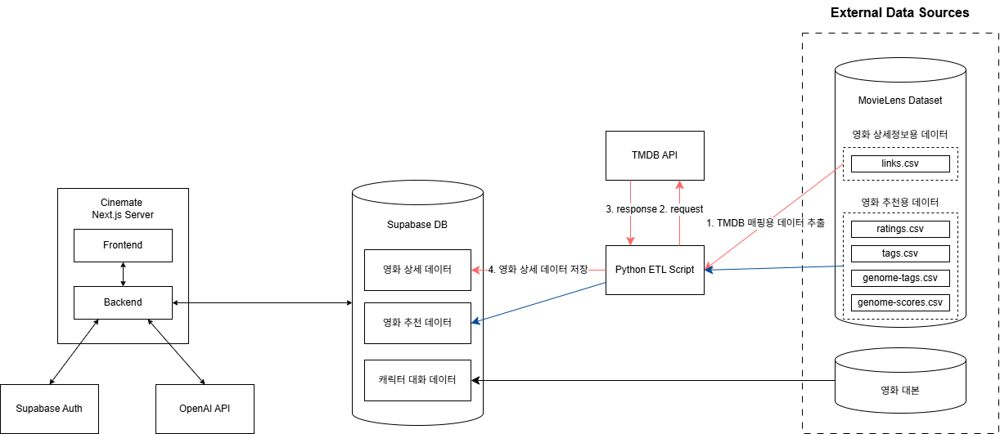

# Software Requirements Specification
## Cinemate 영화 리뷰 및 추천 플랫폼

# Introduction

## Purpose
이 문서는 씨네메이트(Cinemate) 서비스의 요구사항을 명확히 정의하기 위해 작성되었다. 씨네메이트는 사용자가 영화 정보를 탐색하고, 취향에 맞는 영화를 추천받고, 영화에 대한 리뷰와 반응을 남기고, AI 추천 채팅과 영화 캐릭터 대화를 통해 추가 정보를 얻을 수 있도록 지원하는 웹 기반 영화 서비스이다.

## Scope
씨네메이트는 사용자가 영화 정보를 탐색하고, 개인 취향에 맞는 영화를 추천받으며, 영화에 대한 반응과 의견을 남길 수 있도록 지원하는 웹 기반 영화 서비스이다. 본 시스템은 TMDB 기반 영화 메타데이터를 활용하고, MovieLens 기반 추천 데이터와 온보딩 및 사용자 행동 정보를 결합해 영화 검색, 상세 조회, 찜하기, 리뷰 작성, 온보딩, AI 추천 채팅, 캐릭터 대화, 맞춤 추천 기능을 제공한다.

본 문서에서 정의하는 범위는 다음과 같다.

- 포함 범위
  - 미로그인 사용자를 위한 영화 검색 및 영화 상세 조회
  - 로그인 사용자를 위한 찜하기, 리뷰, 리뷰 좋아요, 온보딩, 맞춤 추천
  - 자연어 기반 AI 추천 채팅
  - 영화 속 캐릭터와의 대화 기능
  - 온보딩에서 선택한 선호 영화와 사용자 행동 데이터를 활용한 개인화 추천

- 제외 범위
  - 영화 예매, 결제, 스트리밍 재생, 오프라인 감상
  - 실시간 커뮤니티 게시판이나 일반 SNS형 소셜 기능
  - TMDB 전체 영화 데이터의 무제한 동기화
  - 추천과 무관한 외부 영상 플레이어 또는 전용 하드웨어 연동

즉, 씨네메이트의 범위는 영화 선택과 탐색에 필요한 핵심 기능과 개인화 추천 기능에 한정되며, 영화 감상 이후의 상영·결제·커뮤니티 영역은 포함하지 않는다.

## Definitions, Acronyms, and Abbreviation

Table: Table of acronyms and abbreviations
| Acronym & Abbreviations | Explanation                                                                |
| ----------------------- | -------------------------------------------------------------------------- |
| TMDB                    | The Movie Database. 영화 메타데이터의 주요 원천으로 사용하는 데이터베이스이다.                       |
| MovieLens               | 온보딩 추천, 태그 기반 추천, 집계 데이터 구성에 활용하는 영화 추천 데이터셋이다.                            |
| Item CF                 | Item-based Collaborative Filtering. 유사한 아이템 간의 관계를 이용해 추천을 생성하는 방식이다. |
| LLM                     | Large Language Model. 사용자의 자연어 입력을 해석하고 응답을 생성하는 모델이다.                     |
| AI                      | Artificial Intelligence. 본 문서에서는 추천 채팅 및 캐릭터 대화 응답 생성에 활용되는 인공지능 기능을 의미한다. |

Table: Table of terms and definitions
| Term     | Definitions                                              |
| -------- | -------------------------------------------------------- |
| AI 추천 채팅 | 사용자가 자연어로 상황, 분위기, 장르, 감정, 취향을 입력하면 이에 맞는 영화를 추천하는 기능이다. |
| 캐릭터 대화   | 특정 영화의 등장인물과 대화하는 형태로 정보를 탐색하는 기능이다.                     |
| 온보딩      | 로그인 후 사용자가 선호 영화 5개를 선택하여 개인화 추천의 기준 데이터를 제공하는 절차이다.     |
| 찜하기      | 사용자가 관심 있는 영화를 저장하는 기능이다.                                |
| 리뷰       | 사용자가 영화에 대해 남기는 평점과 의견이다.                                |
| 리뷰 좋아요   | 다른 사용자가 작성한 리뷰에 반응을 표시하는 기능이다.                           |
| 맞춤 추천    | 온보딩 선택, 찜한 영화, 리뷰 내역 등을 바탕으로 사용자에게 개인화된 영화를 제공하는 기능이다.   |
| Item CF   | 온보딩 선택 영화와 사용자 행동을 바탕으로 유사한 영화를 추천하는 Item-based Collaborative Filtering 방식이다. |

## References
본 문서 작성에 참고한 자료는 다음과 같다.

- [TMDB 공식 문서](https://developer.themoviedb.org/)
- [MovieLens 데이터셋 문서](https://grouplens.org/datasets/movielens/)
- [OpenAI API 공식 문서](https://platform.openai.com/docs)
- [Supabase 공식 문서](https://supabase.com/docs)

## Overview
본 문서는 씨네메이트 서비스의 요구사항을 단계적으로 정의한다.

- 1장 Introduction에서는 문서의 목적, 범위, 주요 용어, 참고 문헌, 전체 구조를 정의한다.
- 2장 Overall Description에서는 시스템 관점, 주요 기능, 사용자 유형, 제약 사항, 가정과 의존성을 설명한다.
- 3장 Specific Requirements에서는 외부 인터페이스 요구사항, 기능 요구사항, 성능 요구사항, 데이터베이스 요구사항, 설계 제약, 시스템 특성, 시스템 구조와 진화를 상세히 기술한다.

# Overall Description

## Product Perspective

씨네메이트는 사용자가 영화 정보를 탐색하고, 취향에 맞는 영화를 추천받고, 영화에 대한 반응을 기록하며, AI 추천 채팅과 영화 캐릭터 대화를 통해 영화 선택에 필요한 추가 정보를 얻을 수 있도록 지원하는 웹 기반 영화 서비스이다. 본 시스템은 TMDB 기반 영화 메타데이터를 활용하고, MovieLens 기반 추천 데이터와 온보딩 및 사용자 행동 정보를 바탕으로 개인화된 탐색 경험을 제공하는 것을 목표로 한다.

사용자는 영화 검색과 상세 조회를 통해 작품 정보를 확인할 수 있으며, 찜하기와 리뷰 작성 기능을 통해 자신의 선호를 기록할 수 있다. 또한 로그인 사용자는 온보딩에서 선택한 선호 영화와 자신의 행동 데이터를 바탕으로 맞춤 추천을 받을 수 있고, 자연어 기반 AI 추천 채팅과 영화 캐릭터 대화를 통해 영화 선택의 맥락을 확장할 수 있다.

### System Interfaces

씨네메이트는 웹 브라우저를 통해 사용자의 입력을 수신하고, 서버를 통해 영화 데이터와 각종 서비스 기능을 제공한다. 사용자 입력은 검색어, 로그인 정보, 온보딩 선택값, 리뷰 내용, 채팅 메시지 형태로 전달되며, 서버는 이를 처리해 영화 목록, 상세 정보, 추천 결과, 대화 응답, 저장 결과를 사용자에게 반환한다.

주요 연동 요소는 다음과 같다.

- 인증 서비스: 사용자 인증 및 권한 검증
- 영화 메타데이터 및 사용자 데이터 저장소: 영화, 장르, 인물 정보와 리뷰, 찜한 영화, 대화 기록 저장
- 추천 모듈: 온보딩 선택 영화와 사용자 행동 정보를 기반으로 맞춤 추천 결과 제공
- AI 서비스: OpenAI API를 이용한 자연어 영화 추천 및 캐릭터 대화 응답 생성

### User Interfaces

사용자 인터페이스는 웹 브라우저 화면을 기준으로 구성된다. 주요 화면은 홈, 검색, 영화 상세, 로그인, 온보딩, AI 추천 채팅, 캐릭터 대화, 맞춤 추천, 마이페이지로 구성된다.

화면 구성의 기본 원리는 다음과 같다.

- 홈 화면에서는 주요 영화 섹션과 서비스 진입점을 제공한다.
- 검색 화면에서는 검색창과 영화 목록을 제공한다.
- 상세 화면에서는 포스터, 줄거리, 출연진, 감독, 평점, 찜한 영화, 리뷰 정보를 제공한다.
- 로그인과 온보딩 화면에서는 사용자 식별과 선호 데이터 수집을 수행한다.
- 채팅 화면에서는 사용자의 자연어 입력과 시스템 응답을 대화형으로 주고받는다.

### Hardware Interfaces

씨네메이트는 일반적인 PC와 노트북 환경에서 사용되는 것을 기본으로 한다. 사용자는 키보드와 마우스를 이용해 검색, 선택, 입력, 제출, 찜하기, 리뷰 작성, 채팅 입력 등의 기능을 수행한다.

본 시스템은 별도의 전용 입력 장치, 영상 재생 장치, 센서, 카메라, 마이크를 필수로 요구하지 않는다. 모바일 환경에서도 접속은 가능하나, 주요 사용 시나리오는 데스크탑 또는 노트북 브라우저 환경을 기준으로 한다.

### Software Interfaces

씨네메이트는 웹 애플리케이션으로 동작하며, 주요 웹 브라우저에서 실행되어야 한다. 클라이언트는 HTML, CSS, JavaScript 기반 화면을 렌더링하고, 서버는 JSON 기반 API 응답을 제공한다.

지원 환경의 기본 조건은 다음과 같다.

- 웹 브라우저: Chrome, Edge, Firefox, Safari 계열 최신 버전

### Memory Constraints

클라이언트 측에서는 일반적인 웹 브라우저 실행에 필요한 메모리만 요구한다. 서버 측에서는 영화 메타데이터, 사용자 계정, 찜한 영화, 리뷰, 추천 관련 데이터, 채팅 기록을 저장할 수 있는 범위의 저장 공간이 필요하다.

서비스는 추천 품질과 검색 응답 속도를 유지할 수 있도록 캐시, 인덱스, 데이터 적재량을 관리해야 한다. 특히 영화 데이터와 추천 데이터는 서비스 범위 내에서 유지 가능한 용량으로 제한되어야 한다.

또한 본 서비스는 Supabase Free tier를 사용하므로, 데이터베이스 저장 공간, 인증 사용량, 네트워크 트래픽, 저장 가능한 파일/이미지 리소스 등 Free tier의 자원 제한을 초과하지 않도록 데이터 규모를 관리해야 한다. 대용량 데이터 적재나 고빈도 요청이 필요한 기능은 범위에서 제외하거나 별도 최적화가 필요하다.

### Operations

시스템 운영자는 다음과 같은 작업을 수행할 수 있어야 한다.

- 영화 데이터 적재 및 검증
- 장르, 인물, 캐릭터 데이터 관리
- 사용자 및 권한 상태 확인
- 리뷰, 찜한 영화, 추천, 채팅 데이터 점검
- 추천 데이터 조회 상태 및 AI 연동 상태 확인
- 오류 로그 및 장애 원인 확인

운영 작업은 서비스 품질 유지와 데이터 일관성 확보를 위한 관리 행위로 정의한다.

## Product Functions

씨네메이트가 제공하는 핵심 기능은 다음과 같다.

### 로그인

로그인 기능은 사용자를 식별하고, 사용자별 찜한 영화, 리뷰, 대화 기록, 온보딩 상태를 연동하기 위해 필요하다. 로그인 사용자는 개인화 기능을 사용할 수 있으며, 미로그인 사용자는 제한된 영화 탐색 기능만 사용할 수 있다.

### 온보딩

온보딩 기능은 로그인 후 초기 취향 데이터를 수집하기 위한 기능이다. 사용자는 인기 영화 목록에서 정확히 5개의 선호 영화를 선택하며, 이 선택 결과는 맞춤 추천의 seed 데이터로 사용된다.

### 영화 검색

사용자는 영화 제목을 검색창에 입력해 영화 목록을 탐색할 수 있다. 이 기능은 사용자가 원하는 영화를 빠르게 찾고 비교할 수 있도록 지원한다.

### 영화 상세 조회

영화 상세 조회 기능은 특정 영화의 제목, 포스터, 줄거리, 개봉 정보, 장르, 출연진, 감독, 평점, 리뷰, 유사 영화 정보를 제공한다. 사용자는 상세 화면을 통해 작품의 핵심 정보를 종합적으로 확인할 수 있다.

### 찜하기

찜하기 기능은 사용자가 관심 있는 영화를 저장하는 기능이다. 찜한 영화는 마이페이지에서 다시 확인할 수 있으며, 개인화 추천에 활용될 수 있다.

### 리뷰 작성 및 리뷰 좋아요

리뷰 작성 기능은 사용자가 영화에 대한 평점과 의견을 남기는 기능이다. 리뷰 좋아요 기능은 다른 사용자가 작성한 리뷰에 반응을 표시하는 기능이다. 이 두 기능은 사용자 참여와 평점 집계에 활용된다.

### AI 추천 채팅

AI 추천 채팅은 사용자가 자연어로 상황, 분위기, 장르, 감정, 취향을 입력하면 이에 맞는 영화를 추천하는 기능이다. 사용자는 대화를 이어가며 추천 조건을 수정하거나 범위를 좁힐 수 있다.

### 캐릭터 대화

캐릭터 대화는 특정 영화의 등장인물과 대화하는 형태로 영화 정보를 탐색하는 기능이다. 사용자는 실제 영화 대본을 참고해 작성한 `persona_prompt`와 캐릭터 설정을 반영한 응답을 통해 영화의 분위기와 맥락을 더 쉽게 파악할 수 있다.

### 맞춤 추천

맞춤 추천 기능은 온보딩 선택 영화, 찜한 영화, 리뷰, 대화 이력 등을 바탕으로 사용자에게 개인화된 영화를 제공하는 기능이다. 이 기능은 사용자가 이미 선호를 보인 영화와 유사한 작품을 중심으로 사전 적재된 추천 결과를 제공한다.

### 마이페이지

마이페이지 기능은 사용자의 프로필, 찜한 영화, 작성한 리뷰를 확인할 수 있는 기능이다. 사용자는 자신의 활동 이력을 기반으로 서비스 이용 상태를 확인할 수 있다.

## User Characteristics

### 미로그인 사용자

미로그인 사용자는 로그인하지 않은 상태의 사용자이다. 이 사용자는 영화 검색 및 상세 조회와 같은 기본 탐색 기능을 사용할 수 있으나, 찜하기, 리뷰, 온보딩, AI 추천 채팅, 캐릭터 대화, 맞춤 추천과 같은 개인화 기능은 사용할 수 없다.

### 로그인 사용자

로그인 사용자는 로그인한 상태의 사용자이다. 이 사용자는 온보딩을 완료한 뒤 맞춤 추천을 사용할 수 있으며, 영화 찜하기, 리뷰 작성, 리뷰 좋아요, AI 추천 채팅, 캐릭터 대화, 마이페이지 기능을 활용할 수 있다.

### 신규 로그인 사용자

신규 로그인 사용자는 로그인한 상태이며 온보딩을 아직 완료하지 않은 사용자이다. 이 사용자는 온보딩을 통해 선호 영화 5개를 선택한 뒤 개인화 추천 기능을 이용할 수 있다.

### 운영자

운영자는 서비스 데이터와 동작 상태를 점검하는 사용자이다. 운영자는 영화 데이터, 추천 결과, 사용자 활동 데이터, 채팅 기록의 상태를 확인하고 문제를 관리할 수 있어야 한다.

## Constraints

씨네메이트는 다음 제약을 따른다.

- 서비스는 웹 기반으로 구현하며, 사용자는 웹 브라우저와 인터넷 연결이 가능한 환경에서 접근해야 한다.
- 주요 사용 환경은 데스크탑 브라우저를 기준으로 한다.
- 로그인 기반 기능과 미로그인 기능을 구분해야 한다.
- 온보딩은 로그인 사용자만 접근 가능해야 한다.
- 온보딩은 정확히 5개 영화 선택 규칙을 만족해야 한다.
- 영화 예매, 결제, 스트리밍 재생 기능은 범위에 포함하지 않는다.
- 영화 데이터는 TMDB와 MovieLens 기반으로만 구성한다.
- 사용자 데이터는 인증과 권한 정책에 따라 보호되어야 한다.
- 서비스는 Supabase Free tier의 자원 한도 내에서 동작해야 한다.

## Assumptions and Dependencies

본 시스템은 사용자가 기본적인 웹 브라우저 사용이 가능하고, 인터넷 연결이 안정적인 환경에서 서비스를 이용한다고 가정한다. 또한 사용자는 영화에 대한 선호를 선택하거나 자연어로 설명할 수 있다고 가정한다.

씨네메이트는 다음 요소에 의존한다.

- 영화 메타데이터 저장소의 정상 동작
- 추천 데이터의 조회 가능 여부
- TMDB 및 MovieLens 기반 데이터 적재 상태
- Supabase 인증 서비스의 정상 동작
- Supabase Free tier의 저장 공간, 인증 사용량, 네트워크 트래픽 제한
- OpenAI API의 응답 가능 여부, 정책, 응답 형식, 호출 제한
- 추천 데이터와 영화 메타데이터가 서비스에 필요한 범위만큼 미리 적재되어 있을 것

외부 API의 응답 지연, 호출 제한, 정책 변경이 발생하면 일부 기능의 동작 방식이나 응답 품질이 달라질 수 있다.

# Specific Requirements

## External Interface Requirements

### User Interface

#### 공통 입력 인터페이스

| 이름           | 사용자 입력 처리 인터페이스                                                                                              |
| ------------ | ------------------------------------------------------------------------------------------------------------ |
| 목적/내용        | 사용자가 버튼 클릭, 검색어 입력, 평점 선택, 메시지 전송, 영화 선택 등의 동작을 통해 씨네메이트 기능을 제어할 수 있도록 한다.                                   |
| 입력 주체/출력 목적지 | 사용자 / 클라이언트 및 서버                                                                                             |
| 범위/정확도/허용 오차 | 범위: 화면에 노출된 입력 요소와 선택 요소. 정확도: 키보드, 마우스, 터치 입력에 따른 선택 정확도. 허용 오차: 입력 오류 시 재입력 가능.                            |
| 단위           | 버튼 클릭, 텍스트 입력, 선택값 변경, 카드 선택                                                                                 |
| 시간/속도        | 비정기적 입력 / 즉시 화면 반응 또는 서버 요청                                                                                  |
| 타 입출력과의 관계   | 입력값은 클라이언트 상태를 변경하거나 서버로 전달되어 로그인, 검색, 추천, 리뷰 작성, 찜하기 처리, 채팅 응답 생성에 사용된다. 미로그인 사용자의 입력은 개인화 기능에 한정된 화면으로 유도된다. |
| 화면 형식 및 구성   | 검색창, 필터, 카드, 탭, 버튼, 채팅 입력창, 평점 선택 영역, 리뷰 입력 영역                                                               |
| 윈도우 형식 및 구성  | 웹 브라우저 기반 단일 페이지 또는 라우트 전환 방식                                                                                |
| 데이터 형식 및 구성  | Text, Boolean, Integer, Number, 배열 형태의 선택값                                                                   |
| 명령 형식        | Enter 입력, 버튼 클릭, 카드 선택, 토글 변경                                                                                |
| 종료 메시지       | 입력 완료 후 별도 종료 메시지는 없으며, 실패 시 안내 메시지를 출력한다.                                                                   |

#### 홈 화면 출력 인터페이스

| 이름           | 메인 화면 출력 인터페이스                                                                       |
| ------------ | ------------------------------------------------------------------------------------ |
| 목적/내용        | 사용자가 씨네메이트의 핵심 기능인 영화 탐색, AI 추천 채팅, 맞춤 추천, 캐릭터 대화로 빠르게 진입할 수 있도록 주요 기능과 대표 영화 목록을 출력한다. |
| 입력 주체/출력 목적지 | 클라이언트 / 사용자                                                                          |
| 범위/정확도/허용 오차 | 범위: 히어로 섹션, 인기 영화, 최고 평점 영화, AI 추천 소개, 푸터. 정확도: DB 또는 하드코딩된 영화 데이터의 정확도에 따름.         |
| 단위           | 페이지, 섹션, 영화 카드                                                                       |
| 시간/속도        | 화면 진입 시 즉시 표시                                                                        |
| 타 입출력과의 관계   | 사용자의 첫 진입 지점으로서 검색, AI 추천 채팅, 맞춤 추천, 영화 상세로 이동할 수 있는 링크를 제공한다.                          |
| 화면 형식 및 구성   | 상단 헤더, 중앙 히어로 문구, 기능 소개 카드, 영화 섹션, AI 추천 프리뷰                                         |
| 윈도우 형식 및 구성  | 웹 브라우저 화면 내 카드형 레이아웃                                                                 |
| 데이터 형식 및 구성  | 이미지, Text, Number, 링크                                                                |
| 명령 형식        | 섹션 링크 클릭, 영화 카드 선택, CTA 버튼 클릭                                                        |
| 종료 메시지       | 해당 없음                                                                                |

#### 영화 탐색 화면 출력 인터페이스

| 이름           | 영화 검색 및 탐색 인터페이스                                                 |
| ------------ | ---------------------------------------------------------------- |
| 목적/내용        | 사용자가 제목 기반 검색을 통해 영화 목록을 탐색할 수 있도록 한다.                           |
| 입력 주체/출력 목적지 | 사용자 / 클라이언트 및 서버                                                 |
| 범위/정확도/허용 오차 | 범위: 검색창, 검색 결과 목록. 정확도: 입력한 검색어와 DB의 영화 제목, 연도, 장르 메타데이터 매칭에 따름. |
| 단위           | 텍스트 검색어, 영화 카드                                                   |
| 시간/속도        | 검색 입력 또는 페이지 진입 시 즉시 반응                                          |
| 타 입출력과의 관계   | 검색 조건에 따라 영화 목록을 출력하고, 선택된 영화는 상세 화면으로 이동한다.                     |
| 화면 형식 및 구성   | 검색창, 결과 수 표시, 카드 그리드, 결과 없음 안내                                   |
| 윈도우 형식 및 구성  | 브라우저 기반 목록 화면                                                    |
| 데이터 형식 및 구성  | Text, Image URL, Number, Boolean                                 |
| 명령 형식        | 검색 입력, 검색 초기화, 카드 선택                                             |
| 종료 메시지       | 검색 결과가 없으면 "검색 결과가 없습니다" 안내를 출력한다.                               |

#### 영화 상세 화면 출력 인터페이스

| 이름 | 영화 상세 및 리뷰 인터페이스 |
| --- | --- |
| 목적/내용 | 사용자가 특정 영화의 상세 정보, 찜하기, 예고편, 유사 영화, 리뷰 목록, 리뷰 작성 기능을 이용할 수 있도록 한다. |
| 입력 주체/출력 목적지 | 사용자 및 클라이언트 / 사용자 및 서버 |
| 범위/정확도/허용 오차 | 범위: 포스터, 제목, 원제, 개봉연도, 장르, 러닝타임, 국가, 감독, 출연진, 줄거리, 평점, 리뷰, 유사 영화. 정확도: TMDB 및 씨네메이트 DB 저장 데이터에 따름. |
| 단위 | 영화 상세 정보, 리뷰 카드, 별점, 텍스트 입력 |
| 시간/속도 | 영화 상세 페이지 진입 시 즉시 출력, 리뷰 작성/찜은 사용자 입력 시 갱신 |
| 타 입출력과의 관계 | 찜과 리뷰는 사용자 계정과 연결되며, 평점 및 추천 결과 갱신에 사용된다. |
| 화면 형식 및 구성 | 포스터 중심 히어로 영역, 메타데이터 영역, 리뷰 영역, 유사 영화 영역 |
| 윈도우 형식 및 구성 | 웹 브라우저 기반 상세 페이지 |
| 데이터 형식 및 구성 | Text, Number, Array, Image URL |
| 명령 형식 | 찜하기, 예고편 보기, 리뷰 등록, 리뷰 좋아요, 유사 영화 이동 |
| 종료 메시지 | 리뷰 작성 성공 시 저장 완료 안내를 표시한다. |

#### AI 추천 채팅 인터페이스

| 이름           | AI 추천 채팅 인터페이스                                                                                                                    |
| ------------ | ------------------------------------------------------------------------------------------------------------------------------------ |
| 목적/내용        | 사용자가 자연어로 취향, 상황, 조건을 입력하면 영화 추천 결과와 추천 이유를 대화 형태로 제공한다.                                                                             |
| 입력 주체/출력 목적지 | 사용자 / 클라이언트 및 서버                                                                                                                     |
| 범위/정확도/허용 오차 | 범위: 메시지 입력, 추천 질문 클릭, 추천 결과 카드. 정확도: OpenAI API 기반 자연어 해석, DB 후보 검색, DB에 저장된 추천 데이터 조회 결과에 따름. 허용 오차: 생성형 응답 특성상 추천 문장 표현은 달라질 수 있다. |
| 단위           | 채팅 메시지, 추천 영화 카드, 추천 이유                                                                                                              |
| 시간/속도        | 메시지 전송 시 응답 생성 후 출력                                                                                                                  |
| 타 입출력과의 관계   | 사용자의 메시지는 영화 태그 해석, 후보 검색, 추천 결과 생성, 추천 설명 생성 단계로 전달된다.                                                                              |
| 화면 형식 및 구성   | 대화 기록 영역, 추천 질문 목록, 입력창, 응답 카드 영역                                                                                                    |
| 윈도우 형식 및 구성  | 채팅형 브라우저 화면                                                                                                                          |
| 데이터 형식 및 구성  | Text, Movie list, Reason text, Conversation ID                                                                                       |
| 명령 형식        | Enter 입력, 전송 버튼 클릭, 추천 질문 클릭, 새 대화 클릭                                                                                                |
| 종료 메시지       | 대화 종료 메시지는 없으며, 오류 발생 시 재시도 안내를 출력한다.                                                                                                |

#### 온보딩 인터페이스

| 이름           | 선호 영화 선택 인터페이스                                                                         |
| ------------ | -------------------------------------------------------------------------------------- |
| 목적/내용        | 사용자가 선호 영화 5개를 선택하여 맞춤 추천과 Item CF 추천의 seed 데이터를 생성한다.                                 |
| 입력 주체/출력 목적지 | 사용자 / 클라이언트 및 서버                                                                       |
| 범위/정확도/허용 오차 | 범위: 인기 영화 후보 목록, 선택 상태, 완료 버튼. 정확도: 정확히 5개를 선택해야 완료 가능. 허용 오차: 5개 미만 또는 초과 선택 시 저장 불가. |
| 단위           | 영화 카드 선택, 선택 해제                                                                        |
| 시간/속도        | 선택 즉시 반영, 완료 시 서버 저장                                                                   |
| 타 입출력과의 관계   | 선택된 영화는 사용자 선호 정보로 저장되며 맞춤 추천 화면의 추천 기준으로 사용된다.                                        |
| 화면 형식 및 구성   | 영화 카드 그리드, 선택 현황 패널, 진행률 표시, 완료 버튼                                                     |
| 윈도우 형식 및 구성  | 웹 브라우저 기반 선택 화면                                                                        |
| 데이터 형식 및 구성  | Movie ID 배열, Boolean, Number                                                           |
| 명령 형식        | 카드 클릭, 선택 해제, 완료 버튼 클릭                                                                 |
| 종료 메시지       | 정확히 5개 선택 후 완료 성공 메시지를 표시하고 다음 화면으로 이동한다.                                              |

#### 맞춤 추천 화면 출력 인터페이스

| 이름 | 맞춤 추천 출력 인터페이스 |
| --- | --- |
| 목적/내용 | 사용자가 온보딩에서 선택한 영화와 서비스 내 반응 데이터를 바탕으로 사전 적재된 추천 결과를 확인할 수 있도록 한다. |
| 입력 주체/출력 목적지 | 클라이언트 / 사용자 |
| 범위/정확도/허용 오차 | 범위: seed 영화별 추천 섹션, 추천 영화 카드, 추천 이유. 정확도: DB에 사전 적재된 추천 결과와 백엔드 보정 로직에 따름. |
| 단위 | 추천 섹션, 영화 카드 |
| 시간/속도 | 화면 진입 시 추천 결과 조회 후 출력 |
| 타 입출력과의 관계 | 로그인 사용자만 접근 가능하며, 선택한 seed 영화와 제외 영화 목록을 반영해 결과를 생성한다. |
| 화면 형식 및 구성 | 섹션 제목, seed 영화 정보, 추천 카드 그리드 |
| 윈도우 형식 및 구성 | 카드형 추천 목록 화면 |
| 데이터 형식 및 구성 | Text, Number, Image URL, Recommendation reason |
| 명령 형식 | 카드 선택, 찜하기 |
| 종료 메시지 | 해당 없음 |

#### 캐릭터 대화 인터페이스

| 이름 | 캐릭터 대화 인터페이스 |
| --- | --- |
| 목적/내용 | 사용자가 특정 영화의 캐릭터와 대화할 수 있도록 영화 목록, 캐릭터 목록, 대화 세션, 추천 질문을 제공한다. |
| 입력 주체/출력 목적지 | 사용자 / 클라이언트 및 서버 |
| 범위/정확도/허용 오차 | 범위: 영화 선택, 캐릭터 선택, 메시지 입력, 추천 질문. 정확도: 캐릭터 설정 데이터와 응답 생성 로직에 따름. |
| 단위 | 캐릭터 카드, 메시지, 추천 질문 |
| 시간/속도 | 메시지 전송 시 즉시 응답 출력 |
| 타 입출력과의 관계 | 사용자의 입력은 선택된 영화와 캐릭터 정보에 연결되어 별도의 채팅 세션으로 저장된다. |
| 화면 형식 및 구성 | 영화 목록, 캐릭터 목록, 대화 영역, 추천 질문 버튼 |
| 윈도우 형식 및 구성 | 웹 브라우저 기반 채팅 화면 |
| 데이터 형식 및 구성 | Text, Character ID, Conversation ID |
| 명령 형식 | 캐릭터 선택, 메시지 전송, 추천 질문 클릭 |
| 종료 메시지 | 별도 종료 메시지는 없으며, 대화 시작 시 인사 메시지를 출력한다. |

#### 마이페이지 인터페이스

| 이름 | 사용자 정보 및 활동 요약 인터페이스 |
| --- | --- |
| 목적/내용 | 사용자의 프로필, 찜한 영화, 작성한 리뷰를 조회할 수 있도록 한다. |
| 입력 주체/출력 목적지 | 클라이언트 / 사용자 |
| 범위/정확도/허용 오차 | 범위: 프로필 헤더, 통계 수치, 찜한 영화 탭, 내 리뷰 탭. 정확도: 사용자 계정 데이터와 활동 데이터에 따름. |
| 단위 | 프로필 카드, 탭, 영화 카드, 리뷰 카드 |
| 시간/속도 | 화면 진입 시 조회 결과 출력 |
| 타 입출력과의 관계 | 로그인 사용자만 접근 가능하며, 사용자의 찜한 영화/리뷰 상태를 보여준다. |
| 화면 형식 및 구성 | 프로필 영역, 탭형 목록, 카드형 콘텐츠 |
| 윈도우 형식 및 구성 | 브라우저 기반 개인 페이지 |
| 데이터 형식 및 구성 | Text, Number, Image URL, List |
| 명령 형식 | 탭 선택, 영화 카드 선택 |
| 종료 메시지 | 해당 없음 |

#### 로그인 인터페이스

| 이름 | 소셜 로그인 인터페이스 |
| --- | --- |
| 목적/내용 | 사용자가 Supabase Auth를 통해 Google 또는 Kakao 계정으로 로그인할 수 있도록 한다. |
| 입력 주체/출력 목적지 | 사용자 / 인증 시스템 |
| 범위/정확도/허용 오차 | 범위: 로그인 버튼, OAuth 리다이렉트. 정확도: 인증 제공자의 계정 정보와 토큰 검증 결과에 따름. |
| 단위 | 로그인 버튼 클릭 |
| 시간/속도 | 로그인 시도 즉시 OAuth 흐름 시작 |
| 타 입출력과의 관계 | 로그인 성공 시 온보딩 여부에 따라 홈, 온보딩, 또는 맞춤 추천 화면으로 이동한다. |
| 화면 형식 및 구성 | 로그인 버튼, 인증 안내, 소셜 제공자 선택 |
| 윈도우 형식 및 구성 | 웹 브라우저 기반 인증 화면 |
| 데이터 형식 및 구성 | OAuth token, email, profile data |
| 명령 형식 | Google 로그인, Kakao 로그인 |
| 종료 메시지 | 로그인 성공 시 서비스 화면으로 이동한다. |

### Hardware Interface

| 이름 | 서비스에서 사용 가능한 디바이스 |
| --- | --- |
| 목적/내용 | 사용자가 웹 브라우저를 통해 씨네메이트를 이용할 수 있도록 PC, 노트북, 태블릿, 모바일 기기의 기본 입력/출력 장치를 지원한다. |
| 입력 주체/출력 목적지 | 사용자 / 클라이언트 기기 |
| 범위/정확도/허용 오차 | 범위: 키보드, 마우스, 터치 입력, 화면 출력. 정확도: 사용자의 입력 장치 정밀도에 따름. 허용 오차: 해당 없음. |
| 단위 | 클릭, 탭, 스크롤, 키보드 입력 |
| 시간/속도 | 사용자의 조작에 따라 즉시 반응 |
| 타 입출력과의 관계 | 모든 화면 입력 요소는 기본 입력 장치에서 동작해야 한다. |
| 화면 형식 및 구성 | 해당 없음 |
| 윈도우 형식 및 구성 | 해당 없음 |
| 데이터 형식 및 구성 | 해당 없음 |
| 명령 형식 | 포인터 입력, 키보드 입력, 터치 입력 |
| 종료 메시지 | 해당 없음 |

### Software Interface

Table: Software Interface
| 이름 | 웹 브라우저 및 런타임 인터페이스 |
| --- | --- |
| 목적/내용 | 사용자가 별도 설치 없이 웹 브라우저를 통해 씨네메이트에 접속하고 기능을 사용할 수 있도록 한다. |
| 입력 주체/출력 목적지 | 사용자 및 클라이언트 / 웹 브라우저 |
| 범위/정확도/허용 오차 | 범위: Chrome, Edge, Firefox, Safari 등 주요 브라우저. 정확도: HTML, CSS, JavaScript 렌더링 및 실행. 허용 오차: 브라우저별 스타일 차이 가능. |
| 단위 | 웹 페이지, 브라우저 탭 |
| 시간/속도 | 페이지 진입 또는 새로고침 시 즉시 렌더링 |
| 타 입출력과의 관계 | 브라우저는 사용자 입력을 수신하고 서버 응답을 표시한다. |
| 화면 형식 및 구성 | 웹 사이트 형태 |
| 윈도우 형식 및 구성 | 브라우저 창 또는 탭 |
| 데이터 형식 및 구성 | HTML, CSS, JavaScript, JSON, 이미지 URL |
| 명령 형식 | 링크 이동, 버튼 클릭, 폼 제출 |
| 종료 메시지 | 해당 없음 |

Table: External Service Integration Interface
| 이름 | 외부 서비스 연동 인터페이스 |
| --- | --- |
| 목적/내용 | 영화 메타데이터, 인증, 추천, 대화 기능을 위해 Supabase Auth, TMDB, OpenAI API와 추천 데이터 DB를 활용한다. |
| 입력 주체/출력 목적지 | 서버 / 외부 서비스 |
| 범위/정확도/허용 오차 | 범위: 영화 데이터, 사용자 데이터, 추천 결과, 대화 응답. 정확도: 외부 서비스 원천 데이터와 응답 품질에 따름. 허용 오차: 외부 API 지연, 제한, 오류 발생 가능. |
| 단위 | API 요청, API 응답, 토큰, JSON payload |
| 시간/속도 | 로그인, 영화 조회, 추천, 대화 요청 시 |
| 타 입출력과의 관계 | 외부 응답은 영화 목록, 상세 정보, 추천 영화, 채팅 답변, 인증 상태로 변환되어 사용자에게 제공된다. |
| 화면 형식 및 구성 | 해당 없음 |
| 윈도우 형식 및 구성 | 해당 없음 |
| 데이터 형식 및 구성 | JSON, Text, Image URL, Token |
| 명령 형식 | HTTP 요청, OAuth 리다이렉트, 서버 간 API 호출 |
| 종료 메시지 | 연동 실패 시 오류 메시지 또는 재시도 안내를 출력한다. |

### Communication Interface

Table: Client-Server Communication Interface
| 이름 | 클라이언트-서버 통신 인터페이스 |
| --- | --- |
| 목적/내용 | 사용자의 서비스 요청을 서버로 전달하고, 서버의 처리 결과를 클라이언트에 반환한다. |
| 입력 주체/출력 목적지 | 클라이언트 / 서버 |
| 범위/정확도/허용 오차 | 범위: 로그인, 검색, 상세 조회, 찜하기, 리뷰, 추천, 채팅, 온보딩, 마이페이지 요청. 정확도: 요청/응답 JSON의 구조 일치. 허용 오차: 네트워크 지연, 인증 실패, 서버 오류 가능. |
| 단위 | HTTP request / response |
| 시간/속도 | 사용자의 조작 시 즉시 송수신 |
| 타 입출력과의 관계 | 화면에서 발생한 입력은 API 요청으로 변환되며, 응답은 화면 데이터로 렌더링된다. |
| 데이터 형식 및 구성 | JSON, Text, Binary image URL |
| 명령 형식 | `GET`, `POST`, `PATCH`, `PUT`, `DELETE` |
| 종료 메시지 | 실패 시 에러 메시지, 성공 시 갱신된 데이터 반환 |

Table: Server-External API Communication Interface
| 이름           | 서버-외부 API 통신 인터페이스                                                                        |
| ------------ | ----------------------------------------------------------------------------------------- |
| 목적/내용        | 서버가 TMDB, Supabase Auth, OpenAI API와 통신하고, 추천 데이터 DB에서 사전 적재된 추천 결과를 조회한다.                |
| 입력 주체/출력 목적지 | 서버 / 외부 API                                                                               |
| 범위/정확도/허용 오차 | 범위: 영화 메타데이터, 사용자 인증, 추천 결과, 자연어 응답. 정확도: 외부 API가 제공하는 데이터에 따름. 허용 오차: 응답 지연 및 일시적 실패 가능. |
| 단위           | API request / response                                                                    |
| 시간/속도        | 기능 요청 시                                                                                   |
| 타 입출력과의 관계   | 외부 API 응답은 내부 DB와 합쳐져 사용자 화면에 전달된다.                                                       |
| 데이터 형식 및 구성  | JSON, token, metadata                                                                     |
| 명령 형식        | 서버의 비동기/동기 API 호출                                                                         |
| 종료 메시지       | 실패 시 백엔드가 대체 응답을 조합하거나 재시도 안내를 제공한다.                                                      |

## Functional Requirements

### Use Case

#### UC-01 로그인

| Item | Content |
| --- | --- |
| Actor | 미로그인 사용자 |
| Description | 사용자는 Google 또는 Kakao 소셜 로그인을 통해 서비스에 진입한다. |
| Precondition | 사용자는 로그인 화면에 접근할 수 있어야 한다. |
| Normal Course | 1. 사용자가 로그인 버튼을 선택한다. 2. 인증 제공자가 계정을 확인한다. 3. 서비스가 사용자 프로필을 조회하거나 생성한다. 4. 로그인 성공 후 홈 화면 또는 온보딩 화면으로 이동한다. |
| Post Condition | 로그인 상태가 유지된다. |
| Assumptions | 인증은 Supabase Auth를 사용한다. |
| Exception | 인증 실패 또는 취소 시 로그인 화면에 머무르며 오류 메시지를 표시한다. |

#### UC-02 로그아웃

| Item | Content |
| --- | --- |
| Actor | 로그인 사용자 |
| Description | 사용자는 서비스에서 로그아웃하여 인증 세션을 종료한다. |
| Precondition | 사용자는 로그인 상태여야 한다. |
| Normal Course | 1. 사용자가 로그아웃 버튼을 선택한다. 2. 시스템이 인증 세션을 해제한다. 3. 사용자가 홈 화면으로 이동한다. |
| Post Condition | 로그인 세션이 종료된다. |
| Assumptions | 로그아웃은 Supabase Auth 세션 종료를 따른다. |
| Exception | 세션 해제 실패 시 현재 화면에 오류 메시지를 표시한다. |

#### UC-03 온보딩 선호 영화 5개 선택

| Item | Content |
| --- | --- |
| Actor | 신규 로그인 사용자 |
| Description | 사용자는 인기 영화 목록에서 선호 영화 5개를 선택하여 추천 seed 데이터를 생성한다. |
| Precondition | 사용자는 로그인 상태이며 온보딩을 완료하지 않았어야 한다. |
| Normal Course | 1. 온보딩 화면에서 인기 영화 후보를 확인한다. 2. 사용자가 영화 카드를 선택한다. 3. 시스템이 선택 개수를 실시간으로 갱신한다. 4. 정확히 5개가 선택되면 시작하기 버튼이 활성화된다. 5. 사용자가 완료하면 선택 목록이 저장되고 추천 화면으로 이동한다. |
| Post Condition | 선택한 영화 정보가 저장되고 온보딩 완료 상태가 설정된다. |
| Assumptions | 후보 영화는 MovieLens 데이터셋에 포함된 영화만 제공된다. |
| Exception | 5개 미만 또는 초과 선택 상태에서는 완료할 수 없다. |

#### UC-04 영화 검색 및 탐색

| Item | Content |
| --- | --- |
| Actor | 미로그인 사용자 또는 로그인 사용자 |
| Description | 사용자는 제목 검색 또는 목록 탐색을 통해 영화를 찾는다. |
| Precondition | 사용자는 검색 화면에 접근할 수 있어야 한다. |
| Normal Course | 1. 사용자가 검색어를 입력한다. 2. 시스템이 검색 조건에 맞는 영화 목록을 조회한다. 3. 결과 목록이 영화 카드 형태로 표시된다. 4. 사용자가 영화 카드를 선택하면 상세 화면으로 이동한다. |
| Post Condition | 검색 결과에 대한 화면 상태가 갱신된다. |
| Assumptions | 검색은 기본적으로 내부 영화 카탈로그를 대상으로 한다. |
| Exception | 결과가 없으면 빈 상태 안내를 보여준다. |

#### UC-05 영화 상세 조회 및 찜하기/리뷰

| Item | Content |
| --- | --- |
| Actor | 미로그인 사용자 또는 로그인 사용자 |
| Description | 사용자는 영화의 상세 정보, 유사 영화, 리뷰를 확인하고 로그인 사용자일 경우 찜하기, 리뷰 작성, 리뷰 좋아요를 수행한다. |
| Precondition | 영화 식별자가 존재해야 한다. |
| Normal Course | 1. 사용자가 상세 페이지에 진입한다. 2. 시스템이 영화 메타데이터와 리뷰를 표시한다. 3. 사용자가 찜하기, 리뷰 작성, 리뷰 좋아요를 수행한다. 4. 시스템이 변경된 상태를 갱신한다. |
| Post Condition | 로그인 사용자의 찜한 영화, 리뷰, 리뷰 좋아요가 저장된다. |
| Assumptions | 리뷰는 한 사용자당 영화별 1개만 작성 가능하다. |
| Exception | 미로그인 사용자가 찜하기 또는 리뷰 기능을 사용하면 로그인 화면으로 이동한다. |

#### UC-06 AI 추천 채팅

| Item | Content |
| --- | --- |
| Actor | 로그인 사용자 |
| Description | 사용자는 자연어로 원하는 영화 조건을 입력하고 AI 추천 결과를 받는다. |
| Precondition | 사용자는 로그인 상태여야 한다. |
| Normal Course | 1. 사용자가 추천 질문을 입력한다. 2. 시스템이 조건을 해석하고 후보 영화를 추린다. 3. AI가 추천 이유를 포함한 응답을 생성한다. 4. 추천 영화 카드가 대화 영역에 출력된다. |
| Post Condition | 대화 기록과 추천 결과가 저장된다. |
| Assumptions | 추천 후보는 씨네메이트 DB에 사전 적재된 추천 데이터와 태그 점수를 기반으로 조회된다. |
| Exception | 자연어 해석이 불충분하면 추가 질문을 통해 조건을 보완한다. |

#### UC-07 맞춤 추천 조회

| Item | Content |
| --- | --- |
| Actor | 로그인 사용자 |
| Description | 사용자는 온보딩에서 선택한 영화를 기반으로 섹션별 추천 결과를 확인한다. |
| Precondition | 사용자는 로그인 상태이며 온보딩을 완료해야 한다. |
| Normal Course | 1. 사용자가 추천 화면에 진입한다. 2. 시스템이 seed 영화와 제외 영화 목록을 계산한다. 3. 씨네메이트 DB에 저장된 Item CF 추천 데이터를 조회한다. 4. 섹션별 추천 카드가 출력된다. |
| Post Condition | 화면에 맞춤 추천 목록이 표시된다. |
| Assumptions | 추천 결과는 DB에 미리 저장된 Item CF 추천 데이터를 조회하여 제공한다. |
| Exception | 추천 결과가 부족하면 평점 상위 영화로 보완한다. |

#### UC-08 캐릭터 대화

| Item | Content |
| --- | --- |
| Actor | 로그인 사용자 |
| Description | 사용자는 영화와 캐릭터를 선택하여 캐릭터 대화를 한다. |
| Precondition | 사용자는 로그인 상태여야 한다. |
| Normal Course | 1. 사용자가 캐릭터 대화 화면에서 영화를 선택한다. 2. 사용자가 캐릭터를 선택한다. 3. 시스템이 세션을 생성하고 초기 인사 메시지를 출력한다. 4. 사용자가 메시지를 입력하면 캐릭터 응답이 반환된다. |
| Post Condition | 캐릭터 대화 기록이 저장된다. |
| Assumptions | 캐릭터 데이터는 수동으로 관리된다. |
| Exception | 선택한 영화에 캐릭터가 없으면 대화 시작이 제한된다. |

#### UC-09 마이페이지 조회

| Item | Content |
| --- | --- |
| Actor | 로그인 사용자 |
| Description | 사용자는 자신의 프로필, 찜한 영화, 작성한 리뷰를 확인한다. |
| Precondition | 사용자는 로그인 상태여야 한다. |
| Normal Course | 1. 사용자가 마이페이지에 진입한다. 2. 시스템이 프로필 정보와 요약 통계를 표시한다. 3. 사용자가 탭을 전환하여 찜한 영화 목록 또는 리뷰 목록을 확인한다. 4. 사용자가 영화 카드를 선택하면 상세 페이지로 이동한다. |
| Post Condition | 사용자 활동 내역이 조회된다. |
| Assumptions | 프로필 정보와 활동 내역은 로그인 시점의 계정 데이터와 서비스 DB 저장 데이터에 따른다. |
| Exception | 프로필 데이터가 없으면 로그인 화면으로 유도한다. |

### Use Case Diagram

{ width=0.9\textwidth }

### Data Dictionary
#### profiles

| Field | Key | Constraint | Description |
| --- | --- | --- | --- |
| `id` | PK | Not Null, FK -> `auth.users(id)` | User ID |
| `name` |  | Not Null | Display name |
| `email` | UQ | Not Null | Email address |
| `profile_image_url` |  | Nullable | Profile image URL |
| `onboarding_completed` |  | Not Null, Default `false` | Onboarding completion status |
| `created_at` |  | Not Null | Created time |
| `updated_at` |  | Not Null | Updated time |

#### movies

| Field | Key | Constraint | Description |
| --- | --- | --- | --- |
| `id` | PK | Not Null | TMDB movie ID |
| `movielens_id` | UQ | Not Null | MovieLens movie ID |
| `title` |  | Not Null | Movie title |
| `original_title` |  | Nullable | Original title |
| `overview` |  | Nullable | Overview |
| `release_year` |  | Not Null | Release year |
| `runtime` |  | Nullable | Runtime |
| `poster_path` |  | Nullable | Poster path |
| `backdrop_path` |  | Nullable | Backdrop path |
| `trailer_url` |  | Nullable | Trailer URL |
| `movielens_avg_rating` |  | Not Null, Default `0` | MovieLens average rating |
| `movielens_rating_count` |  | Not Null, Default `0` | MovieLens rating count |
| `cinemate_rating_sum` |  | Not Null, Default `0` | Cinemate review rating sum |
| `cinemate_review_count` |  | Not Null, Default `0` | Cinemate review count |

#### genres

| Field | Key | Constraint | Description |
| --- | --- | --- | --- |
| `id` | PK | Not Null | TMDB genre ID |
| `name` | UQ | Not Null | Genre name |
| `name_ko` |  | Not Null | Korean genre name |

#### people

| Field | Key | Constraint | Description |
| --- | --- | --- | --- |
| `id` | PK | Not Null | TMDB person ID |
| `name` |  | Not Null | Person name |
| `profile_path` |  | Nullable | Profile image path |
| `known_for_department` |  | Nullable | Known department |
| `created_at` |  | Not Null, Default `now()` | Created time |

#### movie_genres

| Field      | Key    | Constraint                   | Description |
| ---------- | ------ | ---------------------------- | ----------- |
| `movie_id` | PK, FK | Not Null, FK -> `movies(id)` | Movie ID    |
| `genre_id` | PK, FK | Not Null, FK -> `genres(id)` | Genre ID    |

#### liked_movies

| Field | Key | Constraint | Description |
| --- | --- | --- | --- |
| `user_id` | PK, FK | Not Null, FK -> `profiles(id)` | User ID |
| `movie_id` | PK, FK | Not Null, FK -> `movies(id)` | Movie ID |
| `created_at` |  | Not Null, Default `now()` | Liked time |

#### reviews

| Field | Key | Constraint | Description |
| --- | --- | --- | --- |
| `id` | PK | Not Null | Review ID |
| `user_id` | FK | Not Null, FK -> `profiles(id)` | Author ID |
| `movie_id` | FK | Not Null, FK -> `movies(id)` | Movie ID |
| `rating` |  | Not Null, Check `0.5 <= rating <= 5.0` | Rating |
| `content` |  | Not Null | Review content |
| `created_at` |  | Not Null, Default `now()` | Created time |
| `updated_at` |  | Not Null, Default `now()` | Updated time |
| `UNIQUE(user_id, movie_id)` |  | One review per user per movie | Composite unique constraint |

#### review_likes

| Field | Key | Constraint | Description |
| --- | --- | --- | --- |
| `user_id` | PK, FK | Not Null, FK -> `profiles(id)` | User ID |
| `review_id` | PK, FK | Not Null, FK -> `reviews(id)` | Review ID |
| `created_at` |  | Not Null, Default `now()` | Liked time |

#### user_onboarding_movies

| Field | Key | Constraint | Description |
| --- | --- | --- | --- |
| `user_id` | PK, FK | Not Null, FK -> `profiles(id)` | User ID |
| `movie_id` | PK, FK | Not Null, FK -> `movies(id)` | Selected movie ID |
| `position` |  | Not Null, Check `1 <= position <= 5`, `UNIQUE(user_id, position)` | Selection order from 1 to 5 |
| `created_at` |  | Not Null, Default `now()` | Saved time |

#### movielens_item_similarities

| Field | Key | Constraint | Description |
| --- | --- | --- | --- |
| `source_movie_id` | PK, FK | Not Null, FK -> `movies(id)` | Source movie ID |
| `target_movie_id` | PK, FK | Not Null, FK -> `movies(id)` | Target movie ID |
| `score` |  | Not Null | Item CF similarity score |
| `co_rating_count` |  | Not Null | Co-rated user count |
| `created_at` |  | Not Null, Default `now()` | Created time |

#### movie_stats

| Field | Key | Constraint | Description |
| --- | --- | --- | --- |
| `movie_id` | PK, FK | Not Null, FK -> `movies(id)` | Movie ID |
| `rating_count` |  | Not Null, Default `0` | Rating count |
| `average_rating` |  | Not Null, Default `0` | Average rating |
| `user_tag_count` |  | Not Null, Default `0` | Tag count |
| `created_at` |  | Not Null, Default `now()` | Created time |

#### recommendation_chat_conversations

| Field | Key | Constraint | Description |
| --- | --- | --- | --- |
| `id` | PK | Not Null | Conversation ID |
| `user_id` | FK | Not Null, FK -> `profiles(id)` | User ID |
| `title` |  | Not Null | Conversation title |
| `created_at` |  | Not Null, Default `now()` | Created time |
| `updated_at` |  | Not Null, Default `now()` | Updated time |

#### recommendation_chat_messages

| Field | Key | Constraint | Description |
| --- | --- | --- | --- |
| `id` | PK | Not Null | Message ID |
| `conversation_id` | FK | Not Null, FK -> `recommendation_chat_conversations(id)` | Conversation ID |
| `role` |  | Not Null, Check `role IN ('request', 'response')` | `request` or `response` |
| `content` |  | Not Null | Message content |
| `created_at` |  | Not Null, Default `now()` | Created time |

#### recommendation_chat_message_movies

| Field | Key | Constraint | Description |
| --- | --- | --- | --- |
| `message_id` | PK, FK | Not Null, FK -> `recommendation_chat_messages(id)` | Message ID |
| `movie_id` | PK, FK | Not Null, FK -> `movies(id)` | Recommended movie ID |
| `reason` |  | Not Null | Recommendation reason |

#### characters

| Field | Key | Constraint | Description |
| --- | --- | --- | --- |
| `id` | PK | Not Null | Character ID |
| `movie_id` | FK | Not Null, FK -> `movies(id)` | Related movie ID |
| `actor_person_id` | FK | Nullable, FK -> `people(id)` | Related actor ID |
| `name` |  | Not Null | Character name |
| `description` |  | Not Null | Character description |
| `greeting` |  | Not Null | Initial greeting message |
| `persona_prompt` |  | Nullable | Prompt for character chat |
| `avatar_color` |  | Nullable | UI display color |
| `created_at` |  | Not Null, Default `now()` | Created time |
| `updated_at` |  | Not Null, Default `now()` | Updated time |

#### character_suggested_questions

| Field | Key | Constraint | Description |
| --- | --- | --- | --- |
| `id` | PK | Not Null | Suggested question ID |
| `character_id` | FK | Not Null, FK -> `characters(id)` | Character ID |
| `question` |  | Not Null | Suggested question |
| `display_order` |  | Not Null, Default `0` | Display order |
| `UNIQUE(character_id, display_order)` |  | No duplicate display order per character | Composite unique constraint |

#### character_chat_conversations

| Field | Key | Constraint | Description |
| --- | --- | --- | --- |
| `id` | PK | Not Null | Conversation ID |
| `user_id` | FK | Not Null, FK -> `profiles(id)` | User ID |
| `character_id` | FK | Not Null, FK -> `characters(id)` | Character ID |
| `created_at` |  | Not Null, Default `now()` | Created time |
| `updated_at` |  | Not Null, Default `now()` | Updated time |

#### character_chat_messages

| Field | Key | Constraint | Description |
| --- | --- | --- | --- |
| `id` | PK | Not Null | Message ID |
| `conversation_id` | FK | Not Null, FK -> `character_chat_conversations(id)` | Conversation ID |
| `role` |  | Not Null, Check `role IN ('user', 'character')` | `user` or `character` |
| `content` |  | Not Null | Message content |
| `created_at` |  | Not Null, Default `now()` | Created time |

### Data Flow Diagram

{ width=0.9\textwidth }

## Performance Requirements

### Static Numerical Requirement

- 시스템은 여러 사용자가 동시에 영화 검색, 상세 조회, 추천, 리뷰 작성, 채팅 기능을 사용할 수 있도록 지원해야 한다.
- 시스템은 1.5GHz 이상의 싱글 프로세서와 2GB 이상의 메모리 환경의 데스크톱 및 노트북에서 웹 브라우저를 통해 원활히 동작해야 한다.
- 1Mbps 이상의 인터넷 연결 환경에서 정상적으로 서비스가 제공되어야 한다.

### Dynamic Numerical Requirement

- 홈, 검색, 상세, 마이페이지 등 일반 화면은 정상 네트워크 환경에서 2초 이내에 주요 콘텐츠를 표시해야 한다.
- 영화 검색 요청은 일반적인 데이터 규모에서 2초 이내에 결과를 반환해야 한다.
- 찜하기, 리뷰 작성, 리뷰 좋아요와 같은 갱신 요청은 2초 이내에 완료되어야 한다.
- 맞춤 추천 요청은 추천 데이터 DB 조회를 포함해 5초 이내에 초기 섹션을 표시해야 한다.
- AI 추천 채팅과 캐릭터 대화는 외부 모델 응답을 포함하더라도 5초 이내에 첫 응답을 제공해야 한다.
- 동시 접속은 소규모 학부 프로젝트 운영 기준으로 최소 100명 수준의 읽기 요청을 감당할 수 있어야 한다.

## Logical Database Requirements

- 영화, 장르, 인물 데이터는 주로 조회 중심의 공용 데이터로 관리한다.
- 사용자별 데이터는 프로필, 찜한 영화, 리뷰, 리뷰 좋아요, 온보딩 선택, 채팅 대화 기록으로 구분해 관리한다.
- 리뷰 작성 시 영화의 평균 평점과 리뷰 수에 반영되는 집계 정보만 갱신한다.
- 리뷰는 사용자당 영화별 1개만 허용한다.
- 리뷰 좋아요는 사용자당 리뷰별 1개만 허용한다.
- 맞춤 추천에서는 온보딩 선택 영화, 찜한 영화, 작성한 리뷰가 있는 영화를 제외한다.
- 사용자 개인 데이터는 본인만 조회 및 수정할 수 있어야 한다.
- 공개 데이터인 영화, 장르, 인물 정보는 읽기 가능해야 한다.
- 대화 기록은 대화 주체 본인만 조회 가능해야 한다.
- 데이터는 백업과 복구가 가능해야 하며, 관련 데이터 간 참조 일관성이 유지되어야 한다.

## Design Constraints

### Physical design constraints

- 시스템은 웹 기반 서비스로 제공되어야 한다.
- 사용자는 별도 설치 없이 브라우저에서 서비스에 접근해야 한다.
- 입력 장치는 키보드, 마우스, 터치를 기본으로 지원해야 한다.
- 영화 예매, 결제, 영상 재생 전용 하드웨어는 요구하지 않는다.
- 모바일 환경은 접근 가능해야 하지만 핵심 사용 환경은 데스크탑 브라우저로 본다.

### Standards compliance

- 프론트엔드는 Next.js, TypeScript, Tailwind CSS 기반으로 구현한다.
- 클라이언트와 서버 간 통신은 HTTP/HTTPS와 JSON 형식을 기본으로 한다.
- 인증은 Supabase Auth를 사용한다.
- 영화 추천은 DB에 사전 적재된 추천 데이터와 연동한다.
- 영화 메타데이터는 TMDB 기준을 따른다.
- 추천 설명, 자연어 질의 처리, 캐릭터 대화 응답은 OpenAI API를 활용한다.
- 브라우저 호환성은 Chrome, Edge, Firefox, Safari의 최신 계열을 기준으로 한다.

## Software System Characteristics

### Product Requirements

#### Reliability

- 시스템은 검색, 상세 조회, 찜하기, 리뷰, 채팅, 추천 기능 요청에 대해 일관된 응답을 제공해야 한다.
- 외부 API 실패 시 서비스 전체가 중단되지 않아야 하며, 가능한 범위에서 대체 결과 또는 오류 안내를 제공해야 한다.

#### Usability

- 사용자는 로그인 후 별도의 학습 없이 영화 검색, 상세 조회, 찜하기, 리뷰, AI 추천 채팅을 사용할 수 있어야 한다.
- 온보딩은 정확히 5개 선택 규칙을 시각적으로 이해할 수 있어야 한다.

#### Security

- 인증이 필요한 기능은 로그인 사용자에게만 제공되어야 한다.
- 사용자 개인 데이터는 사용자별 권한 경계 안에서만 접근 가능해야 한다.
- 외부 API 키는 클라이언트에 노출되지 않아야 한다.

#### Maintainability

- 화면, API, 추천 로직, 채팅 로직은 분리 가능한 모듈 구조로 유지해야 한다.
- 추천 데이터 구조, AI 응답, DB 스키마 변경이 있어도 다른 화면의 영향이 최소화되어야 한다.

### Organizational Requirements

- 인증 및 데이터 저장은 서비스 정책에 맞게 Supabase 중심으로 관리한다.
- 추천 로직은 MovieLens 기반 Item CF를 우선 사용한다.
- 영화 데이터는 MovieLens와 TMDB의 역할을 분리하여 관리한다.
- 리뷰 수정/삭제는 1차 범위에서 제외한다.

### External Requirements

- 개인정보와 사용자 생성 콘텐츠는 서비스 정책과 관련 법규를 준수하여 관리한다.
- TMDB, Supabase, OpenAI API의 이용 약관과 호출 제한을 준수해야 한다.
- HTTPS 기반 통신을 사용해야 한다.

## Organizing the Specific Requirements

### Context Model

{ width=0.9\textwidth }

### Process Model
{ width=0.9\textwidth }

## System Architecture

{ width=0.9\textwidth }

- 프론트엔드
  - Next.js 기반 사용자 화면을 제공한다.
  - 사용자의 검색, 선택, 입력, 조회 요청을 받아 백엔드로 전달한다.
- 백엔드
  - Next.js의 Route Handlers 기능을 통해 인증, 영화 조회, 찜하기/리뷰, 추천, 채팅, 마이페이지 기능을 처리한다.
  - 프론트엔드 요청을 받아 데이터베이스와 외부 API를 호출하고, 결과를 다시 프론트엔드로 반환한다.
- 데이터베이스
  - Supabase DB에 사용자, 영화, 리뷰, 찜한 영화, 온보딩, 채팅 데이터를 저장한다.
  - 추천 결과는 데이터베이스에 사전 적재된 형태로 보관하고 조회한다.
- 외부 API
  - Supabase Auth로 사용자 인증을 수행한다.
  - MovieLens에는 영화 상세 정보가 충분하지 않으므로, TMDB를 통해 영화 메타데이터를 보충한다.
  - OpenAI API로 추천 응답과 캐릭터 대화 응답을 생성한다.
  
## System Evolution

### Limitation and Assumption

- 현재 버전은 영화 예매, 결제, 스트리밍 기능을 포함하지 않는다.
- 리뷰 수정/삭제, 일반 커뮤니티 게시판, 관리자 운영 화면은 1차 범위에서 제외한다.
- 맞춤 추천은 온보딩 seed 기반 Item CF를 기본으로 하며, 다른 추천 방식은 향후 확장 대상이다.

### Evolution of Hardware and Change of User Requirements

- 브라우저 성능과 네트워크 환경이 개선되면 더 많은 실시간 추천 및 대화 기능을 추가할 수 있다.
- 사용자 요구가 확장되면 프로필 수정, 알림, 팔로우, 리뷰 수정/삭제 같은 기능을 단계적으로 추가할 수 있다.
- 데이터 규모가 증가하면 검색 인덱스, 추천 캐시, 채팅 저장 구조를 분리하여 확장할 수 있어야 한다.
- 캐릭터 대화 고도화 시에는 영화 대본 기반의 `persona_prompt` 외에 챕터별 중요 사건 요약이나 장면 단위 지식을 DB에 추가할 수 있다.

# Supporting Information

## Software Requirements Specification

소프트웨어 요구사항 명세는 IEEE 권장사항인 IEEE Recommended Practice for Software Requirements Specifications, IEEE Std 830에 따라 작성되었다.

## Document History

| Date | Version | Description | Writer |
|---|---|---|---|
| 2026-05-10 | V1.0 | Product perspective, product functions, and user characteristics | 서동규 |
| 2026-05-10 | V1.0 | Overall description, constraints, assumptions, and dependencies | 정다연 |
| 2026-05-10 | V1.0 | Functional requirements, performance requirements, and logical database requirements | 왕지훈 |
| 2026-05-10 | V1.0 | External interface requirements, design constraints, and software system characteristics | 이진성 |
